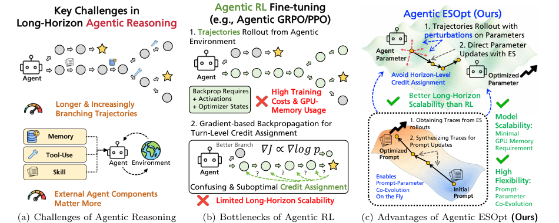
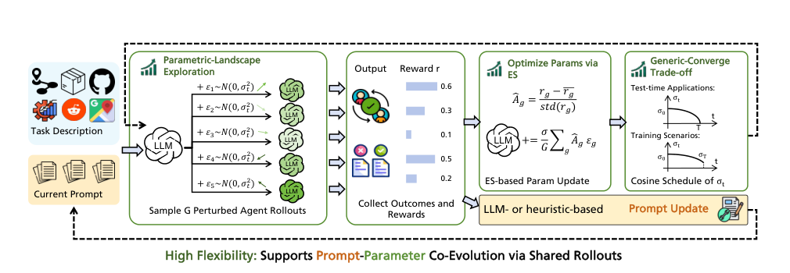
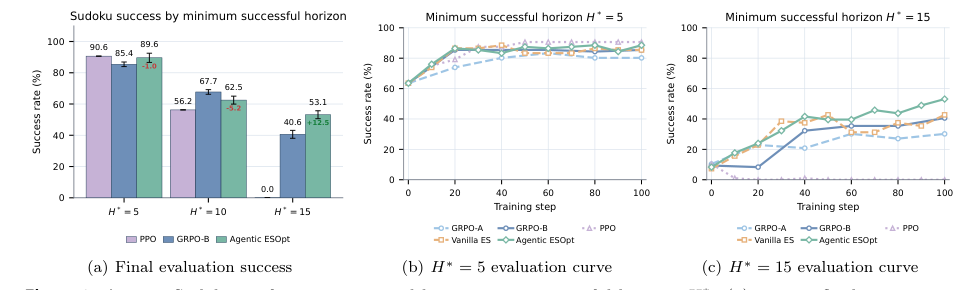
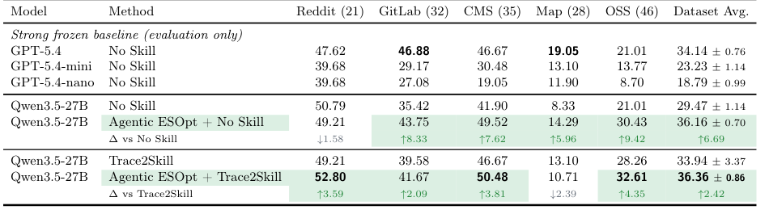
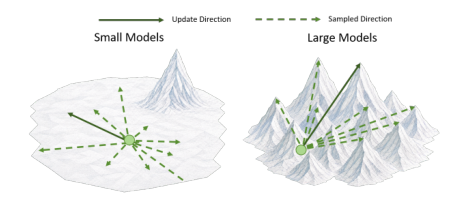

# Agentic ESOpt: Fine-Tuning Long-Horizon LLM Agents with Minimal GPU Requirements

## 基本信息

- 作者 / 机构：Zhi Zheng、Rongsheng Chen、Yunpeng Ba、Zhenkun Wang、Yee Whye Teh、Wee Sun Lee；National University of Singapore、Southern University of Science and Technology、University of Oxford。
- 年份 / 会议：2026，arXiv preprint；本文使用 arXiv v2（2026-08-21 修订）。
- 论文链接：https://arxiv.org/abs/2608.17310
- 原文 PDF：[Agentic ESOpt - Fine-Tuning Long-Horizon LLM Agents with Minimal GPU Requirements.pdf](../sources/Agentic%20ESOpt%20-%20Fine-Tuning%20Long-Horizon%20LLM%20Agents%20with%20Minimal%20GPU%20Requirements.pdf)
- 提取时间：2026-09-26 CST（Asia/Shanghai）。
- 提取范围：PDF 共 37 页，包含正文、附录 A--F、完整实验设置、提示词与外部组件说明；原文 PDF 的 SHA-256 为 `2e5a3edf648771b7f81c5dd8f5fdabc66ff8290876ea3721f9540044e53abaa5`。

## 1. 开源资源

- 项目主页：原文未单独列出。
- 官方 GitHub：https://github.com/zz1358m/Agentic-ESOpt
- 模型权重：原文未列出单独的模型权重下载地址。
- 数据：Sudoku、ReAct-style Math、DocVQA、WebArena-Lite 和自动启发式设计的任务配置与提示词见论文附录；外部数据集和组件按各自许可证使用。
- 文档：GitHub 仓库提供实现与运行说明；论文附录 E 提供环境提示词、任务提示词和技能上下文，附录 F 说明许可证与上游仓库。

## 2. 摘要

### 原文

Reinforcement Learning (RL) has been promising in single-turn LLM fine-tuning. However, long-horizon agentic reasoning introduces increasingly branching interactions and sparse rewards, exposing several limitations of RL: its heavyweight backpropagation-based training stack makes it impractical to fine-tune larger LLMs, and longer-horizon trajectories make the credit assignment in RL substantially harder. This paper argues that evolution strategies (ES) can be a better choice for fine-tuning long-horizon LLM agents. Compared with agentic RL, ES offers three key advantages: 1) Model Scalability: ES enables full-parameter optimization with only minimal, inference-level GPU memory, making it possible to fine-tune large LLMs. 2) Flexibility: its lightweight, black-box feedback interface makes ES fine-tuning easy to compose with prompt-space evolution (e.g., skill optimization & test-time compute); and 3) Long-Horizon Scalability: ES performs trajectory-level parameter attribution without decomposing rewards across horizons, yielding better scalability than Agentic RL as the horizon length grows.

Based on this insight, we propose Agentic ESOpt, a full-parameter agentic fine-tuning framework tailored to flexible parameter–context co-evolution. At each step, Agentic ESOpt samples perturbations around the current LLM parameters, evaluates the resulting agents with rewards, and applies an online reward-weighted update. To improve the exploration–adaptation trade-off, Agentic ESOpt further introduces a cosine decay schedule of the perturbation scale $\sigma$. We evaluate Agentic ESOpt across both train-time fine-tuning and agentic test-time compute settings. On long-horizon Sudoku, Agentic ESOpt outperforms RL methods by 12.50% with Qwen3.5-4B. On WebArena-Lite, full-parameter optimization of Qwen3.5-27B improves the No Skill baseline by 6.69%, and combining Agentic ESOpt with Trace2Skill further improves the Trace2Skill baseline by 2.42%. In test-time automatic heuristic design, Agentic ESOpt performs online prompt–parameter co-evolution, improving its matched baseline in 28 of 36 settings.

### 中文翻译

强化学习（RL）在单轮大语言模型微调中展现出良好效果。然而，长时域智能体推理带来越来越多的分支交互和稀疏奖励，暴露出 RL 的若干局限：基于反向传播的沉重训练体系使微调更大的 LLM 变得不切实际，而更长的轨迹使 RL 中的信用分配变得明显更加困难。本文认为，进化策略（ES）可能是微调长时域 LLM 智能体的更好选择。与智能体 RL 相比，ES 具有三个关键优势：1）**模型可扩展性**：ES 只需要极少的、推理级别的 GPU 显存即可进行全参数优化，因此能够微调大型 LLM；2）**灵活性**：轻量级的黑盒反馈接口使 ES 微调容易与提示词空间进化结合，例如技能优化和测试时计算；3）**长时域可扩展性**：ES 在轨迹层面进行参数归因，不需要跨时域分解奖励，因此随着时域变长，它比智能体 RL 具有更好的可扩展性。

基于这一观察，我们提出 Agentic ESOpt，一个面向灵活参数—上下文协同进化的全参数智能体微调框架。在每一步中，Agentic ESOpt 围绕当前 LLM 参数采样扰动，使用奖励评估得到的智能体，并执行在线的奖励加权更新。为了改善探索与适应之间的权衡，Agentic ESOpt 进一步对扰动尺度 $\sigma$ 引入余弦衰减调度。我们在训练时微调和智能体测试时计算两种设置下评估 Agentic ESOpt。在长时域 Sudoku 上，Agentic ESOpt 使用 Qwen3.5-4B 比 RL 方法高 12.50%。在 WebArena-Lite 上，对 Qwen3.5-27B 进行全参数优化，使 No Skill 基线提高 6.69%；将 Agentic ESOpt 与 Trace2Skill 结合后，Trace2Skill 基线进一步提高 2.42%。在测试时自动启发式设计中，Agentic ESOpt 执行在线提示词—参数协同进化，在 36 个设置中的 28 个设置上改进了对应基线。

## 3. 引言

### 原文

Advanced Large Language Models (LLMs) such as Qwen3, DeepSeek-R1, and Gemini 2.5 have demonstrated strong capabilities as general-purpose agents (Yang et al., 2025; Guo et al., 2025; Gemini Team, 2025). With their capabilities in tool use, long-context processing, and multimodal interaction, these models can navigate websites (Zhou et al., 2024), edit repositories (Yang et al., 2024), and coordinate multi-step software workflows (Wang et al., 2024). However, general-purpose agents can still perform poorly on uncommon tool APIs (Ma et al., 2024) and specialized scientific or algorithmic tasks (Liu et al., 2024). Therefore, efficiently fine-tuning advanced LLM agents to adapt task-specific expertise remains important (Du et al., 2026).

Reinforcement learning (RL) has demonstrated remarkable effectiveness in single-turn LLM fine-tuning (Shao et al., 2024; Liu et al., 2025d; Zheng et al., 2025a; Tajwar et al., 2026). However, in long-horizon agentic reasoning, which introduces increasingly branching interactions and provides only sparse feedback, several limitations of Agentic RL are exposed. As illustrated in Figure 1, first, Agentic RL requires storing heavyweight activations, optimizer states, and performing backpropagation through trajectories, making full-parameter fine-tuning increasingly impractical for larger LLMs. Moreover, as trajectories become longer and more branching, assigning sparse trajectory-level rewards back to individual decisions becomes substantially harder (Kim et al., 2026).

This paper argues that evolution strategies (ES) (Salimans et al., 2017) can be a better choice for fine-tuning long-horizon LLM agents. Instead of performing backpropagation, ES samples perturbations around the current LLM parameters, evaluates the perturbed agents with environment rewards, and applies a reward-weighted parameter update. Compared with Agentic RL, ES offers three key advantages:

1. **Model Scalability:** ES enables full-parameter optimization with only inference-level GPU memory, which is the minimal amount, substantially reducing the memory barrier to fine-tuning larger LLM agents.
2. **Flexibility:** Its lightweight, black-box feedback interface makes ES fine-tuning easy to compose with skill-space evolution (Ni et al., 2026) and test-time compute (Liu et al., 2024).
3. **Long-Horizon Scalability:** Unlike RL estimators that usually lead to poor long-horizon credit assignment, ES performs trajectory-level parameter attribution without decomposing rewards across turns, yielding better scalability than Agentic RL as the horizon length grows.

Recent work has explored ES for single-turn LLM reasoning (Qiu et al., 2026; Sun et al., 2026; Sarkar et al., 2025), where ES achieves higher GPU memory efficiency but slightly lower performance than RL methods. However, we argue that the structural advantages of ES are particularly pronounced in fine-tuning long-horizon agents, where ES can be significantly preferable to RL, rather than merely a cheaper alternative. To implement this advantage, we propose Agentic ESOpt, a full-parameter ES framework for both train-time agent fine-tuning and agentic test-time compute. At each generation, Agentic ESOpt samples full-parameter perturbations, evaluates the resulting agents with environment rewards, and applies an online reward-weighted update. Its lightweight black-box update enables on-the-fly parameter adaptation within prompt-space optimization loops, allowing parameter updates to complement both skill-space optimization and test-time search. To improve the exploration–adaptation trade-off, Agentic ESOpt further introduces a cosine decay mechanism for the perturbation scale $\sigma$, which retains a nonzero terminal $\sigma_T$ for mild smoothing regularization in train-time optimization, and decays $\sigma_T$ to 0 for progressively finer adaptation in test-time optimization.

We evaluate Agentic ESOpt for agentic fine-tuning in both train-time and test-time compute with LLMs from 4B to 27B. In the train-time fine-tuning, we study long-horizon reasoning, ReAct-style tool use, and web agents. On Sudoku, RL- and ES-based methods with matched FLOPs are competitive at smaller minimum successful horizons (5- and 10-horizon), but their relative ordering changes as the horizon grows: at 15 turns, Agentic ESOpt reaches +12.5% compared to the strongest GRPO baseline. Across ReAct-style Math and DocVQA, Agentic ESOpt achieves an average improvement of 13.7% over the Qwen3.5-4B base model and 8.3% over Agentic GRPO. On WebArena-Lite, full-parameter optimization of Qwen3.5-27B improves the No Skill baseline from 29.47% to 36.16%, while combining Agentic ESOpt with Trace2Skill raises it from 33.94% to 36.36%. In the test-time agentic heuristic design, Agentic ESOpt improves the matched baselines in 28 of 36 comparisons. Moreover, a preliminary population-sensitivity study further suggests that stronger LLM backbones can obtain useful ES updates with smaller populations.

Our contributions are summarized as follows:

- We identify that, on long-horizon agentic reasoning, ES becomes preferable to Agentic RL. We attribute this shift to three key properties of ES: model scalability through inference-level GPU memory, flexibility through black-box trajectory feedback, and long-horizon scalability through trajectory-level parameter attribution.
- We introduce Agentic ESOpt, a backpropagation-free ES framework requiring only minimal GPU memory. It supports flexible agentic fine-tuning in both train-time adaptation and test-time compute. It allows parameter optimization to compose with prompt-space evolution, while a cosine schedule of perturbation improves the exploration–adaptation trade-off.
- We validate Agentic ESOpt across long-horizon Sudoku, ReAct-style tool use, web agents, and automatic heuristic design with models from 4B to 27B. Agentic ESOpt outperforms RL on long-horizon Sudoku and ReAct-style Math/DocVQA, enables full-parameter adaptation of a 27B WebArena agent, improves Trace2Skill, and enhances existing test-time evolutionary search in 28 of 36 settings.

### 中文翻译

Qwen3、DeepSeek-R1 和 Gemini 2.5 等先进大语言模型（LLM）已经展现出作为通用智能体的强大能力（Yang et al., 2025；Guo et al., 2025；Gemini Team, 2025）。凭借工具使用、长上下文处理和多模态交互能力，这些模型可以浏览网站（Zhou et al., 2024）、编辑代码仓库（Yang et al., 2024）并协调多步骤软件工作流（Wang et al., 2024）。然而，通用智能体在不常见的工具 API（Ma et al., 2024）以及专门的科学或算法任务（Liu et al., 2024）上仍可能表现不佳。因此，高效微调先进 LLM 智能体，使其适应特定任务的专业能力，仍然很重要（Du et al., 2026）。

强化学习（RL）在单轮 LLM 微调中已经展现出显著效果（Shao et al., 2024；Liu et al., 2025d；Zheng et al., 2025a；Tajwar et al., 2026）。然而，长时域智能体推理带来越来越多的分支交互，而反馈又很稀疏，这暴露了智能体 RL 的若干局限。如图 1 所示，首先，智能体 RL 需要保存大量激活值和优化器状态，并对轨迹执行反向传播，使得在更大的 LLM 上进行全参数微调越来越不切实际。此外，随着轨迹变得更长、分支更多，将稀疏的轨迹级奖励分配回单个决策会变得明显更加困难（Kim et al., 2026）。

本文认为，进化策略（ES）（Salimans et al., 2017）可能是微调长时域 LLM 智能体的更好选择。ES 不执行反向传播，而是围绕当前 LLM 参数采样扰动，使用环境奖励评估受扰动的智能体，并执行奖励加权的参数更新。与智能体 RL 相比，ES 具有三个关键优势：

1. **模型可扩展性**：ES 只需要推理级别的 GPU 显存，也就是最低限度的显存，即可进行全参数优化，从而大幅降低微调更大 LLM 的显存门槛。
2. **灵活性**：轻量级黑盒反馈接口使 ES 微调容易与技能空间进化（Ni et al., 2026）和测试时计算（Liu et al., 2024）结合。
3. **长时域可扩展性**：与通常导致长时域信用分配困难的 RL 估计器不同，ES 在轨迹层面进行参数归因，不需要跨交互轮次分解奖励；随着时域增长，它具有更好的可扩展性。

近期工作已经探索使用 ES 进行单轮 LLM 推理（Qiu et al., 2026；Sun et al., 2026；Sarkar et al., 2025）。这些工作显示，ES 的 GPU 显存效率更高，但性能略低于 RL 方法。然而，我们认为 ES 的结构性优势在长时域智能体微调中尤其明显；在这一场景下，ES 可能显著优于 RL，而不仅仅是更便宜的替代方案。为实现这一优势，我们提出 Agentic ESOpt，一个同时支持训练时智能体微调和智能体测试时计算的全参数 ES 框架。在每一代中，Agentic ESOpt 采样全参数扰动，使用环境奖励评估得到的智能体，并执行在线奖励加权更新。轻量级的黑盒更新使参数能够在提示词空间优化循环中即时适应，让参数更新与技能空间优化和测试时搜索互相补充。为了改善探索与适应之间的权衡，Agentic ESOpt 进一步引入扰动尺度 $\sigma$ 的余弦衰减机制：训练时保留非零终止值 $\sigma_T$，以提供温和的平滑正则；测试时则将 $\sigma_T$ 衰减到 0，使适应逐步变得更加精细。

我们使用 4B 到 27B 的 LLM，在训练时微调和测试时计算两种设置下评估 Agentic ESOpt。训练时微调覆盖长时域推理、ReAct 风格工具使用和网页智能体。在 Sudoku 上，在 FLOPs 对齐的条件下，RL 和 ES 方法在较小的最小成功时域（5 和 10）上具有竞争力，但随着时域增长，方法排序发生变化：在 15 步时，Agentic ESOpt 相比最强 GRPO 基线高出 12.5%。在 ReAct 风格 Math 和 DocVQA 上，Agentic ESOpt 平均比 Qwen3.5-4B 基础模型高 13.7%，比 Agentic GRPO 高 8.3%。在 WebArena-Lite 上，对 Qwen3.5-27B 进行全参数优化，使 No Skill 基线从 29.47% 提升到 36.16%；将 Agentic ESOpt 与 Trace2Skill 结合后，结果从 33.94% 提升到 36.36%。在测试时智能体启发式设计中，Agentic ESOpt 在 36 个比较设置中的 28 个改进了对应基线。此外，初步的种群规模敏感性研究进一步表明，更强的 LLM 骨干可能只需要较小种群就能获得有用的 ES 更新。

本文贡献如下：

- 我们指出，在长时域智能体推理中，ES 可能优于智能体 RL，并将这种转变归因于 ES 的三个性质：使用推理级显存带来的模型可扩展性、通过黑盒轨迹反馈带来的灵活性，以及通过轨迹级参数归因带来的长时域可扩展性。
- 我们提出 Agentic ESOpt，一个无需反向传播、只需极少 GPU 显存的 ES 框架。它支持训练时适应和测试时计算中的灵活智能体微调，可以与提示词空间进化组合，并通过余弦扰动调度改善探索—适应权衡。
- 我们在长时域 Sudoku、ReAct 风格工具使用、网页智能体和自动启发式设计上，用 4B 到 27B 的模型验证 Agentic ESOpt。Agentic ESOpt 在长时域 Sudoku 和 ReAct 风格 Math/DocVQA 上超过 RL，支持对 27B WebArena 智能体进行全参数适应，改进 Trace2Skill，并在 36 个测试时进化搜索设置中的 28 个设置上取得提升。

## 4. 论文定位与主要贡献

这篇论文研究的是**长时域 LLM 智能体的参数微调**，不是机器人 VLA。它将 Agentic RL 与参数空间的 Evolution Strategies 进行比较，核心论点是：当交互轮数增加、奖励变稀疏且模型变大时，直接在参数空间进行黑盒搜索可能比逐动作的策略梯度更合适。

主要贡献为：

1. **Agentic ESOpt**：提出无需反向传播的全参数智能体微调方法，只需要推理级显存。
2. **奖励加权参数搜索**：对当前模型参数加入高斯扰动，运行完整智能体轨迹，用标量奖励估计参数更新方向。
3. **余弦扰动衰减**：训练早期使用更大扰动促进探索，后期减小扰动以精细适应；训练时保留非零终点尺度，测试时可衰减到零。
4. **参数—上下文协同进化**：同一批轨迹反馈既可以更新模型参数，也可以驱动 Trace2Skill、EoH 等提示词、技能或启发式搜索。
5. **长时域信用分配分析**：论文比较策略梯度逐轮累加 score term 与 ES 对整条轨迹进行参数归因的方差结构，并在可控最小成功时域的 Sudoku 上验证二者随时域增长的性能交叉。

## 5. 核心方法

*原文图注：Figure 1 (a) Long-horizon agentic reasoning introduces new challenges for Agentic RL (b), including high GPU memory requirements in training and difficult credit assignment across horizons. Agentic ESOpt (c) addresses these issues through inference-level GPU memory, flexible black-box feedback, and better long-horizon scalability.*

*中文翻译：长时域智能体推理给智能体 RL 带来新的挑战，包括训练时高 GPU 显存需求和跨时域信用分配困难。Agentic ESOpt 通过推理级显存、灵活的黑盒反馈和更好的长时域可扩展性应对这些问题。*

### 5.1 智能体轨迹与目标

多轮 LLM 智能体在每一轮观察环境并产生动作：

$$
a_t\sim\pi_\theta(a_t\mid o_{\le t},c_t),
$$

其中 $\theta$ 是模型参数，$o_{\le t}$ 是交互历史，$c_t$ 是外部提示词、记忆、技能或工具指令。一个 episode 产生轨迹：

$$
\tau=(o_1,a_1,\ldots,o_H,a_H),
$$

其中 $H$ 是终止前的智能体—环境交互轮数。轨迹回报为：

$$
R(\tau)=\sum_{t=1}^{H}\gamma^{t-1}r_t。
$$

很多智能体推理任务只有稀疏奖励：$t<H$ 时通常 $r_t=0$，只有完整轨迹结束时才得到任务分数。参数微调优化 $\theta$；提示词空间方法则冻结 LLM，只优化 $c_t$。论文讨论的 SFT、OPD、GRPO 和 PPO 属于策略微调方法。

### 5.2 Agentic RL 的长时域问题

以 GRPO 为例，模型为同一任务采样多条轨迹，用组内相对回报形成优势。PPO 则依赖 critic 估计每个交互轮次的优势：

$$
\hat A_t=\sum_{l=0}^{H-t}(\gamma\lambda)^l
\left(r_{t+l}+\gamma V_\phi(h_{t+l+1})-V_\phi(h_{t+l})\right)。
$$

论文认为，长时域和稀疏终端奖励下存在两个问题：critic 需要预热才能学到有用的价值，早期优势估计不可靠；即使 critic 已经较好，策略梯度仍然会累加 $H$ 个动作级 score term，因此估计器方差随轨迹长度增加。

### 5.3 Agentic ESOpt 的参数空间目标

固定外部智能体上下文 $c$，令当前模型参数为 $\theta$，由策略 $\pi_\theta$ 产生的轨迹回报期望为：

$$
J(\theta;c)=\mathbb E_{\tau\sim\pi_\theta(\cdot\mid c)}[R(\tau)]。
$$

Agentic ESOpt 在参数空间采样高斯扰动：

$$
\epsilon\sim\mathcal N(0,I),\qquad \vartheta=\theta+\sigma\epsilon。
$$

对应的高斯平滑目标为：

$$
J_\sigma(\theta;c)=\mathbb E_{\epsilon\sim\mathcal N(0,I)}[J(\theta+\sigma\epsilon;c)]。
$$

通过高斯分布的 score-function identity，可以得到 ES 伪梯度：

$$
\nabla_\theta J_\sigma(\theta;c)
=\frac{1}{\sigma}\mathbb E_\epsilon[J(\theta+\sigma\epsilon;c)\epsilon]。
$$

这一步不需要对模型输出、环境转移或奖励函数求导。只要运行受扰动模型并取得一个标量轨迹回报，就可以估计更新方向。

### 5.4 奖励归一化与实际更新

每一代采样 $G$ 个参数扰动 $\epsilon_1,\ldots,\epsilon_G$，分别评估受扰动智能体，得到回报 $R_i=R(\tau_i)$。在种群内做 z-score 归一化：

$$
\hat R_i=\frac{R_i-\mu_R}{s_R+\varepsilon},
$$

其中：

$$
\mu_R=\frac1G\sum_{j=1}^G R_j,\qquad
s_R^2=\frac1G\sum_{j=1}^G(R_j-\mu_R)^2。
$$

论文的实现省略显式的 $1/\sigma$，把更新尺度交给 $\alpha$：

$$
\theta_{t+1}
=\theta_t+\frac{\alpha}{G}\sum_{i=1}^{G}\hat R_i\epsilon_i。
$$

奖励高于种群平均值的扰动方向得到正权重，奖励低于平均值的方向得到负权重。它不是对单个 token 或单个决策执行梯度回传，而是把整条轨迹的回报归因给一次完整的参数扰动。

### 5.5 低显存全参数更新

Agentic ESOpt 的更新是 forward-only：

1. 保存当前参数和每个扰动的随机种子；
2. 根据种子重建 $\epsilon_i$，将 $\theta+\sigma\epsilon_i$ 加到模型参数上；
3. 只用推理运行受扰动智能体，获取轨迹奖励；
4. 恢复参数，并根据奖励加权累加扰动方向；
5. 原地更新参数。

因此不需要保存反向传播激活、不需要 optimizer states，也不需要通过多轮环境交互反向传播。显存需求接近模型推理所需显存。论文同时强调，这并不意味着总环境评估成本更低：ES 使用更大的扰动种群，以独立 rollout 换取反向传播和参考模型前向的省略。

*原文图注：Figure 2 Detailed workflow of Agentic ESOpt. Starting from the current LLM, Agentic ESOpt samples parameter perturbations, evaluates the perturbed agents in the environment, normalizes their scalar rewards, and applies a reward-weighted ES update. Compared with Agentic RL, Agentic ESOpt provides model scalability, optimization flexibility, and long-horizon scalability. Its lightweight black-box interface also allow easy composition with prompt-space optimization methods such as Trace2Skill (LLM-based) and EoH (heuristic-based), enabling on-the-fly parameter adaptation within existing test-time compute procedures.*

*中文翻译：从当前 LLM 出发，Agentic ESOpt 采样参数扰动，在环境中评估受扰动智能体，归一化标量奖励，并应用奖励加权的 ES 更新。与智能体 RL 相比，Agentic ESOpt 提供模型可扩展性、优化灵活性和长时域可扩展性。轻量级黑盒接口还支持与 Trace2Skill（基于 LLM）和 EoH（基于启发式）等提示词空间优化方法组合，在已有测试时计算流程中即时更新参数。*

### 5.6 参数—上下文协同进化

测试时计算和提示词空间优化通常冻结 LLM 参数，只优化外部上下文 $c_t$。Agentic ESOpt 允许参数和上下文同时变化：

$$
\theta_{t+1}=U_{ES}(\theta_t;c_t,D_t),
\qquad
c_{t+1}=U_c(c_t;D_t),
$$

其中 $D_t$ 是第 $t$ 轮收集的轨迹与分数，$U_{ES}$ 是参数空间更新，$U_c$ 是外部提示词、技能或启发式更新。这样，同一批 rollout 可以同时支持模型参数更新和技能/提示词蒸馏。

### 5.7 扰动尺度的余弦衰减

固定 $\sigma$ 实际上优化的是高斯平滑目标。论文给出：

$$
J_\sigma(\theta;c)
=J(\theta;c)+\frac{\sigma^2}{2}\operatorname{Tr}(\nabla_\theta^2J(\theta;c))+O(\sigma^4)。
$$

较大的 $\sigma$ 带来更强探索和更强平滑正则，但也增加相对于原始目标的偏差。Agentic ESOpt 使用：

$$
\sigma_t
=\sigma_T+(\sigma_0-\sigma_T)\frac{1+\cos(\pi t/T)}{2},
\qquad t=0,\ldots,T。
$$

- 训练时保留非零 $\sigma_T$，在适应和邻域平滑之间保持平衡；
- 测试时计算将 $\sigma_T$ 衰减到 0，使最终结果更接近当前任务的未平滑目标。

## 6. 长时域信用分配分析

考虑长度为 $H$、只有终端回报 $R$ 的轨迹。传统策略梯度的简化估计器为：

$$
\hat g_{PG}=(R-b)\sum_{t=1}^{H}\nabla_\theta\log\pi_\theta(a_t\mid s_t)。
$$

在回报与单个动作 score 弱相关、不同时间步 score 近似不相关且边际协方差相近的假设下，估计器方差近似随 $H$ 线性增长：

$$
\operatorname{Var}(\hat g_{PG})\approx
\operatorname{Var}(R-b)\,H\Sigma_u。
$$

ES 对整条轨迹只采样一个参数扰动：

$$
\hat g_{ES}=(R(\theta+\sigma\epsilon)-b)\frac{\epsilon}{\sigma}。
$$

参数 score $\epsilon/\sigma$ 不会对每个交互轮次求和。因此，在上述近似下，ES 的估计器不会额外引入随 $H$ 增加的动作级 score 累加项。论文明确限定：这不是说 ES 的总方差与 $H$ 无关，也不是说 ES 普遍优于策略梯度；它只说明在其他困难因素相近时，策略梯度具有额外的 horizon-wise 累加，而参数空间 ES 没有这一项。

## 7. 数据集、模型与框架

### 7.1 任务与评测

| 任务 / 基准 | 用途 | 规模 / 设定 |
|---|---|---|
| Agentic Sudoku | 可控长时域信用分配实验 | 遮挡 5、10、15 个格子，最小成功时域 $H^*\in\{5,10,15\}$；仅有终端成功奖励 |
| ReAct-style Math | Python 工具使用和数学推理 | 400 个 DAPO 训练题；100 个留出 DAPO 题；30 个 AIME 2026 OOD 题；最多 50 轮 |
| DocVQA | OCR 与文档图像分析工具使用 | 50 个验证问题训练；100 个留出问题评测；最多 50 轮，单轮最多 512 token |
| WebArena-Lite | 网页智能体参数可扩展性 | 165 个任务；Reddit 21、GitLab 32、CMS 35、Map 28、OSS 46，Wikipedia 纳入总体平均 |
| 自动启发式设计（AHD） | 测试时提示词—参数协同进化 | 构造式 TSP、KP、ASP；ACO 风格 TSP、CVRP、BPP；总评估预算 $T\in\{1000,2000\}$ |

### 7.2 模型与基础组件

| 名称 | 用途 | 规模 / 说明 |
|---|---|---|
| Qwen3.5-4B | Sudoku、Math、DocVQA 的训练和对比 | 主要 Agentic ESOpt 与 Agentic RL 骨干 |
| Qwen3.5-9B | 种群规模敏感性 | 与 4B 模型在 15-turn Sudoku 上比较 |
| Qwen3.5-27B | WebArena-Lite | 在 4 张 NVIDIA H100 80GB 上做全参数 Agentic ESOpt |
| LLaMA-3.1-8B-Instruct | AHD | 构造式与 ACO 风格启发式设计 |
| Agentic GRPO / PPO | RL 对照方法 | 使用标量环境奖励；PPO 额外使用 critic 估计 turn-level advantage |
| Trace2Skill | 提示词 / 技能空间方法 | 从轨迹蒸馏可迁移技能，和 ESOpt 共享 rollout |
| EoH / Sample | 测试时启发式搜索 | Agentic ESOpt 附加在原有搜索框架上 |

## 8. 实验

### 8.1 Agentic Sudoku

Sudoku 环境要求智能体每轮填充一个空格，动作格式为 `set <row> <col> <value>`。一个动作最多填一个格子；episode 只有在交互预算内完整解出 Sudoku 时才成功。遮挡 5、10、15 个格子分别定义最小成功时域 $H^*=5,10,15$，实际轨迹可能因为无效或无效益动作而更长。

实验在 4 张 NVIDIA H100 80GB 上进行，使用 Qwen3.5-4B，并比较 Agentic PPO、两种采样配置的 Agentic GRPO、Vanilla ES 和 Agentic ESOpt。Agentic ESOpt 使用 $G=32$ 个扰动方向、每代 32 个谜题、100 代、种群 z-score 奖励归一化；训练和评测使用 temperature 0.7、top-p 0.8、top-k 20。

*原文图注：Figure 3 Agentic Sudoku performance grouped by minimum successful horizon $H^*$. (a) reports final success rate averaged over 3 runs with standard-deviation error bars for PPO, the stronger GRPO-B configuration, and Agentic ESOpt. Red/green annotations below the Agentic ESOpt values report its difference from the stronger Agentic RL result. (b) and (c) show evaluation curves for the methods. Both Vanilla ES and Agentic ESOpt use $G=32$.*

*中文翻译：按最小成功时域 $H^*$ 分组的 Agentic Sudoku 性能。 (a) 报告 PPO、较强 GRPO-B 配置和 Agentic ESOpt 在 3 次运行上的最终成功率均值及标准差误差条；Agentic ESOpt 数值下方的红色/绿色标注表示相对于较强 Agentic RL 结果的差值。 (b) 和 (c) 展示各方法的评测曲线。Vanilla ES 和 Agentic ESOpt 均使用 $G=32$。*

| 方法 | GPU 显存 | $H^*=5$ | $H^*=10$ | $H^*=15$ |
|---|---:|---:|---:|---:|
| Qwen3.5-27B | 51.75 GB | 86.46 ± 3.90 | 50.00 ± 2.55 | 28.13 ± 2.55 |
| Qwen3.5-4B | 8.41 GB | 63.54 ± 7.80 | 31.25 ± 4.42 | 10.42 ± 1.47 |
| + Agentic PPO | 89.40 GB | **90.63 ± 0.00** | 56.25 ± 0.00 | 0.00 ± 0.00 |
| + Agentic GRPO（temperature 0.7） | 58.88 GB | 80.21 ± 1.47 | 44.79 ± 2.95 | 30.21 ± 2.95 |
| + Agentic GRPO（temperature 1） | 58.88 GB | 85.42 ± 1.47 | **67.71 ± 1.47** | 40.63 ± 2.55 |
| + Agentic ESOpt（$G=32$） | **8.41 GB** | 89.58 ± 2.95 | 62.50 ± 2.55 | **53.13 ± 2.55** |
| w/o $\sigma$ decay（Vanilla ES） | 8.41 GB | 85.42 ± 3.90 | 55.21 ± 5.89 | 42.71 ± 3.90 |
| w/o $\sigma_T$（$\sigma_T=0$） | 8.41 GB | 85.42 ± 3.90 | 54.17 ± 3.90 | 28.13 ± 2.55 |

结果显示，Agentic ESOpt 并非在所有时域都统一领先：$H^*=5$ 时 PPO 最高，$H^*=10$ 时 GRPO-B 最高；当 $H^*=15$ 时，Agentic ESOpt 达到 53.13%，比最强 GRPO-B 高 12.50 个百分点，而 PPO 下降到 0%。作者将这种排序反转解释为长时域稀疏终端奖励下 critic 信号和动作级信用分配变得更加困难。Agentic ESOpt 的 GPU 显存为 8.41 GB，与基础 Qwen3.5-4B 推理需求相同。

在 15-turn 设置中，去掉余弦衰减的 Vanilla ES 最终为 42.71%，将终止扰动尺度设为 0 则为 28.13%，说明训练时保留非零终止尺度有助于维持探索与平滑。

### 8.2 训练计算与时钟时间

在相同四张 H100 上，Agentic ESOpt 使用较大的种群（$G=32$），但每条轨迹只需要一次策略前向；GRPO 需要策略前向、参考模型前向和策略反向。作者按模型 FLOPs 估算：等长轨迹下，ES 每条采样轨迹约为一次策略前向，GRPO 约为四个前向等价量，PPO 约为七个前向等价量。

在 Sudoku 中，$H^*=5,10,15$ 时 Agentic ESOpt 的模型 FLOPs 分别为 3.1、6.3、9.4 EFLOPs；GRPO 分别为 3.2、7.6、10.9 EFLOPs。对应的实际时钟时间分别约为 ESOpt 3.1、5.8、9.4 小时，GRPO 5.4、13.1、19.0 小时。作者同时强调，环境评估次数是 ES 的主要交换成本。

### 8.3 ReAct 风格 Math 与 DocVQA

这两项任务使用 Qwen3.5-4B。Math 任务中，智能体可以多次调用命令行 Python 工具；DocVQA 任务中，智能体使用 OCR 和文档图像分析工具。比较方法包括 Agentic GRPO、Agentic ESOpt、Trace2Skill，以及它们的顺序组合。

| 模型 / 方法 | DAPO Mean@4 | DAPO Pass@4 | AIME 2026 Mean@4 | AIME 2026 Pass@4 | DocVQA ANLS Mean@4 | DocVQA ANLS Max@4 | DocVQA Accuracy Mean@4 | Accuracy Pass@4 |
|---|---:|---:|---:|---:|---:|---:|---:|---:|
| Qwen3.5-27B No Skill | 65.8 | 87.0 | 76.7 | 93.3 | 0.5036 | 0.7843 | 51.8 | 69.0 |
| Qwen3.5-4B No Skill | 63.0 | 86.0 | 55.8 | 86.7 | 0.3875 | 0.5981 | 40.3 | 53.0 |
| Qwen3.5-4B Agentic GRPO + No Skill | 68.8 | 83.0 | 58.3 | 76.7 | 0.4627 | 0.5398 | 48.0 | 56.0 |
| Qwen3.5-4B Agentic ESOpt + No Skill | **76.8** | **86.0** | **70.8** | **96.7** | **0.5043** | 0.6507 | **52.5** | **61.0** |
| Qwen3.5-4B Trace2Skill | 64.8 | 82.0 | 50.8 | 83.3 | 0.4612 | **0.6772** | 47.3 | **69.0** |
| Qwen3.5-4B Agentic GRPO + Trace2Skill | 67.8 | 85.0 | 50.0 | 80.0 | 0.4743 | 0.5692 | 49.5 | 60.0 |
| Qwen3.5-4B Agentic ESOpt + Trace2Skill | **77.3** | **86.0** | **71.7** | **96.7** | **0.5086** | 0.6654 | **52.8** | 61.0 |

在不加入技能时，Agentic ESOpt 相比 Qwen3.5-4B 基线在 DAPO、AIME 2026 和 DocVQA Mean@4 上分别提升 13.8、15.0 和 12.3 个百分点，三项指标平均提升 13.7 个百分点；相对 Agentic GRPO 平均提升 8.3 个百分点。与 Trace2Skill 结合后，Agentic ESOpt 仍能提升平均结果。附录的重复采样曲线显示，在 $k\le32$ 的采样预算下，Agentic ESOpt 的多项 Pass@K 指标保持在匹配的 GRPO 之上，作者据此认为平均性能提升不是通过牺牲成功轨迹覆盖度换来的。

### 8.4 WebArena-Lite

WebArena-Lite 是由 WebArena 派生的 165 任务浏览器基准。每个任务给出自然语言目标和交互式网站状态，智能体接收 WebRL 风格的文本浏览器表示，并在基于 ID 的动作空间中操作。评测在轨迹结束时根据目标是否达成给出二元成功反馈，每个任务最多 30 次浏览器动作。

作者在四张 NVIDIA H100 80GB 上对 Qwen3.5-27B 做全参数优化。训练使用 582 个 WebArena 训练任务，65 个验证任务；WebArena-Lite 的 165 个测试任务不参与参数更新或技能蒸馏。Agentic ESOpt 使用 $G=8$、70 代、固定 $\sigma=1.5\times10^{-3}$、更新尺度 $\alpha=2.5\times10^{-4}$。

*原文表注：Table 4 WebArena-Lite success rates (%). We report the average over 3 runs and the standard deviations. Improved Agentic ESOpt cells relative to their paired baseline are shaded green; bold denotes the best result in each column. The five displayed site categories contain 162 tasks; the remaining Wikipedia tasks are included in Dataset Avg.*

*中文翻译：表 4 WebArena-Lite 成功率（%）。结果报告 3 次运行的平均值和标准差。相对于对应基线有所提升的 Agentic ESOpt 单元格以绿色阴影标示；粗体表示每列的最佳结果。表中展示的五个网站类别共包含 162 个任务，其余 Wikipedia 任务计入数据集平均值。*

| 模型 / 方法 | Reddit | GitLab | CMS | Map | OSS | Dataset Avg. |
|---|---:|---:|---:|---:|---:|---:|
| GPT-5.4 No Skill | 47.62 | **46.88** | 46.67 | **19.05** | 21.01 | 34.14 ± 0.76 |
| GPT-5.4-mini No Skill | 39.68 | 29.17 | 30.48 | 13.10 | 13.77 | 23.23 ± 1.14 |
| GPT-5.4-nano No Skill | 39.68 | 27.08 | 19.05 | 11.90 | 8.70 | 18.79 ± 0.99 |
| Qwen3.5-27B No Skill | 50.79 | 35.42 | 41.90 | 8.33 | 21.01 | 29.47 ± 1.14 |
| Qwen3.5-27B Agentic ESOpt + No Skill | 49.21 | 43.75 | 49.52 | 14.29 | 30.43 | **36.16 ± 0.70** |
| Qwen3.5-27B Trace2Skill | 49.21 | 39.58 | 46.67 | 13.10 | 28.26 | 33.94 ± 3.37 |
| Qwen3.5-27B Agentic ESOpt + Trace2Skill | **52.80** | **41.67** | **50.48** | 10.71 | **32.61** | **36.36 ± 0.86** |

Agentic ESOpt 将 Qwen3.5-27B No Skill 基线从 29.47% 提升至 36.16%，提高 6.69 个百分点；与 Trace2Skill 结合后，将 Trace2Skill 从 33.94% 提升至 36.36%，提高 2.42 个百分点。不同网站类别的变化并不一致，Map 在组合设置下出现下降。

### 8.5 测试时计算：自动启发式设计

自动启发式设计（AHD）不是普通的文本生成任务：LLM 生成的文本只有在它诱导出更好的算法行为时才有价值。论文把它看成启发式空间上的优化，并将 Agentic ESOpt 插入两类测试时搜索：

- **构造式 AHD**：启发式在部分解状态上对可行动作进行局部选择；任务包括旅行商问题（TSP）、0-1 背包问题（KP）和 Admissible Set Problem（ASP）。
- **ACO 风格 AHD**：启发式为蚁群优化器提供信息；任务包括 TSP、容量约束车辆路径问题（CVRP）和装箱问题（BPP）。

比较的外部搜索框架是独立 Sample 和 EoH。Agentic ESOpt 保留原有搜索流程，只在参数空间加入扰动更新；EoH 中只对 mutation operators $m_1,m_2$ 附加参数更新。最小化任务将目标成本转换为负向奖励，EoH 的奖励是父代成本减去受扰动子代成本，Sample 的奖励是负子代成本；每个更新批次均进行 z-score 归一化。

在构造式任务的 24 个匹配比较中，Agentic ESOpt + EoH 全部改进；Agentic ESOpt + Sample 改进 12 项中的 9 项、1 项持平、2 项下降。结合构造式和 ACO 风格设置，在 12 个测试集和 6 个场景的 36 个匹配方法—预算比较中，Agentic ESOpt 改进 28 项。

*原文图注：Figure 4 Intuition for population scaling: sampled directions around a stronger backbone are more likely to align with a useful Agentic ESOpt direction.*

*中文翻译：种群规模的直觉：围绕更强骨干采样的方向更有可能与有用的 Agentic ESOpt 更新方向一致。*

### 8.6 种群规模消融

在 15-turn Sudoku 上，Qwen3.5-4B 从 $G=8$ 增加到 $G=16$ 后，最佳测试成功率从 5.10% 提升到 35.42%，最终测试成功率从 2.95% 提升到 22.92%。Qwen3.5-9B 对种群规模不那么敏感：$G=8$ 到 $G=16$ 使最佳测试成功率从 30.21% 变为 37.50%，但最终测试成功率仍为 30.21%。作者将其解释为，更强的预训练骨干周围可能存在更密集的有用行为区域，因此较小种群也更容易采到有信息的方向。

## 9. 附录与实现细节

### 9.1 局限

- **新增超参数**：Agentic ESOpt 引入扰动半径 $\sigma$，其最优值可能随 LLM、奖励分布和环境变化，带来额外调参成本。论文在 5 组实验中使用相对一致的 $\sigma_0\approx10^{-3}$ 和 $\alpha\approx5\times10^{-4}$，但自动调度仍留给未来工作。
- **环境评估成本**：ES 用更多独立环境评估换取不保存反向传播状态和减少模型侧计算；当环境评估极其昂贵时，这种交换可能不再有利。
- **持续学习仍不明确**：ES 更新可能在与目标无关的方向上形成随机游走。WebArena 分析显示，更新幅度大多较小，但长期持续学习性质仍需研究。
- **规模化证据有限**：论文只评估到 27B，并以 4B/9B 的初步结果推测更强骨干可能需要更小种群；普遍的种群规模规律以及在前沿 LLM 上的验证仍是未来工作。

### 9.2 未来工作

作者提出：将 Agentic ESOpt 扩展到更大的 LLM；研究种群规模随模型能力变化的规律；发展支持量化权重的 ES 优化和可复现种子机制；让技能上下文和模型参数在相近时间尺度上进行更紧密的多步协同进化。

### 9.3 训练配置摘要

| 设置 | 骨干 | 迭代 / 更新批次 | 种群方向数 | $\sigma$ 调度 | 更新尺度 |
|---|---|---:|---:|---|---:|
| Sudoku $H^*=5/10$ | Qwen3.5-4B | 100 | 32 | $10^{-3}\rightarrow2.5\times10^{-4}$ | $5\times10^{-4}$ |
| Sudoku $H^*=15$ | Qwen3.5-4B | 100 | 32 | $7\times10^{-4}\rightarrow5\times10^{-4}$ | $5\times10^{-4}$ |
| Math | Qwen3.5-4B | 25 | 16 | $10^{-3}\rightarrow5\times10^{-4}$ | $5\times10^{-4}$ |
| DocVQA | Qwen3.5-4B | 40 | 16 | $10^{-3}\rightarrow5\times10^{-4}$ | $5\times10^{-4}$ |
| WebArena-Lite | Qwen3.5-27B | 70 | 8 | $1.5\times10^{-3}$ 固定 | $2.5\times10^{-4}$ |
| AHD + EoH，$T=1000$ | LLaMA-3.1-8B | 50 | 10 | $10^{-3}\rightarrow0$ | $5\times10^{-4}$ |
| AHD + EoH，$T=2000$ | LLaMA-3.1-8B | 50 | 30 | $10^{-3}\rightarrow0$ | $5\times10^{-4}$ |
| AHD + Sample，$T=1000/2000$ | LLaMA-3.1-8B | 50/100 | 20 | $10^{-3}\rightarrow0$ | $5\times10^{-4}$ |

### 9.4 任务奖励与提示词

- **Sudoku**：只有完整合法解在交互预算内完成时奖励 1；无效格式、越界、修改给定数字或覆盖等动作不会推进棋盘。
- **Math / AIME**：对解析出的最终答案使用 exact match；轨迹必须包含工具调用，完整轨迹的最终答案决定奖励。
- **DocVQA**：使用连续 ANLS 作为训练奖励；ANLS 严格大于 0.5 时计为正确。
- **WebArena-Lite**：轨迹结束时根据目标网页状态是否达成给出二元成功；中间动作没有直接任务信用。
- **AHD**：根据求解器目标值构造奖励；无效或非有限程序会得到批次内的有限惩罚，全批次无效时不更新。

## 10. 结论

Agentic ESOpt 提出一个只需要推理级 GPU 显存的全参数进化策略框架，用于长时域 LLM 智能体微调。它用一次完整参数扰动影响整条智能体轨迹，再用轨迹级标量奖励直接归因给这一扰动，避免了策略梯度在长时域上逐轮累积动作 score term 的信用分配问题。

实验显示，Agentic PPO 和 GRPO 在较短 Sudoku 时域仍具有竞争力，但随着最小成功时域增长，Agentic ESOpt 变得更强；它也在 ReAct 风格 Math、DocVQA 和 WebArena-Lite 上提升表现，并可以在四张 H100 上对 Qwen3.5-27B 做全参数 WebArena 适应。在测试时计算中，Agentic ESOpt 将参数更新加入技能和启发式搜索流程，在 36 个匹配 AHD 比较中改进 28 个设置。

论文将 ES 定位为长时域、稀疏反馈 LLM 智能体的更匹配的优化机制，而不仅是 RL 的低成本替代方案。其适用性仍受到环境评估成本、扰动尺度调参、持续学习稳定性和更大模型规模验证不足的限制。

## 11. 重要参考文献

| 原文 / 作者 | 文献 | 本文中的引用用途 | 链接 |
|---|---|---|---|
| Salimans et al. (2017) | *Evolution Strategies as a Scalable Alternative to Reinforcement Learning* | ES 的参数空间梯度估计基础 | https://arxiv.org/abs/1703.03864 |
| Schulman et al. (2017) | *Proximal Policy Optimization Algorithms* | Agentic PPO 对照与长时域优势估计背景 | https://arxiv.org/abs/1707.06347 |
| Shao et al. (2024) | *DeepSeekMath: Pushing the Limits of Mathematical Reasoning in Open Language Models* | GRPO 与 LLM RL 基础 | https://arxiv.org/abs/2402.03300 |
| Yao et al. (2022) | *ReAct: Synergizing Reasoning and Acting in Language Models* | ReAct 风格工具使用任务 | https://arxiv.org/abs/2210.03629 |
| Zhou et al. (2024) | *WebArena: A Realistic Web Environment for Building Autonomous Agents* | WebArena-Lite 的网页智能体环境来源 | https://arxiv.org/abs/2307.13854 |
| Liu et al. (2024) | *Evolution of Heuristics: Towards Efficient Automatic Algorithm Design Using Large Language Model* | 自动启发式设计与 EoH 搜索 | https://arxiv.org/abs/2401.02051 |
| Ni et al. (2026) | *Trace2Skill: Distill Trajectory-Local Lessons into Transferable Agent Skills* | 提示词 / 技能空间优化与组合 | https://arxiv.org/abs/2603.25158 |
| Qiu et al. (2026) | *Evolution Strategies at Scale: LLM Fine-Tuning Beyond Reinforcement Learning* | 大模型 ES 与显存效率背景 | arXiv 页面见正文引用 |
| Kim et al. (2026) | *On Training Large Language Models for Long-Horizon Tasks: An Empirical Study of Horizon Length* | 长时域信用分配与时域困难 | arXiv 页面见正文引用 |
| Ma et al. (2024) | *SpreadsheetBench: Towards Challenging Real World Spreadsheet Manipulation* | 专用工具 API 与真实工作流任务背景 | arXiv 页面见正文引用 |
