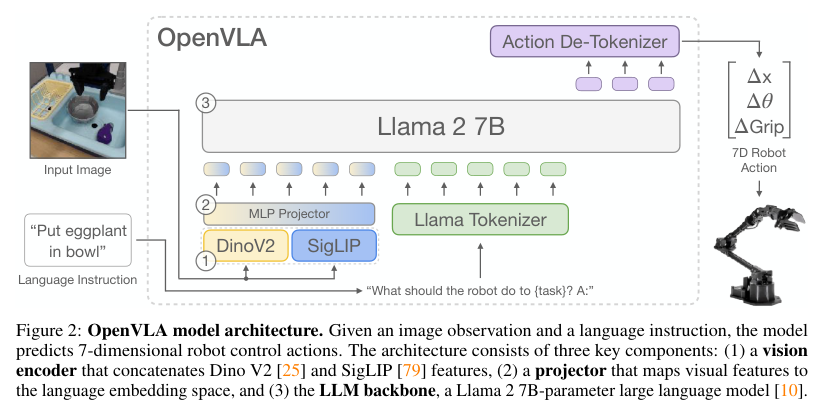
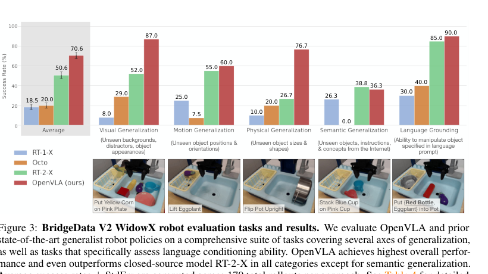
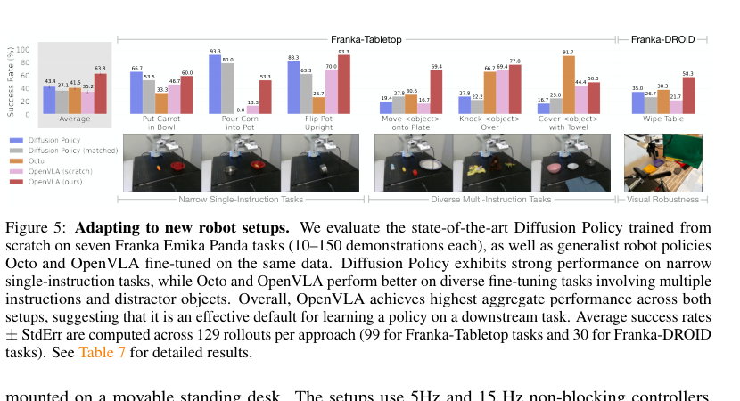

# OpenVLA: An Open-Source Vision-Language-Action Model

## 基本信息

- 作者 / 机构：Moo Jin Kim、Karl Pertsch、Siddharth Karamcheti 等；Stanford University、UC Berkeley、Toyota Research Institute、Google DeepMind、Physical Intelligence、MIT。
- 年份 / 会议：2024，Proceedings of the 8th Conference on Robot Learning（CoRL 2024）。
- 论文链接：https://arxiv.org/abs/2406.09246
- 原文 PDF：[OpenVLA - An Open-Source Vision-Language-Action Model.pdf](../sources/OpenVLA%20-%20An%20Open-Source%20Vision-Language-Action%20Model.pdf)
- 提取时间：2026-09-25 17:11 CST（Asia/Shanghai）。
- 提取范围：论文 PDF 共 37 页，含附录 A--E；原文 PDF 的 SHA-256 为 `353c37df34458f12f969b14dfd8b77175b727b9cddea7bb891759beddeefe1be`。

## 1. 开源资源

- 项目主页：https://openvla.github.io/
- 官方 GitHub：https://github.com/openvla/openvla
- 模型权重：https://huggingface.co/openvla/openvla-7b
- 数据：[Open X-Embodiment](https://robotics-transformer-x.github.io/)；本文训练混合的组成与权重见原文附录 A 表 3。
- 文档：官方 GitHub README 中提供推理、LoRA 微调、全参数微调、从头训练和评测说明。
- 资源说明：论文称其发布模型 checkpoint、部署与微调 notebook，以及可扩展训练 VLA 的 PyTorch 代码库。官方模型卡说明 `openvla-7b` 为论文的旗舰模型；模型使用仍受底层基础模型许可约束。

## 2. 摘要

### 原文

Large policies pretrained on a combination of Internet-scale vision-language data and diverse robot demonstrations have the potential to change how we teach robots new skills: rather than training new behaviors from scratch, we can fine-tune such vision-language-action (VLA) models to obtain robust, generalizable policies for visuomotor control. Yet, widespread adoption of VLAs for robotics has been challenging as 1) existing VLAs are largely closed and inaccessible to the public, and 2) prior work fails to explore methods for efficiently fine-tuning VLAs for new tasks, a key component for adoption. Addressing these challenges, we introduce OpenVLA, a 7B-parameter open-source VLA trained on a diverse collection of 970k real-world robot demonstrations. OpenVLA builds on a Llama 2 language model combined with a visual encoder that fuses pretrained features from DINOv2 and SigLIP. As a product of the added data diversity and new model components, OpenVLA demonstrates strong results for generalist manipulation, outperforming closed models such as RT-2-X (55B) by 16.5% in absolute task success rate across 29 tasks and multiple robot embodiments, with 7x fewer parameters. We further show that we can effectively fine-tune OpenVLA for new settings, with especially strong generalization results in multi-task environments involving multiple objects and strong language grounding abilities, and outperform expressive from-scratch imitation learning methods such as Diffusion Policy by 20.4% We also explore compute efficiency; as a separate contribution, we show that OpenVLA can be fine-tuned on consumer GPUs via modern low-rank adaptation methods and served efficiently via quantization without a hit to downstream success rate. Finally, we release model checkpoints, fine-tuning notebooks, and our PyTorch codebase with built-in support for training VLAs at scale on Open X-Embodiment datasets.

### 中文翻译

在互联网规模视觉-语言数据和多样化机器人示范的组合上预训练的大型策略，有可能改变我们教机器人学习新技能的方式：与其从头训练新行为，我们可以微调这类视觉-语言-动作（VLA）模型，从而获得用于视觉运动控制的稳健、可泛化策略。然而，VLA 在机器人领域的广泛采用一直颇具挑战，原因在于：1）现有 VLA 大多是闭源的，公众无法获得；2）先前工作未探索为新任务高效微调 VLA 的方法，而这正是采用的关键组成部分。为应对这些挑战，我们提出 OpenVLA：一个参数量为 7B 的开源 VLA，在由 97 万条真实机器人示范构成的多样化集合上训练。OpenVLA 建立在一个 Llama 2 语言模型与一个融合 DINOv2 和 SigLIP 预训练特征的视觉编码器之上。新增的数据多样性和新的模型组件带来了通用操作方面的强劲结果：OpenVLA 跨 29 个任务和多个机器人本体，以少 7 倍的参数量，在绝对任务成功率上比 RT-2-X（55B）等闭源模型高 16.5%。我们进一步表明，可以将 OpenVLA 有效微调到新设置；它在涉及多个物体且具有很强语言落地能力的多任务环境中，表现出尤其强的泛化结果，并且比从头训练的高表达力模仿学习方法（如 Diffusion Policy）高 20.4%。我们还探索了计算效率；作为一项单独的贡献，我们表明，OpenVLA 可以通过现代低秩适配方法在消费级 GPU 上微调，并可通过量化高效地提供服务，而下游成功率不会受损。最后，我们发布模型 checkpoint、微调 notebook，以及内置在 Open X-Embodiment 数据集上规模化训练 VLA 支持的 PyTorch 代码库。

## 3. 引言

### 原文

A key weakness of learned policies for robotic manipulation is their inability to generalize beyond their training data: while existing policies trained for individual skills or language instructions have the capacity to extrapolate behaviors to new initial conditions such as object positions or lighting [2, 3], they lack robustness to scene distractors or novel objects [4, 5] and struggle to execute unseen task instructions [6, 7]. Yet beyond robotics, existing foundation models for vision and language such as CLIP [8], SigLIP [9], and Llama 2 [10] are capable of these types of generalization and more, stemming from the priors captured by their Internet-scale pretraining datasets. While reproducing this scale of pretraining for robotics is still an open challenge—even the largest robot manipulation datasets [1, 11] only have 100K to 1M examples—this imbalance suggests an opportunity: using existing foundation models for vision and language as a core building block for training robotic policies that can generalize to objects, scenes, and tasks beyond their training data.

Towards this goal, existing work has explored integrating pretrained language and vision-language models for robotic representation learning [12--14] and as a component in modular systems for task planning and execution [15, 16]. More recently, they have been used for directly learning vision-language-action models [VLAs; 1, 7, 17, 18] for control. VLAs provide a direct instantiation of using pretrained vision-and-language foundation models for robotics, directly fine-tuning visually-conditioned language models (VLMs) such as PaLI [19, 20] to generate robot control actions. By building off of strong foundation models trained on Internet-scale data, VLAs such as RT-2 [7] demonstrate impressive robustness results, as well as an ability to generalize to novel objects and tasks, setting a new standard for generalist robot policies. Yet, there are two key reasons preventing the widespread use of existing VLAs: 1) current models [1, 7, 17, 18] are closed, with limited visibility into model architecture, training procedures, and data mixture, and 2) existing works do not provide best practices for deploying and adapting VLAs to new robots, environments, and tasks—especially on commodity hardware (e.g., consumer-grade GPUs). We argue that to develop a rich foundation for future research and development, robotics needs open-source, generalist VLAs that support effective fine-tuning and adaptation, akin to the existing ecosystem around open-source language models [21--24].

To this end, we introduce OpenVLA, a 7B-parameter open-source VLA that establishes a new state of the art for generalist robot manipulation policies. OpenVLA consists of a pretrained visually-conditioned language model backbone that captures visual features at multiple granularities, fine-tuned on a large, diverse dataset of 970k robot manipulation trajectories from the Open-X Embodiment [1] dataset—a dataset that spans a wide range of robot embodiments, tasks, and scenes. As a product of increased data diversity and new model components, OpenVLA outperforms the 55B-parameter RT-2-X model [1, 7], the prior state-of-the-art VLA, by 16.5% absolute success rate across 29 evaluation tasks on the WidowX and Google Robot embodiments. We additionally investigate efficient fine-tuning strategies for VLAs, a new contribution not explored in prior work, across 7 diverse manipulation tasks spanning behaviors from object pick-and-place to cleaning a table. We find that fine-tuned OpenVLA policies clearly outperform fine-tuned pretrained policies such as Octo [5]. Compared to from-scratch imitation learning with diffusion policies [3], fine-tuned OpenVLA shows substantial improvement on tasks involving grounding language to behavior in multi-task settings with multiple objects. Following these results, we are the first to demonstrate the effectiveness of compute-efficient fine-tuning methods leveraging low-rank adaptation [LoRA; 26] and model quantization [27] to facilitate adapting OpenVLA models on consumer-grade GPUs instead of large server nodes without compromising performance. As a final contribution, we open-source all models, deployment and fine-tuning notebooks, and the OpenVLA codebase for training VLAs at scale, with the hope that these resources enable future work exploring and adapting VLAs for robotics.

### 中文翻译

用于机器人操作的学习策略的一个关键弱点，是它们无法泛化到训练数据之外：尽管为单个技能或语言指令训练的现有策略，具备将行为外推到诸如物体位置或光照等新初始条件的能力 [2, 3]，但它们对场景干扰物或新物体缺乏稳健性 [4, 5]，并且难以执行未见的任务指令 [6, 7]。但在机器人领域之外，现有的视觉和语言基础模型，如 CLIP [8]、SigLIP [9] 和 Llama 2 [10]，能够完成这些类型的泛化以及更多任务，这源自其互联网规模预训练数据集所捕获的先验。尽管在机器人领域复现这一规模的预训练仍是一个开放挑战——即便最大的机器人操作数据集 [1, 11] 也只有 10 万到 100 万个样本——这种不平衡表明了一个机会：将现有的视觉和语言基础模型作为训练机器人策略的核心构建模块，使其能够泛化到训练数据之外的物体、场景和任务。

朝着这一目标，已有工作探索了将预训练语言模型和视觉-语言模型整合用于机器人表征学习 [12--14]，以及将其作为任务规划和执行的模块化系统中的组成部分 [15, 16]。最近，它们被用于直接学习用于控制的视觉-语言-动作模型 [VLA；1, 7, 17, 18]。VLA 直接体现了将预训练视觉和语言基础模型用于机器人的方式：直接微调 PaLI [19, 20] 等视觉条件语言模型（VLM），以生成机器人控制动作。以在互联网规模数据上训练的强大基础模型为基础，RT-2 [7] 等 VLA 展示了令人瞩目的稳健性结果，以及对新物体和新任务进行泛化的能力，为通用机器人策略设立了新标准。然而，现有 VLA 的广泛使用受到两个关键原因的阻碍：1）当前模型 [1, 7, 17, 18] 是闭源的，对模型架构、训练程序和数据混合的可见性有限；2）现有工作没有提供将 VLA 部署和适配到新机器人、环境和任务的最佳实践，尤其是在通用硬件上（例如消费级 GPU）。我们认为，为了为未来研究和开发打下丰富的基础，机器人领域需要支持有效微调和适配的开源通用 VLA，类似于现有开源语言模型周围的生态系统 [21--24]。

为此，我们提出 OpenVLA，一个参数量为 7B 的开源 VLA，它为通用机器人操作策略建立了新的最先进水平。OpenVLA 由一个预训练的视觉条件语言模型骨干组成，该骨干捕获多个粒度的视觉特征；它在来自 Open-X Embodiment [1] 数据集的大型、多样化的 97 万条机器人操作轨迹数据集上微调，该数据集覆盖了广泛的机器人本体、任务和场景。由于数据多样性的增加和新的模型组件，OpenVLA 在 WidowX 和 Google Robot 本体上的 29 个评测任务中，以 16.5% 的绝对成功率超过了先前最先进的 VLA、参数量为 55B 的 RT-2-X 模型 [1, 7]。我们还在从抓取放置到擦桌子的 7 个多样化操作任务上，研究 VLA 的高效微调策略，这是先前工作未探索的新贡献。我们发现，微调后的 OpenVLA 策略明显优于 Octo [5] 等微调后的预训练策略。与使用 diffusion policy 从头进行的模仿学习 [3] 相比，微调后的 OpenVLA 在多物体多任务设置中、涉及将语言落地为行为的任务上表现出显著提升。在这些结果之后，我们首次展示了利用低秩适配 [LoRA；26] 和模型量化 [27] 的计算高效微调方法的有效性，以便在消费级 GPU 而不是大型服务器节点上适配 OpenVLA 模型，同时不损害性能。作为最后一项贡献，我们开源全部模型、部署和微调 notebook，以及用于规模化训练 VLA 的 OpenVLA 代码库，希望这些资源能够支持未来探索和适配用于机器人的 VLA 的工作。

## 4. 创新点与贡献

以下为论文在摘要、引言和方法部分明确提出的贡献：

1. 提出 7B 参数的开源通用 VLA OpenVLA，在 97 万条 Open X-Embodiment 真实机器人轨迹上训练，并公开模型、代码、部署与微调资源。
2. 将 Prismatic-7B VLM 用作骨干：视觉侧融合 DINOv2 与 SigLIP，语言侧为 Llama 2；将连续机器人动作映射到语言模型词表中的动作 token，直接以 VLM 的 next-token 目标预测动作。
3. 在 WidowX 和 Google Robot 两种本体、共 29 个任务上评测；论文报告 OpenVLA 比 RT-2-X 高 16.5 个绝对成功率百分点，参数量为后者的约七分之一。
4. 系统评估迁移到新机器人和新任务的微调：在 7 个 Franka 任务、每项 10--150 条示范上，与 Diffusion Policy、Octo 和未经过 OpenX 机器人预训练的基线比较。
5. 评估低成本适配和部署：LoRA 只训练 1.4% 参数且性能接近全参数微调；4-bit 量化保持与 bfloat16 相近的实机成功率，同时将推理显存降至 7.0 GB。

## 5. 核心方法

### 5.1 模型结构

OpenVLA 以 Prismatic-7B 为视觉条件语言模型骨干。视觉编码器由预训练的 DINOv2 与 SigLIP 组成；输入图像 patch 分别通过两个编码器，特征在通道维拼接。一个两层 MLP projector 将视觉特征映射到语言嵌入空间；语言模型骨干为 Llama 2 7B。给定一张图像观察和一条语言指令，模型输出 7 维机器人控制动作（平移变化、旋转变化与夹爪）。

*图 2 原文图注：OpenVLA model architecture. Given an image observation and a language instruction, the model predicts 7-dimensional robot control actions. The architecture consists of three key components: (1) a vision encoder that concatenates Dino V2 and SigLIP features, (2) a projector that maps visual features to the language embedding space, and (3) the LLM backbone, a Llama 2 7B-parameter large language model [10]。*

*中文：给定图像观察和语言指令，模型预测 7 维机器人控制动作。结构包含三个组成部分：(1) 拼接 DINOv2 与 SigLIP 特征的视觉编码器；(2) 将视觉特征映射到语言嵌入空间的投影器；(3) Llama 2 7B 大语言模型骨干 [10]。*

### 5.2 动作 token 化与训练目标

- 将输入图像和自然语言任务指令视作“视觉-语言”输入，将连续机器人动作表示为语言模型输出空间中的离散 token 序列。
- 每一个动作维度独立离散为 256 个 bin。bin 的范围取训练动作该维度的第 1 至第 99 分位数；作者以此忽略极端离群动作，避免 min-max 范围过大而降低离散粒度。
- Llama tokenizer 预留的新 special token 少于 256 个，因此作者将词表中使用频率最低的 256 个 token（词表末尾的 256 个）改作动作 token。
- 对得到的 $N$ 个动作 token，用标准 next-token prediction 目标训练，但交叉熵只在预测动作 token 上计算。

### 5.3 训练数据与设计选择

训练数据来自 Open X-Embodiment。作者先限制为至少有一个第三人称相机、单臂末端执行器控制的操作数据集，再使用 Octo [5] 的数据混合权重平衡本体、任务和场景。最终训练集为 97 万条轨迹；附录 A 表 3 列出 Fractal、Kuka、Bridge、Taco Play、Jaco Play、Roboturk、Language Table、FurnitureBench、BC-Z、FMB、DROID 等组件。DROID 初始按 10% 权重加入，但作者报告其动作 token 准确率持续较低，因此在最后三分之一训练中移除并把权重重新分配给其余数据集。

在 BridgeData V2 上的小规模探索中，作者报告：

- 选用融合 DINOv2-SigLIP 的 Prismatic VLM；它比 LLaVA 在单物体和多物体语言落地任务上约高 10 个绝对成功率百分点。
- 输入分辨率从 $224\times224$ 提至 $384\times384$ 未带来评测差异，后者训练时间约为 3 倍，因此最终使用 $224\times224$。
- VLA 训练中微调视觉编码器对性能至关重要；冻结视觉编码器会明显降低表现。
- 最终训练运行穿过训练数据 27 个 epoch，固定学习率为 $2\times10^{-5}$，未使用 warmup。

### 5.4 训练与推理基础设施

最终模型以 batch size 2,048 在 64 张 A100 GPU 上训练 14 天，共 21,500 A100-hours。推理时，bfloat16 权重约需 15 GB GPU 内存；在单张 RTX 4090 上的未编译、未使用 speculative decoding 的速度约为 6 Hz。代码库使用 PyTorch AMP、FlashAttention、FSDP，支持 Open X 数据、Hugging Face `AutoModel`、LoRA 微调与量化推理，并提供远程 VLA 推理服务器。

## 6. 数据集与框架

### 数据集

| 名称 | 用途 | 规模 / 版本 | 链接 |
|---|---|---|---|
| Open X-Embodiment | OpenVLA 机器人动作预训练；本文由其中多个数据集构成混合 | 最终使用 970k 真实机器人轨迹；原始集合在论文写作时含 70 余个数据集和 200 万余条轨迹 | https://robotics-transformer-x.github.io/ |
| BridgeData V2 | 小规模设计选择；WidowX 直接评测；量化评测 | 直接评测 17 个任务、每个方法 170 次 rollout | 原文 [6] |
| DROID | 初始训练混合及 Franka-DROID 下游微调评测 | 初始混合权重 10%，最终训练最后三分之一移除；Franka 微调任务之一 | 原文 [11] |
| Franka-Tabletop | 下游微调评测 | 7 个下游任务的一部分；每任务 10--150 条示范 | 原文第 5.2 节 |
| LIBERO | 附录 E 仿真微调 | Spatial、Object、Goal、Long 四个 suite；每个 suite 10 任务、每任务初始 50 条人类遥操作示范 | 原文 [116] |

### 模型与框架

| 名称 | 用途 | 版本 / 规模 | 官方链接 |
|---|---|---|---|
| OpenVLA | 本文提出的 VLA | 7B 参数 | https://github.com/openvla/openvla |
| Prismatic-7B | OpenVLA 的预训练 VLM 骨干 | 600M 视觉编码器、2 层 MLP projector、Llama 2 7B | 原文 [44] |
| DINOv2 + SigLIP | 融合视觉编码器 | 分别提供空间与语义视觉特征 | 原文 [25, 79] |
| Llama 2 | 语言模型骨干与动作 token 预测器 | 7B | 原文 [10] |
| PyTorch / FSDP / FlashAttention | 训练基础设施 | AMP、分片数据并行、注意力加速 | 原文第 4 节 |
| Hugging Face Transformers / PEFT | 模型加载与 LoRA 微调接口 | 代码库集成 | https://github.com/openvla/openvla |

## 7. 实验

### 实验设置

论文围绕三个问题评估：多机器人零样本控制是否优于既有通用策略；是否能高效微调到新本体和任务；参数高效微调与量化会带来怎样的性能-计算权衡。

- **直接评测**：在 BridgeData V2 WidowX（17 个任务，每法 170 次 rollout）及 Google Robot（12 个任务，每法 60 次 rollout）上，覆盖视觉、运动、物理、语义泛化和语言条件能力。比较对象为 RT-1-X（35M）、Octo（93M）与闭源 RT-2-X（55B）。
- **下游微调**：Franka-Tabletop 和 Franka-DROID 两种平台；用 10--150 条示范微调 7 个任务。比较 Diffusion Policy、输入输出规格匹配的 Diffusion Policy、Octo、OpenVLA（scratch）和预训练 OpenVLA。
- **参数高效微调**：比较全参数、仅最后一层、冻结视觉、sandwich fine-tuning 和 LoRA；在所选 Franka-Tabletop 任务上每种方法 33 次 rollout。
- **量化**：在 8 个 BridgeData V2 代表性任务上，每种精度 80 次 rollout，比较 bfloat16、int8 与 int4。
- **仿真**：附录 E 在 LIBERO 的四个 task suite 上比较从头训练 Diffusion Policy、微调 Octo 和 LoRA 微调 OpenVLA；每个 suite 每种方法报告三随机种子、每种子 500 次评测的均值。

### 主要结果与图表

*图 3 原文图注：BridgeData V2 WidowX robot evaluation tasks and results. We evaluate OpenVLA and prior state-of-the-art generalist robot policies on a comprehensive suite of tasks covering several axes of generalization, as well as tasks that specifically assess language conditioning ability. OpenVLA achieves highest overall performance and even outperforms closed-source model RT-2-X in all categories except for semantic generalization. Average success rates ± StdErr are computed across 170 total rollouts per approach. See Table 4 for detailed results。*

*中文：在 BridgeData V2 WidowX 上，作者用涵盖多个泛化维度及语言条件能力的任务套件比较 OpenVLA 与既有通用机器人策略。除语义泛化外，OpenVLA 在各类别及总体表现上均超过 RT-2-X；每种方法的平均成功率及标准误来自 170 次 rollout。*

图 3 的直接评测结果如下，数值为成功率（%）：

| 类别 | RT-1-X | Octo | RT-2-X | OpenVLA |
|---|---:|---:|---:|---:|
| 平均 | 18.5 | 20.0 | 50.6 | 70.6 |
| 视觉泛化 | 8.0 | 29.0 | 52.0 | 87.0 |
| 运动泛化 | 25.0 | 7.5 | 55.0 | 60.0 |
| 物理泛化 | 10.0 | 20.0 | 26.7 | 76.7 |
| 语义泛化 | 26.3 | 0.0 | 38.8 | 36.3 |
| 语言条件 | 30.0 | 40.0 | 85.0 | 90.0 |

作者报告，在 Google Robot 评测中 OpenVLA 与 RT-2-X 的总体表现相当；在 BridgeData V2 上 OpenVLA 明显领先。论文将差异归因于更大的训练数据混合（OpenVLA 的 970k 轨迹，对比 RT-2-X 的 350k）、对数据的清理，以及融合语义和空间特征的视觉编码器。

*图 5 原文图注：Adapting to new robot setups. We evaluate the state-of-the-art Diffusion Policy trained from scratch on seven Franka Emika Panda tasks (10--150 demonstrations each), as well as generalist robot policies Octo and OpenVLA fine-tuned on the same data. Diffusion Policy exhibits strong performance on narrow single-instruction tasks, while Octo and OpenVLA perform better on diverse fine-tuning tasks involving multiple instructions and distractor objects. Overall, OpenVLA achieves highest aggregate performance across both setups, suggesting that it is an effective default for learning a policy on a downstream task. Average success rates ± StdErr are computed across 129 rollouts per approach (99 for Franka-Tabletop tasks and 30 for Franka-DROID tasks).*

*中文：作者在 7 个 Franka Emika Panda 任务上，以每项 10--150 条示范比较从头训练的 Diffusion Policy 以及在相同数据上微调的 Octo 和 OpenVLA。Diffusion Policy 在较窄的单指令任务中表现较强；Octo 和 OpenVLA 在包含多条指令和干扰物的多样化微调任务中更好。两种设置汇总后 OpenVLA 表现最高；每种方法的平均成功率及标准误来自 129 次 rollout，其中 Franka-Tabletop 为 99 次、Franka-DROID 为 30 次。*

图 5 中，平均成功率依次为 Diffusion Policy 43.3%、匹配规格的 Diffusion Policy 37.1%、Octo 41.5%、OpenVLA（scratch）35.2%、OpenVLA 63.8%。论文指出，完整 OpenVLA 是唯一在全部所测任务上都至少达到 50% 成功率的方法；对于较窄但高度灵巧的任务，Diffusion Policy 的轨迹仍更平滑、更精确。

### 消融及其他实验

**参数高效微调（表 1）**：全参数微调成功率为 $69.7\pm7.2\%$，训练 7,188.1M 参数，batch 16 时需 163.3 GB VRAM（跨两张 GPU 用 FSDP 分片）。LoRA rank 32 达到 $68.2\pm7.5\%$，仅训练 97.6M 参数（1.4%），需 59.7 GB；rank 64 同为 $68.2\pm7.8\%$，需 60.5 GB。作者因此推荐默认 $r=32$，并报告单张 A100 上可在 10--15 小时内完成一次任务微调。仅调最后层和冻结视觉编码器的成功率分别为 $30.3\pm6.1\%$ 与 $47.0\pm6.9\%$；sandwich fine-tuning 为 $62.1\pm7.9\%$。

**量化推理（表 2）**：bfloat16 的 Bridge 成功率为 $71.3\pm4.8\%$，显存 16.8 GB；int8 为 $58.1\pm5.1\%$，显存 10.2 GB；int4 为 $71.9\pm4.7\%$，显存 7.0 GB。作者报告 int8 在 A5000 上仅 1.2 Hz，速度较低改变了非阻塞控制系统的动态；int4 在该 GPU 上约 3 Hz，因此保持了与 bfloat16 相近的实机结果。附录 D.4 使用阻塞控制后，三种精度的成功率误差条重叠，支持上述“性能下降来自推理速度”的解释。

**LIBERO 仿真（附录 E，表 12）**：OpenVLA 的四个 suite 平均成功率为 $76.5\pm0.6\%$、平均排名 1.5；Octo 为 $75.1\pm0.6\%$、排名 2；Diffusion Policy 为 $72.4\pm0.7\%$、排名 2.5。按 suite，OpenVLA 在 Spatial 为 $84.7\pm0.9\%$、Long 为 $53.7\pm1.3\%$，均列第一；Object 与 Goal 分别为 $88.4\pm0.8\%$、$79.2\pm1.0\%$。作者称，预训练方法在仿真中的领先幅度小于真实世界微调，并将其与纯真实机器人数据预训练造成的仿真-真实域差相关联。

## 8. 局限与结论

论文列出以下局限：

- 当前模型仅支持单图像观察，尚未覆盖多相机、proprioception 与观察历史等异构传感输入。
- 推理吞吐仍限制其用于如 ALOHA（50 Hz）等高频控制设置，也限制了对更灵巧的双臂操作任务的测试；动作 chunking 与 speculative decoding 是文中提出的可能方向。
- 在所测真实任务上，模型通常仍未达到 90% 以上成功率。
- 由于计算限制，基础 VLM 尺寸、机器人动作数据与互联网视觉-语言数据的联合训练、最适合 VLA 的视觉特征等问题仍未充分探索。

论文结论是：OpenVLA 是一个开源、跨本体、可直接使用并可通过参数高效方法适配的 VLA；作者通过开放模型与训练代码，希望支持后续对 VLA 训练、数据混合、目标函数和推理的研究。

## 9. 重要参考文献

| 原文编号 | 文献 | 本文中的引用用途 | 论文 / 代码链接 |
|---|---|---|---|
| [1] | Open X-Embodiment Collaboration et al. *Open X-Embodiment: Robotic Learning Datasets and RT-X Models* (2023) | 预训练数据来源；RT-X/RT-2-X 对比背景 | https://arxiv.org/abs/2310.08864 |
| [3] | Chi et al. *Diffusion Policy: Visuomotor Policy Learning via Action Diffusion* (RSS 2023) | 从头训练的模仿学习对比基线 | https://arxiv.org/abs/2303.04137 |
| [5] | Octo Model Team et al. *Octo: An Open-Source Generalist Robot Policy* (2023) | 开源通用机器人策略基线；数据混合权重来源 | https://octo-models.github.io/ |
| [7] | Brohan et al. *RT-2: Vision-Language-Action Models Transfer Web Knowledge to Robotic Control* (2023) | VLA 方法与动作 token 化的直接先行工作；RT-2-X 对比 | https://arxiv.org/abs/2307.15818 |
| [10] | Touvron et al. *Llama 2: Open Foundation and Fine-Tuned Chat Models* (2023) | OpenVLA 的 7B 语言模型骨干及 tokenizer | https://arxiv.org/abs/2307.09288 |
| [25] | Oquab et al. *DINOv2: Learning Robust Visual Features without Supervision* (2023) | 融合视觉编码器的空间特征组件 | https://arxiv.org/abs/2304.07193 |
| [26] | Hu et al. *LoRA: Low-Rank Adaptation of Large Language Models* (2021) | 参数高效微调方法 | https://arxiv.org/abs/2106.09685 |
| [27] | Dettmers et al. *QLoRA: Efficient Finetuning of Quantized LLMs* (NeurIPS 2023) | 低比特量化与高效适配的依据 | https://arxiv.org/abs/2305.14314 |
| [44] | Karamcheti et al. *Prismatic VLMs: Investigating the Design Space of Visually-Conditioned Language Models* (2024) | OpenVLA 的预训练 VLM 骨干 | https://arxiv.org/abs/2402.07865 |
| [79] | Zhai et al. *Sigmoid Loss for Language Image Pre-Training* (ICCV 2023) | 融合视觉编码器的语义特征组件 | https://arxiv.org/abs/2303.15343 |
| [116] | Liu et al. *LIBERO: Benchmarking Knowledge Transfer for Lifelong Robot Learning* (NeurIPS 2023) | 附录中的仿真微调与评测基准 | https://arxiv.org/abs/2306.03310 |
