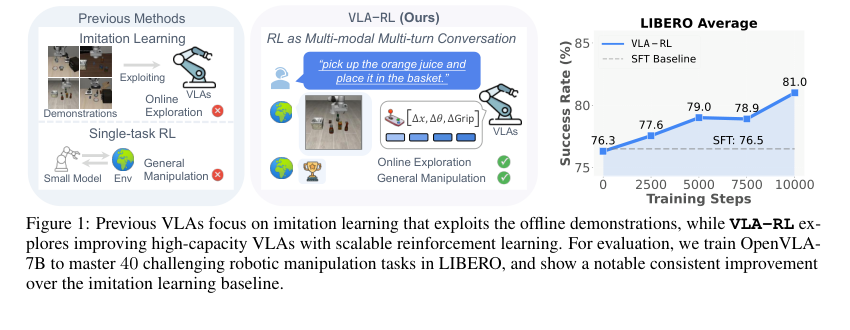

# VLA-RL: Towards Masterful and General Robotic Manipulation with Scalable Reinforcement Learning

## 基本信息

- 作者 / 机构：Guanxing Lu、Wenkai Guo、Chubin Zhang、Yuheng Zhou、Haonan Jiang、Zifeng Gao、Yansong Tang、Ziwei Wang；Tsinghua University、Nanyang Technological University。
- 年份 / 会议：2025，arXiv preprint。
- 论文链接：https://arxiv.org/abs/2505.18719
- 原文 PDF：[VLA-RL - Towards Masterful and General Robotic Manipulation with Scalable Reinforcement Learning.pdf](../sources/VLA-RL%20-%20Towards%20Masterful%20and%20General%20Robotic%20Manipulation%20with%20Scalable%20Reinforcement%20Learning.pdf)
- 提取范围：PDF 共 15 页，包含正文与参考文献；SHA-256：`8016399c5af6084fde140d8744df0a49248f69e4af207b15f5b90049f06c056a`。

## 1. 开源资源

- 官方 GitHub：https://github.com/GuanxingLu/vlarl
- 模型与数据：基于 OpenVLA-7B，在 LIBERO 评测；原文未列出单独权重地址。

## 2. 摘要

### 原文

Recent high-capacity vision-language-action (VLA) models have demonstrated impressive performance on a range of robotic manipulation tasks by imitating human demonstrations. However, exploiting offline data with limited visited states will cause execution failure in out-of-distribution scenarios. Intuitively, an exploration-based method that improves on online collected data at test time could address this limitation. We present VLA-RL, an algorithmic and systematic framework that leverages online reinforcement learning (RL) to improve pretrained auto-regressive VLAs in downstream tasks. Within a unified perspective, we first introduce a trajectory-level RL formulation for auto-regressive VLA training, which models general robotic manipulation trajectory as multi-modal multi-turn conversation. To address the challenge of sparse rewards, we fine-tune a pretrained vision-language model as a robotic process reward model, which is trained on pseudo reward labels annotated on automatically extracted task segments. To scale up, we identify several implementation findings that improve the stability and efficiency including curriculum selection strategy, GPU-balanced vectorized environments, batch decoding, and critic warmup. VLA-RL enables OpenVLA-7B to surpass the strongest finetuned baseline by 4.5% on 40 challenging robotic manipulation tasks in LIBERO, and even matches the performance of advanced commercial models such as π0-FAST.

### 中文翻译

近期高容量视觉-语言-动作（VLA）模型通过模仿人类示范，已在一系列机器人操作任务上展示出令人印象深刻的性能。然而，利用访问状态有限的离线数据，会导致在分布外场景中的执行失败。直观而言，一种在测试时利用在线收集数据进行改进、以探索为基础的方法，可以解决这一限制。我们提出 VLA-RL：一个利用在线强化学习（RL）改进预训练自回归 VLA 下游任务表现的算法与系统框架。从统一视角出发，我们首先为自回归 VLA 训练引入轨迹级 RL 表述，将通用机器人操作轨迹建模为多模态多轮对话。为解决稀疏奖励的挑战，我们将预训练视觉-语言模型微调为机器人过程奖励模型；它在自动提取的任务片段上标注的伪奖励标签上训练。为实现扩展，我们识别出若干可提升稳定性和效率的实现发现，包括课程选择策略、GPU 均衡的向量化环境、批量解码和 critic warmup。VLA-RL 使 OpenVLA-7B 在 LIBERO 的 40 个困难机器人操作任务上比最强微调基线高 4.5%，并且可与 π0-FAST 等先进商业模型的性能相匹配。

## 3. 引言

### 原文

Large foundation models pretrained on internet-scale datasets have demonstrated effectiveness across a variety of domains, such as text [56, 13, 17], image [79, 74, 81, 80], video [87, 73], and audio [14]. Recently, large vision-language-action (VLA) models [9, 8, 68, 39, 44, 35, 36, 19, 6, 7, 57, 32] have been proposed by imitating large-scale human demonstrations [15, 20, 58, 52, 35, 23, 16, 10, 33, 18, 72, 6, 37], which indicates a possible pathway towards generalist robots that can perform diverse manipulation tasks. However, exploiting offline data with limited visited states will cause execution failure in Out-of-Domain (OOD) scenarios at test time.

We believe the key to overcoming such challenges lies in transforming exploitation-based approaches into exploration-based methods, as exemplified by Reinforcement Learning (RL) [63]. Recent breakthroughs witnessed in applying RL to large language models (LLMs) have shown remarkable progress [17, 82, 47, 31], where the scaling benefits from imitation pretraining on offline web data are approaching their limits. Consequently, reinforcement learning has emerged as a promising paradigm for achieving test-time scaling improvements by training on online collected data with unlimited state coverage. It is natural to ask: *can we achieve similar RL-based test-time scaling benefits in the field of robotic manipulation?*

On the other hand, many efforts have been proposed to apply RL to robotics [66]. However, traditional RL from scratch often suffers from data inefficiency and requires extensive reward engineering [2, 29, 85, 91]. Thus, previous works focus on simple domains, with low-dimensional state spaces [60, 24, 54] and small-scale network architecture (e.g. MLP) [60, 70, 1, 50, 51], single-task learning [92, 40]. In contrast, fine-tuning from large robotics foundation models with rich representational knowledge may significantly reduce the search space and enable the model to learn complex motion patterns, making training on general tasks and environments possible.

We explore this question through a systematic study. To efficiently implement scalable RL training, we present **VLA-RL**, a unified framework that leverages online RL to improve pretrained auto-regressive VLAs. Specifically, within a unified perspective, we first introduce a general RL formulation for auto-regressive VLA training, which models general robotic manipulation trajectory as multi-modal multi-turn conversation. To address challenges associated with sparse rewards in the expansive robot action space, we instantiate a robotic process reward model as vision-language model finetuned on automatically extracted pseudo reward labels. Based on VLA-RL, we identify systematic implementation improvements, including task selection, GPU-balanced environments, batch decoding, and critic warmup—to enhance stability and efficiency. Empirically, we adopt OpenVLA-7B [39] as the base VLA and apply our method to 40 challenging robotic tasks in LIBERO [45]. The results show that VLA-RL improves the base model by a large margin of 4.5% and even matches the performance of advanced commercial models such as π0-FAST [57]. Furthermore, VLA-RL’s performance consistently improves with increased test-time computation, suggesting preliminary evidence of inference scaling laws [64] in robotics.

### 中文翻译

在互联网规模数据集上预训练的大型基础模型，已在文本 [56, 13, 17]、图像 [79, 74, 81, 80]、视频 [87, 73] 和音频 [14] 等多种领域显示出有效性。最近，大型视觉-语言-动作（VLA）模型 [9, 8, 68, 39, 44, 35, 36, 19, 6, 7, 57, 32] 通过模仿大规模人类示范 [15, 20, 58, 52, 35, 23, 16, 10, 33, 18, 72, 6, 37] 被提出，这表明存在一条通向能够执行多样化操作任务的通用机器人的可能路径。然而，利用访问状态有限的离线数据，会导致在测试时的域外（OOD）场景中执行失败。

我们相信，克服这类挑战的关键在于，将基于利用的方法转变为以强化学习（RL）[63] 为例的基于探索的方法。近期将 RL 用于大语言模型（LLM）的突破已显示出显著进展 [17, 82, 47, 31]，其中来自离线网页数据上模仿预训练的扩展收益正接近其极限。因此，强化学习已成为一种有前景的范式：通过在具有无限状态覆盖的在线收集数据上训练，实现测试时扩展改进。一个自然的问题是：*我们能否在机器人操作领域实现类似的、基于 RL 的测试时扩展收益？*

另一方面，已有许多工作尝试将 RL 应用于机器人 [66]。但是，从头开始的传统 RL 往往面临数据效率低的问题，并需要大量奖励工程 [2, 29, 85, 91]。因此，先前工作主要集中于简单领域，使用低维状态空间 [60, 24, 54]、小规模网络架构（例如 MLP）[60, 70, 1, 50, 51] 和单任务学习 [92, 40]。相比之下，从拥有丰富表征知识的大型机器人基础模型开始微调，可能显著缩小搜索空间，并使模型能够学习复杂运动模式，从而使在通用任务和环境上训练成为可能。

我们通过一项系统研究探索这个问题。为高效实施可扩展的 RL 训练，我们提出 **VLA-RL**，一个利用在线 RL 改进预训练自回归 VLA 的统一框架。具体地，在统一视角下，我们首先引入自回归 VLA 训练的一般 RL 表述，将通用机器人操作轨迹建模为多模态、多轮对话。为解决宽广机器人动作空间中的稀疏奖励挑战，我们将机器人过程奖励模型实例化为在自动提取的伪奖励标签上微调的视觉-语言模型。基于 VLA-RL，我们找到了包括任务选择、GPU 均衡环境、批量解码和 critic warmup 在内的系统实现改进，以提高稳定性和效率。在实验上，我们使用 OpenVLA-7B [39] 作为基础 VLA，并将方法应用到 LIBERO [45] 的 40 个困难机器人任务上。结果显示，VLA-RL 将基础模型提高了 4.5%，甚至与 π0-FAST [57] 等先进商业模型的性能相匹配。此外，随着测试时计算的增加，VLA-RL 的性能持续提高，这为机器人中的推理扩展律 [64] 提供了初步证据。

## 4. 创新点与贡献

1. 将通用机器人操作的轨迹级强化学习表述成多模态、多轮对话：图像与指令构成状态，VLA 输出的 action-token 序列构成一轮动作，并以 token 概率和定义动作序列的对数概率。
2. 提出机器人过程奖励模型（Robotic Process Reward Model, RPRM）。它以自动分段的成功轨迹生成伪奖励标签，将环境的 golden sparse reward 与预测过程奖励相加，解决长时域操作的稀疏奖励问题。
3. 给出可扩展训练系统中的关键设计：以约 50% 成功率任务为中心的课程选择、GPU 均衡向量环境、vLLM 批量解码、LoRA 合并与广播、critic warmup。
4. 使用 OpenVLA-7B 在 LIBERO 的 Spatial、Object、Goal、Long 四个 suite（共 40 任务）验证。论文报告平均成功率 81.0%，比 OpenVLA(SFT) 高 4.5 个百分点；经 48 GPU-hours 的 RL 后达到 π0-FAST 的平均水平。
5. 分析训练动态、测试时优化、动作覆盖与具体 rollout；论文将持续上升的 suite 成功率视为机器人中推理扩展律的早期证据。

## 5. 核心方法

*图 1 原文图注：Previous VLAs focus on imitation learning that exploits the offline demonstrations, while VLA-RL explores improving high-capacity VLAs with scalable reinforcement learning. For evaluation, we train OpenVLA-7B to master 40 challenging robotic manipulation tasks in LIBERO, and show a notable consistent improvement over the imitation learning baseline.*

*中文：既有 VLA 聚焦于利用离线示范的模仿学习；VLA-RL 探索使用可扩展强化学习提升高容量 VLA。评测中，作者训练 OpenVLA-7B 掌握 LIBERO 的 40 个困难操作任务，并显示出相对模仿学习基线的显著、持续改进。*

### 5.1 问题、策略与多轮对话表述

作者将状态写为 $s=(o,v_{in})\in\mathcal O\times\mathcal V^m$：$o$ 是第三人称相机图像，$v_{in}$ 是人类指令。动作空间是 VLA 产生的输出 token 序列 $\mathcal V^n$；策略为 $\pi_\theta:\mathcal O\times\mathcal V^m\rightarrow\mathcal V^n$。OpenVLA-7B 的核心是 Llama-2-7B，加上 SigLIP 与 DINOv2 双流视觉编码器；每轮输出 $v_{out}\in\mathcal V^n$，后处理函数 $f$ 将其还原为机器人末端执行器动作 $a=f(v_{out})$。

一条动作序列的自回归对数概率分解为：

$$\log\pi_\theta(a_t\mid o_t,v_{in,t})=\sum_{i=1}^{|A|}\log\pi_\theta(v_{out,t,i}\mid o_t,v_{in,t}),\qquad |A|=7.$$

作者以折扣回报 $R_\gamma=\sum_{t=0}^{T}\gamma^t r_t$ 为目标，并用 PPO 优化。其裁剪目标为：

$$L_{\mathrm{PPO}}(\theta)=\mathbb E_t\left[\min\left(\frac{\pi_\theta(a_t\mid o_t,v_{in,t})}{\pi_{\theta_{old}}(a_t\mid o_t,v_{in,t})}\hat A_t,\;\operatorname{clip}\left(\frac{\pi_\theta}{\pi_{\theta_{old}}},1-\epsilon,1+\epsilon\right)\hat A_t\right)\right],$$

其中优势 $\hat A_t$ 由 GAE [61] 计算。作者的 Algorithm 1 指定：并行环境 rollout 时同时记录 token 输出、动作对数概率与 value；环境返回稀疏奖励 $r_{sparse}$，RPRM 返回 $r_{rprm}$，最终奖励为 $r_t=r_{sparse,t}+r_{rprm,t}$；随后用 GAE 和 PPO 更新策略。

### 5.2 机器人过程奖励模型

RPRM 是冻结的视觉-语言模型，训练目标被改写为 next-token prediction。给定状态、动作与指令，模型预测代表“有前景动作”的 reward token，其加权损失为：

$$L_{\mathrm{rprm}}(\phi)=-\mathbb E_t\left[\sum_j\log p_\phi(v_{rprm,t,j}\mid v_{out,t,<j},o_t,v_{in,t})\right].$$

伪标签来自成功轨迹而非额外人工逐步标注。作者先按夹爪开合的显著变化做 milestone segmentation；再在每个子任务内寻找末端执行器速度接近零的关键帧，并给通向这些关键帧的 VLA 动作序列分配正伪奖励。论文将 RPRM 预测奖励直接和环境成功奖励相加，并报告其与实际任务成功率保持强相关。

### 5.3 可扩展系统设计

- **课程选择**：对任务 $j$ 的成功率 $s_j$，按 $P(\mathrm{task}_j)\propto\exp((0.5-s_j)/\tau)$ 采样。其目标是优先选择约 50% 成功率、位于当前能力边界的任务，同时仍保留已掌握与困难任务。
- **critic warmup**：先由模仿预训练策略收集初始轨迹，仅训练 value network 数轮，再开始联合 actor--critic 优化，避免初始不准确 value 误导策略梯度。
- **并行 rollout**：每个训练 GPU 管理一组环境；以 `all_reduce` 汇集环境状态给推理引擎。作者用 bfloat16，1 张 GPU 专用于 vLLM [41] 推理，其余 GPU 用 Ray [53] 学习，并用 FSDP [90] 管理分布式训练。
- **推理实现**：更新的 LoRA 权重合并进原 checkpoint 后广播给推理引擎。作者在 vLLM plugin 中实现 OpenVLA，称此举避免 Hugging Face Transformers 的生成函数在大 batch 下产生错误结果。

## 6. 数据集与框架

| 名称 | 用途 | 规模 / 版本 |
|---|---|---|
| OpenVLA-7B | RL 初始策略 | Llama 2 7B，SigLIP 与 DINOv2 双流视觉编码器；动作由 7 个离散 action token 表示 |
| LIBERO | 训练和评测环境 | Spatial、Object、Goal、Long 四个 suite，各 10 任务，共 40 个语言条件操作任务；每个 suite 的每种方法评测 500 episode |
| 成功轨迹 / RPRM 数据 | 训练过程奖励模型 | 专家示范与先前模型 rollout 中的成功轨迹；按夹爪状态和低末端执行器速度自动抽取子任务、关键帧与正伪标签 |
| Diffusion Policy、Octo、GRAPE(DPO)、π0-FAST | 对比 | Diffusion Policy 从头训练；Octo 为微调 diffusion VLA；GRAPE 使用 DPO；π0-FAST 作为商业自回归模型参考 |

## 7. 实验

### 7.1 主要比较

作者从各 suite 的 SFT OpenVLA-7B checkpoint 开始 RL。评价指标是平均成功率（SR）与按 [39] 计算的平均排名。表 1 的完整数值如下（SR 越高、rank 越低越好）：

| 方法 | Spatial | Object | Goal | Long | 平均 SR | 平均 rank |
|---|---:|---:|---:|---:|---:|---:|
| Diffusion Policy | 78.3 | 92.5 | 68.3 | 50.5 | 72.4 | 4.0 |
| Octo (SFT) | 78.9 | 85.7 | 84.6 | 51.1 | 75.1 | 3.5 |
| OpenVLA (SFT) | 84.7 | 88.4 | 79.2 | 53.7 | 76.5 | 3.5 |
| GRAPE (DPO) | 87.6 | 91.2 | 82.2 | 55.8 | 79.2 | 2.3 |
| π0-FAST | 96.4 | 96.8 | 88.6 | 60.2 | 85.5 | — |
| VLA-RL | **90.2** | 91.8 | 82.2 | **59.8** | **81.0** | **1.5** |

论文据此报告，VLA-RL 分别比 SFT OpenVLA-7B 与 DPO GRAPE 高 4.5 与 1.8 个百分点；正文另称训练约 48 GPU-hours 后已可与 π0-FAST 的表现相匹配，而表 1 给出的最终平均 SR 分别为 81.0% 与 85.5%，各 suite 的提升趋势仍继续上升。

### 7.2 训练动态与测试时优化

图 4 每 2,500 个训练 step 评估一次四个 LIBERO suite；作者报告四个 suite 的成功率均随测试时优化持续改善。图 5 还报告：成功训练时生成 episode 的长度逐渐缩短，表明策略学习到更高效的动作序列；奖励总体上升，课程切换时出现平台期，并与物理成功率强相关；rollout entropy 维持适度并随训练逐步降低。GPU 均衡环境和 vLLM 加速后，环境演化和模型 rollout 的时间显著降低，训练阶段成为主要耗时。

### 7.3 消融

消融在 LIBERO-Spatial 上进行。完整方法为 90.2%；去掉 RPRM 为 85.8%，去掉课程选择为 88.0%，将温度从 1.5 改为 1.0 为 85.8%，将 critic warmup 从 5 step 改为 0 为 80.0%，把学习率从 $2\times10^{-5}$ 改为 $2\times10^{-4}$ 为 0.2%。作者的解释是：RPRM 提供更频繁、信息更丰富的信号；课程选择减小灾难性遗忘；更低温度削弱探索；warmup 提供较准的早期梯度反馈；较大学习率会造成不稳定。

### 7.4 RL 与 SFT 的覆盖与案例

在 LIBERO-Spatial，图 6 将收集动作投影到前两维末端执行器相对位姿的 XY 平面。专家离线动作集中在动作空间中心且含重复运动；RL 动作更均匀地分布在整个空间。图 7 的 LIBERO-Goal 案例任务是“pick up the black bowl on the wooden cabinet and place it on the plate”；文中描述 VLA-RL 成功抓取，而 SFT 基线因在偏离位置尝试抓取而失败。作者将这一观察与接触丰富任务中的对齐和过早闭夹爪问题联系起来。

## 8. 局限与结论

论文结论是，在线策略优化、轨迹级多模态多轮对话表述和 RPRM 可使预训练 VLA 探索离线示范之外的状态，并在 LIBERO 上超越 OpenVLA-7B 4.5 个百分点。作者把随测试时优化上升的成功率称为与语言模型推理扩展律类似的新兴现象。

论文明确列出的局限是：自动抽取伪奖励标签的启发式可能无法充分表达更灵巧操作的细微差别，进而导致低效策略优化。未来工作方向包括把 RL 扩展到 diffusion policy [7, 68]，以及利用大规模真实世界经验进行在线自我改进。本文实验为仿真 LIBERO，文中未报告真实机器人部署实验。

## 9. 重要参考文献

| 原文编号 | 文献 | 本文中的引用用途 |
|---|---|---|
| [39] | OpenVLA | 基础 VLA |
| [45] | LIBERO | 40 个下游机器人操作任务 |
| [62] | PPO | 策略优化算法 |
| [61] | GAE | 优势估计 |
| [41] | vLLM | 批量推理加速 |
| [68] | Octo | diffusion VLA 对比方法 |
| [89] | GRAPE | DPO 对比方法 |
