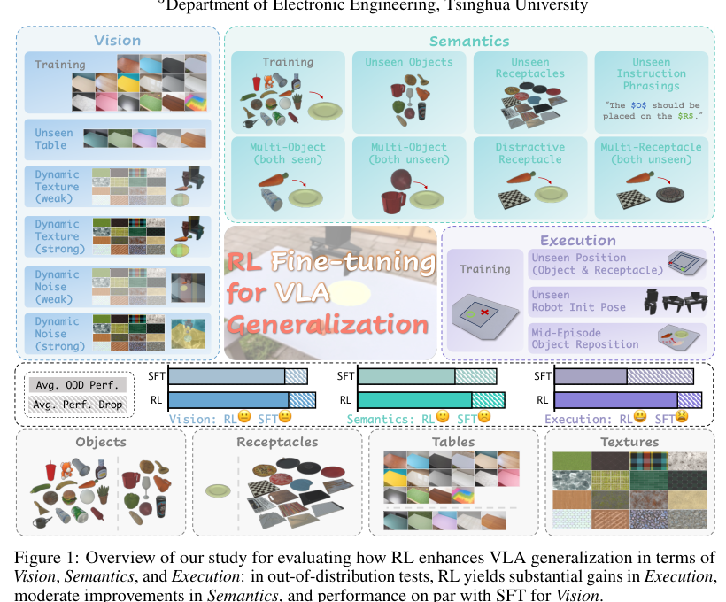

# What Can RL Bring to VLA Generalization? An Empirical Study

## 基本信息

- 作者 / 机构：Jijia Liu、Feng Gao、Bingwen Wei、Xinlei Chen、Qingmin Liao、Yi Wu、Chao Yu、Yu Wang；Tsinghua University。
- 年份 / 会议：2025，NeurIPS 2025。
- 论文链接：https://arxiv.org/abs/2505.19789
- 原文 PDF：[What Can RL Bring to VLA Generalization - An Empirical Study.pdf](../sources/What%20Can%20RL%20Bring%20to%20VLA%20Generalization%20-%20An%20Empirical%20Study.pdf)
- 提取范围：PDF 共 24 页，包含正文、附录和参考文献；SHA-256：`2dc2c73ab51cf2a97f6e3223cf5dd229632afd599a38a9b515f39d46c2e411a9`。

## 1. 开源资源

- 项目主页：https://rlvla.github.io/
- 官方 GitHub：原文未提供可核实链接。
- 模型权重 / 数据：原文未说明公开地址。

## 2. 摘要

### 原文

Large Vision-Language Action (VLA) models have shown significant potential for embodied AI. However, their predominant training via supervised fine-tuning (SFT) limits generalization due to susceptibility to compounding errors under distribution shifts. Reinforcement learning (RL) offers a path to overcome these limitations by optimizing for task objectives via trial-and-error, yet a systematic understanding of its specific generalization benefits for VLAs compared to SFT is lacking. To address this, our study introduces a comprehensive benchmark for evaluating VLA generalization and systematically investigates the impact of RL fine-tuning across diverse visual, semantic, and execution dimensions. Our extensive experiments reveal that RL fine-tuning, particularly with PPO, significantly enhances generalization in semantic understanding and execution robustness over SFT, while maintaining comparable visual robustness. We identify PPO as a more effective RL algorithm for VLAs than LLM-derived methods like DPO and GRPO. We also develop a simple recipe for efficient PPO training on VLAs, and demonstrate its practical utility for improving VLA generalization.

### 中文翻译

大型视觉-语言-动作（VLA）模型已显示出用于具身智能的显著潜力。然而，它们主要通过监督微调（SFT）训练；由于容易在分布偏移下产生累积误差，这种训练限制了泛化。强化学习（RL）通过试错为任务目标进行优化，为克服这些限制提供了一条路径，但相较于 SFT，人们仍缺乏对其为 VLA 带来的具体泛化收益的系统理解。为此，本研究提出一个评估 VLA 泛化的综合基准，并系统考察 RL 微调在多样化视觉、语义和执行维度上的影响。大量实验表明，RL 微调，尤其是 PPO，相较于 SFT 显著增强了语义理解和执行鲁棒性的泛化，同时保持可比较的视觉鲁棒性。我们发现，对 VLA 而言 PPO 是比 DPO、GRPO 等源自 LLM 的方法更有效的 RL 算法。我们还开发了一种高效的 VLA PPO 训练简易配方，并展示其改善 VLA 泛化的实际效用。

## 3. 引言

### 原文

Vision-Language-Action (VLA) models represent an emerging class of foundation models (Ma et al., 2024; Firoozi et al., 2023) that unify perception, language understanding, and embodied control. By leveraging vision-language models pretrained on internet-scale data and further training on large, heterogeneous robot demonstration datasets (Collaboration et al., 2023; Khazatsky et al., 2024), VLAs can interpret sensor observations and natural language instructions to directly map them to robot actions. This paradigm has demonstrated promising generalization across diverse tasks—including single-arm, bimanual, and mobile manipulation (Team et al., 2024; Kim et al., 2024; Liu et al., 2024; Wen et al., 2025), navigation (Shah et al., 2022), and even complex long-horizon activities like kitchen or bedroom cleaning in unseen scenarios (Black et al., 2024; Intelligence et al., 2025).

Despite this promise, VLA model training predominantly relies on supervised fine-tuning (SFT) through behavioral cloning of demonstration labels (Kim et al., 2025). This approach, whether in pretraining or few-shot adaptation, is inherently susceptible to compounding errors under distribution shift: minor deviations from expert trajectories can accumulate, steering the policy into unfamiliar states and undermining robust performance (Ross and Bagnell, 2010; DeHaan et al., 2019; Belkhale et al., 2023; Foster et al., 2024). This mismatch between training and testing distributions fundamentally limits robustness, with research highlighting issues like quadratic regret growth relative to the task horizon under such conditions (Ross and Bagnell, 2010).

In contrast, reinforcement learning (RL) offers a paradigm that directly optimizes cumulative task rewards through trial-and-error, enabling policies to explore beyond narrow expert data and learn corrective behaviors. Crucially, in the broader foundation model landscape, particularly for Large Language Models (LLMs) and Vision-Language Models (VLMs), recent studies have underscored RL’s advantages for generalization (Ouyang et al., 2022; Zhai et al., 2024; Huang et al., 2025). Compelling evidence suggests that while SFT tends to memorize training data, RL fine-tuning can lead to substantially better out-of-distribution performance and unlock greater reasoning capabilities (Chu et al., 2025; Huang et al., 2025; Ma et al., 2025). Drawing from RL’s established success in robotics and these encouraging results from other large-scale models, RL fine-tuning is increasingly being applied to VLAs (Collaboration et al., 2023; Walke et al., 2023; Khazatsky et al., 2024), with approaches ranging from incorporating human feedback (Chen et al., 2025) to using offline RL updates (Zhang et al., 2024b) or algorithms like PPO (Schulman et al., 2017), sometimes in multi-stage processes with imitation learning (Guo et al., 2025b).

However, despite these pioneering efforts, a systematic understanding of what specific generalization benefits RL fine-tuning confers upon VLAs, especially in direct comparison to SFT baselines, and how their respective strengths differ, remains insufficiently developed (Hu et al., 2024; Mark et al., 2024). For instance, while recent work like FLaRe (Hu et al., 2024) demonstrated PPO’s utility for fine-tuning VLAs, a comprehensive analysis of the resulting model’s generalization capabilities was not its primary focus.

This paper aims to address this critical gap. We undertake a systematic study to dissect the generalization properties of VLAs fine-tuned with RL versus SFT.

> Specifically, we empirically investigate: **What unique benefits can RL bring to VLA generalization compared to supervised fine-tuning?**

To answer this, we center our investigations on the representative *pick-and-place* task. On this task, we first evaluate mainstream RL algorithms for large-scale models (PPO (Schulman et al., 2017; Ouyang et al., 2022), DPO (Rafailov et al., 2023; Zhang et al., 2024b), GRPO (Shao et al., 2024; Guo et al., 2025a)) to identify effective VLA fine-tuning strategies. We then conduct a broad comparative evaluation, also on pick-and-place, pinpointing where RL fine-tuning outperforms SFT. As previewed in Fig. 1, this comprehensive evaluation rigorously examines generalization across three key dimensions: 1) **Vision**: challenging generalization with novel backgrounds (unseen tables) and by overlaying unseen textures on the foreground or the entire image. 2) **Semantics**: testing understanding via unseen objects, novel receptacles, and varied instruction phrasings to probe language sensitivity and object recognition. 3) **Execution**: probing robustness by varying initial robot states, object/receptacle positions, and introducing dynamic disturbances like random object reposition within episodes.

Through extensive experiments and deep analyses, we:

1. Establish a rigorous and challenging benchmark to evaluate how VLA fine-tuning methods affect generalization across diverse visual, semantic, and execution dimensions.
2. Identify PPO as the preferred RL algorithm for VLA fine-tuning over GRPO and DPO, while also discuss key challenges in adapting these RL algorithms from LLM/VLM paradigms to the distinct requirements of VLAs.
3. Develop an efficient PPO-based VLA fine-tuning recipe, enabled by a shared actor-critic backbone, VLA model warm-up, and minimal PPO training epochs.
4. Demonstrate RL’s superior generalization over SFT in semantic understanding and embodied execution for VLAs, while maintaining comparable visual robustness.

### 中文翻译

视觉-语言-动作（VLA）模型是一类新兴的基础模型（Ma et al., 2024；Firoozi et al., 2023），统一了感知、语言理解和具身控制。通过利用在互联网规模数据上预训练的视觉-语言模型，并进一步在大型异构机器人示范数据集上训练（Collaboration et al., 2023；Khazatsky et al., 2024），VLA 能够解释传感器观察和自然语言指令，并将它们直接映射为机器人动作。这一范式已在多样化任务上显示出有前景的泛化，包括单臂、双臂和移动操作（Team et al., 2024；Kim et al., 2024；Liu et al., 2024；Wen et al., 2025）、导航（Shah et al., 2022），甚至在未见场景中进行厨房或卧室清洁等复杂长时域活动（Black et al., 2024；Intelligence et al., 2025）。

尽管如此，VLA 模型训练主要仍依赖于对示范标签进行行为克隆的监督微调（SFT）（Kim et al., 2025）。无论是预训练还是少样本适配，这种方法都天然容易在分布偏移下产生累积误差：与专家轨迹的微小偏离会累积，使策略进入不熟悉的状态，并削弱稳健表现（Ross and Bagnell, 2010；DeHaan et al., 2019；Belkhale et al., 2023；Foster et al., 2024）。训练与测试分布间的这种不匹配从根本上限制了鲁棒性；研究指出，在这类条件下，遗憾值可能相对任务时域呈二次增长（Ross and Bagnell, 2010）。

相反，强化学习（RL）提供了一种通过试错直接优化累积任务奖励的范式，使策略能够探索狭窄专家数据之外的区域并学习纠正行为。关键在于，在更广泛的基础模型版图中，特别是对大语言模型（LLM）和视觉-语言模型（VLM）而言，近期研究强调了 RL 对泛化的优势（Ouyang et al., 2022；Zhai et al., 2024；Huang et al., 2025）。有力证据表明，SFT 倾向于记忆训练数据，而 RL 微调可以带来显著更好的分布外性能，并解锁更强的推理能力（Chu et al., 2025；Huang et al., 2025；Ma et al., 2025）。鉴于 RL 在机器人中的既有成功，以及其他大规模模型中的这些积极结果，RL 微调正越来越多地被用于 VLA（Collaboration et al., 2023；Walke et al., 2023；Khazatsky et al., 2024）：方法从引入人类反馈（Chen et al., 2025），到使用离线 RL 更新（Zhang et al., 2024b），或采用 PPO（Schulman et al., 2017）等算法，有时还结合含模仿学习的多阶段过程（Guo et al., 2025b）。

然而，尽管有这些先行探索，人们仍未充分系统地理解：相较于 SFT 基线，RL 微调究竟赋予 VLA 哪些具体泛化收益，以及两者的优势如何不同（Hu et al., 2024；Mark et al., 2024）。例如，FLaRe（Hu et al., 2024）等近期工作虽展示了 PPO 微调 VLA 的效用，但并未将所得模型的泛化能力作系统分析作为其主要重点。

本文旨在弥补这一关键空缺。我们开展系统研究，剖析经 RL 与 SFT 微调的 VLA 的泛化性质。

> 具体而言，我们从实证上研究：**与监督微调相比，RL 能为 VLA 泛化带来哪些独特收益？**

为回答这一问题，我们将研究聚焦于具有代表性的 *pick-and-place* 任务。在该任务上，我们首先评测适用于大规模模型的主流 RL 算法（PPO（Schulman et al., 2017；Ouyang et al., 2022）、DPO（Rafailov et al., 2023；Zhang et al., 2024b）、GRPO（Shao et al., 2024；Guo et al., 2025a）），以找出有效的 VLA 微调策略。随后，我们同样在 pick-and-place 上开展广泛比较评测，确定 RL 微调超越 SFT 的位置。如图 1 预示，这一综合评测严格考察三个关键维度的泛化：1）**视觉**：以新背景（未见桌面）以及在前景或整张图像上叠加未见纹理来挑战泛化；2）**语义**：通过未见物体、新容器和不同的指令措辞测试理解，以探查语言敏感性和物体识别；3）**执行**：通过改变初始机器人状态、物体/容器位置，以及引入回合内随机重新放置物体等动态扰动，探查鲁棒性。

通过大量实验和深入分析，我们：

1. 建立了严格且具有挑战性的基准，用于评估 VLA 微调方法如何影响跨多种视觉、语义和执行维度的泛化。
2. 认定 PPO 是比 GRPO 和 DPO 更适合 VLA 微调的 RL 算法，同时讨论了将这些 RL 算法从 LLM/VLM 范式适配到 VLA 特有要求时的关键挑战。
3. 开发出高效的、基于 PPO 的 VLA 微调配方：共享 actor-critic 骨干、VLA 模型 warm-up 与最少 PPO 训练 epoch。
4. 表明 RL 在 VLA 的语义理解和具身执行上具有优于 SFT 的泛化，同时保持可比较的视觉鲁棒性。

## 4. 创新点与贡献

1. 建立覆盖视觉、语义和执行三维度的 VLA 泛化评测基准。
2. 在 OpenVLA 上比较 PPO、GRPO、DPO，论文报告 PPO 更适合该 POMDP 机器人任务。
3. 提出共享 actor-critic 骨干、VLA warm-up、最少 PPO epoch 的高效 PPO 微调配方。
4. 报告 RL 在语义理解和具身执行泛化上优于 SFT，视觉鲁棒性与 SFT 相当。

## 5. 核心方法

以 OpenVLA 为基础模型：单张 RGB 图像和语言指令输入 Llama 2 骨干，连续动作各维离散为 256 个 token。PPO 使用新采样 rollout、裁剪重要性比和 GAE；所有模型以 rank 32 的 LoRA 微调。critic 与 actor 共享 Transformer，三层 MLP 从第一个 action-token 位置的隐藏向量预测状态价值。作者用 140 条由 Octo-Small 和运动规划器收集的轨迹 warm-up；将 PPO `epoch` 固定为 1。

图 1 将评测划分为 Vision、Semantics、Execution；作者报告 OOD 测试中 RL 在 Execution 上增益显著、在 Semantics 上中等改善、在 Vision 上与 SFT 持平。

## 6. 数据集与框架

| 名称 | 用途 | 规模 / 版本 |
|---|---|---|
| ManiSkill + WidowX-250S | 训练与泛化评测环境 | 8-DoF 机械臂、每步 640×480 RGB 图像和语言指令 |
| Objaverse 等公开资源 | 物体及视觉资产 | 训练使用 16 张桌子、16 个物体；OOD 有 9 个新物体、16 个未见容器、5 个新桌面、16 种干扰纹理 |
| OpenVLA | VLA 基础策略 | SigLIP + DINOv2 + Llama 2 7B |

## 7. 实验

### 实验设置

作者将任务置于 ManiSkill 的 8-DoF WidowX-250S 中。每一步输入为 $640\times480$ RGB 图像及语言指令，输出笛卡尔末端执行器增量和二值夹爪信号；奖励稀疏，正确抓取且持续持有为 0.1，成功放置为 1.0。训练时随机化 16 个桌面、16 个物体及物体与容器位姿；SFT 示范由 MPLib motion planner 收集，并以 LoRA 微调。

OOD 视觉项包括 5 张未见桌面、对象/前景的 Dynamic Texture（混合透明度 0.3 或 0.5），以及覆盖整张图像的 Dynamic Noise（0.3 或 0.5）。语义项包括 9 个未见物体、16 个未见容器、16 种未见指令模板、双物体、干扰容器和双容器。执行项包括未见物体/容器位置、未见机器人初始姿态，以及第 5 步将物体瞬移到新位置的 mid-episode reposition。数字资产来自 ManiSkill、Objaverse 和 Sketchfab；额外桌面外观由 Stable Diffusion 与 ControlNet 合成，干扰纹理由 ambientCG 获取。

### 主要结果与图表

作者在 pick-and-place 上训练 SFT，数据从数百条专家轨迹扩展至 64k 条（约 126 万 transition）；性能在约 16k 条轨迹处趋于饱和，因此使用 16k SFT checkpoint 作为 RL 对比基线。RL 在约 0.4M 环境步后超过最强 SFT-16k 的 OOD 表现；收敛时在训练分布内与 SFT-16k 相当，在未见物体和桌面上高 42.6%。

直接比较中，PPO 持续优于 GRPO 和 DPO。论文认为机器人 POMDP 中每个动作顺序地、非平稳地改变环境，可能使 GRPO 的优势估计不稳定；稀疏奖励和离线数据与交互执行之间的显著分布偏移，使 DPO 难以区分轨迹质量。收敛后的 RL 与 SFT 在 Vision 上相当，在 Semantics 上更好，在 Execution 的三个测试中均更好。可视化中，作者观察到 RL 能完成强动态噪声下的放置、处理未见物体、从失败抓取及中途物体位移中恢复；SFT rollout 更集中在运动规划器数据中的路径附近。

### 消融及其他实验

- **共享 actor-critic**：以第一个 action-token 的隐藏向量 $h_0$ 输入三层 MLP value head，获得最高且最稳定回报。独立 Transformer critic 的回报相近，但训练慢 35%，VRAM 从 44.4 GB 增至 81.3 GB。
- **warm-up**：用 140 条 Octo-Small 与运动规划器收集的轨迹 warm-up 后，以约少 50% 的环境步收敛；充分交互时两种初始化的渐近回报相近。
- **PPO epoch**：超过 1 个 epoch 不增加回报或样本效率，近似线性增加墙钟时间；后续实验固定 `epoch=1`。
- **SFT 动作过滤**：丢弃位置增量范数小于 0.01 且 Euler 角增量范数小于 0.06 的 idle action，约移除三分之一动作，以减少 SFT 策略执行时卡住的问题。

### 附录实验：算法、任务与 sim-to-real

附录 A 明确了所有 RL/SFT 方法均用 LoRA rank $r=32$ 作用于 OpenVLA 的全部线性层，value head 全参数训练。PPO 的动作概率是各 action token 概率的乘积；GRPO 使用 32 组、每组 8 条轨迹的归一化 outcome reward；DPO 采用 trajectory-wise preference optimization（TPO），但本文因只有稀疏奖励而只使用任务成功奖励。运动规划器使用 `plan_screw`、任务空间引导的迭代逆运动学与 TOPP；过滤后约删除三分之一 idle actions。

附录的任务构造具体包括：训练使用 16 个物体、16 个桌面外观和默认黄色盘；OOD 包括 5 个未见桌面、16 种前景/全图纹理、9 个未见物体、16 个未见容器、16 种未见指令模板、已见/未见双物体、干扰容器、双容器、扩大位置范围、随机机器人初始关节姿态，以及第 5 步将物体瞬移到新位置。16 个未见指令模板包含 “Place the $O$ on the $R$”“move the $O$ to the $R$”“Can you put $O$ on $R$?” 等大小写和标点变体。

附录 B 报告，PPO 生成温度过高会妨碍训练，论文最终使用温度 1.0；较低 LoRA rank 略高效，但统一选用 rank 32 以保留容量。完整 OOD 表的任务成功率（SFT → RL）为：IND 0.781→0.938、Unseen Table 0.719→0.844、Dynamic Texture strong 0.557→0.630、Dynamic Noise strong 0.505→0.667、Unseen Object 0.453→0.714、Unseen Receptacle 0.615→0.750、Unseen Instruction 0.672→0.891、双未见物体 0.297→0.578、干扰容器 0.672→0.812、双未见容器 0.458→0.599、未见位置 0.568→0.807、未见机器人姿态 0.339→0.797、中途物体重定位 0.286→0.745；每项还报告 grasp accuracy 与 continuous grasp accuracy。

作者还进行初步真实机器人评测：用 Franka Panda 替换 WidowX，并将相机视角对齐；仿真训练使用 16 个物体、7 个背景和盘，真实评测使用 pepper、cucumber、banana、mangosteen、kiwi、sponge 六个新物体、桌面背景和绿色碗，平均 30 次试验。SFT 的 grasp success / pick-and-place success 为 0.10 / 0.00，RL 为 0.43 / 0.27。作者观察到 SFT 常有过度运动和 overshoot，RL 虽有抖动但能迭代调整末端执行器并取得更高成功率。

附录还在 OpenVLA-OFT（action chunk size 4）上复现，使用逐动作维度 clipping、clip ratio 0.1、$\gamma=0.96$、GAE $\lambda=0.85$；RL 的优势仍保留。对更灵巧的 articulated-object 开门任务，Franka 需要抓住把手并打开超过 $20^\circ$，RL 在视觉、语义和执行 OOD 划分上也继续超过 SFT。

## 8. 局限与结论

结论是，PPO RL 微调能提高 VLA 的语义和执行 OOD 泛化，但视觉 OOD 总体与 SFT 相当，强纹理下不一定更优。论文列出的局限包括：SFT 只使用 motion-planner 示范，可能未覆盖人类收集数据的变异性；主基准集中于 pick-and-place，尚未覆盖更广泛、更复杂的多任务设置；真实机器人实验是初步的 30 次试验，仍需更大规模不同本体和真实环境验证。

## 9. 重要参考文献

| 原文编号 | 文献 | 本文中的引用用途 |
|---|---|---|
| OpenVLA | Kim et al. (2024) | 基础 VLA 模型 |
| PPO | Schulman et al. (2017) | 主要 RL 微调算法 |
| DPO | Rafailov et al. (2023) | 偏好优化对比方法 |
| GRPO | Shao et al. (2024) | 组相对策略优化对比方法 |
