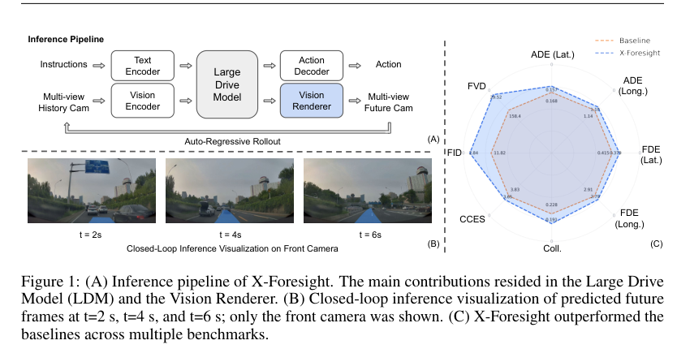

# X-Foresight: A Joint Vision-Action Causal Forecasting Network via Predictive World Modeling

## 基本信息

- 作者 / 机构：PWM Team，XPeng Inc.
- 年份 / 会议：2026，arXiv preprint。
- 论文链接：https://arxiv.org/abs/2605.24892
- 原文 PDF：[X-Foresight - A Joint Vision-Action Causal Forecasting Network via Predictive World Modeling.pdf](../sources/X-Foresight%20-%20A%20Joint%20Vision-Action%20Causal%20Forecasting%20Network%20via%20Predictive%20World%20Modeling.pdf)
- 提取范围：PDF 共 19 页，包含正文、致谢与参考文献；SHA-256：`58111f3080dd5805abe7f8ea2190312732aa628ee9a083020e2faf63ba946c05`。

## 1. 开源资源

- 项目主页：https://x-foresight-1.github.io/
- 官方 GitHub、模型权重、数据：原文首页未提供可核实链接。

## 2. 摘要

### 原文

Physical world knowledge resides mainly in videos. Equipping Vision-Language-Action (VLA) models with such knowledge is fundamental for safe and generalizable planning. To extract this knowledge from video data, predictive world modeling enables VLA to internalize physical dynamics and long-term causality by predicting future video from past observations. However, naive next-frame prediction faces two challenges: 1) unlike semantically distinct text tokens, video tokens are inherently low-entropy and redundant, causing prediction to easily degenerate into trivial extrapolation. 2) world modeling poses a temporal dilemma: instantaneous dynamics need dense frame prediction, while long-term causality unfolds over long and variable-size horizons that dense prediction cannot efficiently cover. To learn world knowledge effectively, we introduce X-Foresight, a predictive world model integrated directly into the VLA architecture to jointly learn world modeling and real-time action control. At its core lies a long-horizon chunk-wise auto-regressive strategy. By predicting across semantically distant chunks rather than adjacent frames, it escapes trivial extrapolation, while preserving dense intra-chunk frames to capture instantaneous dynamics and sparse inter-chunk transitions to capture long-term causality. A curriculum learning schedule progressively extends prediction horizons and stabilizes long-horizon training. Temporal importance sampling concentrates supervision on safety-critical chunks identified by ego-motion and behavioral signals. A diffusion-based multi-view renderer provides photorealistic synthesis. Experiments report that X-Foresight outperforms VLA baselines in planning while maintaining generative fidelity.

### 中文翻译

物理世界知识主要存在于视频中。为视觉-语言-动作（VLA）模型配备这类知识，是实现安全且可泛化规划的基础。为了从视频数据中提取这些知识，预测式世界建模通过根据过去观察预测未来视频，使 VLA 内化物理动力学和长期因果关系。然而，朴素的下一帧预测面临两个挑战：1）不同于语义上可区分的文本 token，视频 token 天然低熵且冗余，导致预测容易退化为平凡外推；2）世界建模带来时间困境：瞬时动力学需要密集帧预测，而长期因果关系在长且长度可变的时间范围上展开，密集预测无法高效覆盖。为有效学习世界知识，我们提出 X-Foresight：一个直接集成到 VLA 架构中的预测世界模型，联合学习世界建模与实时动作控制。其核心是长时域、按 chunk 的自回归策略。它在语义距离较远的 chunk 之间而非相邻帧之间预测，从而避开平凡外推；同时保留密集的 chunk 内帧以捕捉瞬时动力学，以及稀疏的 chunk 间转移以捕捉长期因果关系。课程学习日程逐步延长预测时域并稳定长时域训练。时间重要性采样将监督集中在由自运动和行为信号识别出的安全关键 chunk 上。基于 diffusion 的多视图渲染器提供照片级真实合成。实验报告 X-Foresight 在保持生成保真度的同时，在规划上超过 VLA 基线。

## 3. 引言

### 原文

The pursuit of artificial intelligence in physical world has driven significant interest in world models. With world models, internal representations of the environment can be learned, which enforces agents’ prediction, planning, and control. Recent world models employ diverse strategies to represent internal dynamics of the world: video-based generative models such as Sora [2], Genie [3], and X-World [22] learn to synthesize photorealistic future frames with large diffusion models; 3D-centric frameworks like Marble [12] explicitly model spatial geometry for physically consistent world reconstruction, while latent-based methods such as JEPA [1] bypass pixel-space generation entirely, learning semantic state representations through self-supervised predictive frameworks.

Vision-Language-Action (VLA) models have emerged as powerful paradigms for embodied decision-making, unifying perception, reasoning, and control within a single auto-regressive framework. Foundational works such as RT-2 [23], PaLM-E [6], and OpenVLA [11] have demonstrated remarkable generalization by transferring web-scale vision-language knowledge to robotic manipulation. In the autonomous driving domain, industry systems such as XPeng’s VLA 2.0 [19] exemplify the adoption of VLA architectures for end-to-end perception-to-control pipelines. However, prevailing VLA architectures remain fundamentally reactive, lacking deep world understanding and proactive danger-avoidance mechanisms. This limitation stems from their inability to simulate future states before acting, forcing policies to rely solely on historical observations. Without forward-looking foresight, models struggle to anticipate collisions, navigate through complex scenarios, or exploit long-horizon environmental causality to improve agent control.

Among the representations commonly used in robotics and autonomous driving, video provides one of the most holistic descriptions of the surrounding environment. It captures both low-level visual details, such as color, texture, and object shape, and high-level semantic information, such as the motion patterns of vehicles and vulnerable road users. Moreover, the ego vehicle’s trajectory can often be inferred directly from dash-camera observations. Therefore, we argue that video serves as a primary carrier of physical-world knowledge, encoding rich spatial, temporal, and semantic cues that are essential for future prediction and decision-making. We thus introduce X-Foresight, a predictive world model built atop the VLA architecture that seamlessly integrates multi-view future prediction with closed-loop action control. By actively forecasting future camera images, the model develops an internalized understanding of long-horizon environmental causality, enabling proactive, safety-critical decision-making while preserving the real-time responsiveness required for autonomous systems.

Inspired by the success of large language models, future-token prediction has become a central paradigm for generative sequence modeling. However, directly transferring this paradigm to video-based world modeling introduces an important modality gap. Language tokens are semantically discrete, relatively sparse, and high-entropy, whereas video tokens are often redundant, with high frame-to-frame similarity. This difference can easily lead to degenerate future rollouts, where the model learns only trivial frame-level extrapolation rather than meaningful physical dynamics. A further temporal challenge in world modeling arises from the mismatch between instantaneous dynamics and world transitions: effective world representation learning must capture short-term dynamics and long-term causality simultaneously. Instantaneous dynamics rely primarily on short-term dense visual evidence, whereas world transitions demand long-horizon causal reasoning over extended temporal contexts. To reconcile this discrepancy, X-Foresight employs a chunk-wise auto-regressive rollout that jointly forecasts future vision and action tokens. The proposed long-horizon chunk-wise auto-regressive strategy not only avoids trivial extrapolation by preserving dense intra-chunk frames that capture instantaneous dynamics, but also enables efficient training and low-latency inference.

We further improve world-knowledge learning through targeted training innovations. Since predictive capability develops progressively, we adopt a curriculum learning schedule in which the model first learns to forecast short horizons within each chunk and is then gradually exposed to longer prediction horizons. This progressive training strategy improves the stability of long-horizon forecasting and enhances the robustness of the learned policy. Additionally, because temporal segments do not contribute equally to world modeling, we introduce a hybrid sampling strategy that combines random frame selection with importance-weighted sampling. This approach encourages broad temporal coverage while emphasizing safety-critical transitions, thereby improving the model’s ability to learn informative world knowledge relevant to long-term causality and decision-making. We argue that world representations should remain highly abstract; excessive visual detail at the latent level dilutes the model’s capacity for structural world understanding. To reconcile abstraction with perceptual fidelity, we delegate photorealistic synthesis to a dedicated diffusion module. This enables high-fidelity multi-view rendering, where a diffusion-based renderer reconstructs detailed surround-view cameras within the auto-regressive loop, providing dense latent-space supervision.

In summary, the key contributions of this work are:

1. We introduce a long-horizon chunk-wise auto-regressive strategy that leverages extended future horizons for world modeling. This design both mitigates the collapse of world-knowledge learning under naive next-frame prediction and resolves the temporal dilemma: dense intra-chunk frames allow the model to capture instantaneous dynamics, while long-horizon chunk-level prediction promotes the learning of broader world causality.
2. To improve long-horizon forecasting stability and enhance policy robustness, we exploit a curriculum-based learning strategy, starting with short-horizon prediction across chunks and gradually extending to longer strides.
3. We adopt temporal importance sampling, a hybrid sampling mechanism that accounts for uneven contributions of future frames to world knowledge learning, combining random selection with importance-weighted focus on critical temporal transitions.
4. The proposed method can acquire high-fidelity multi-view future images. Integration of a diffusion-based renderer into the auto-regressive pipeline is developed to reconstruct photorealistic surround-view details.

Comprehensive experiments demonstrate that X-Foresight significantly outperforms the reactive VLA baseline in planning safety, generative fidelity as shown in Fig 1, establishing a robust paradigm for world-knowledge-driven autonomous systems.

### 中文翻译

对物理世界中人工智能的追求，推动了人们对世界模型的显著兴趣。借助世界模型，可以学习环境的内部表征，从而强化智能体的预测、规划和控制。近期世界模型采用多样策略来表示世界的内部动力学：Sora [2]、Genie [3] 和 X-World [22] 等基于视频的生成模型利用大型 diffusion 模型学习合成照片级真实的未来帧；Marble [12] 等以 3D 为中心的框架显式建模空间几何，以进行物理一致的世界重建；而 JEPA [1] 等基于潜变量的方法则完全绕过像素空间生成，通过自监督预测框架学习语义状态表征。

视觉-语言-动作（VLA）模型已成为具身决策的强大范式，在单个自回归框架中统一感知、推理和控制。RT-2 [23]、PaLM-E [6] 和 OpenVLA [11] 等奠基性工作通过将网页规模的视觉-语言知识迁移到机器人操作，展示了显著泛化。在自动驾驶领域，小鹏的 VLA 2.0 [19] 等工业系统体现了 VLA 架构用于端到端感知到控制流水线的采用。然而，主流 VLA 架构仍从根本上是反应式的，缺少深度世界理解和主动避险机制。这一限制源自它们无法在行动前模拟未来状态，迫使策略只依赖历史观察。缺乏前瞻能力时，模型难以预见碰撞、在复杂场景中行驶，或利用长时域环境因果性来改善智能体控制。

在机器人和自动驾驶常用的表征中，视频提供了对周围环境最全面的描述之一。它同时捕获颜色、纹理和物体形状等低层视觉细节，以及车辆与弱势道路使用者运动模式等高层语义信息。此外，自车轨迹往往可以直接从行车记录仪观察中推断。因此，我们认为视频是物理世界知识的主要载体，编码了未来预测与决策所必需的丰富空间、时间和语义线索。由此，我们提出 X-Foresight：一个构建在 VLA 架构之上的预测世界模型，将多视图未来预测与闭环动作控制无缝整合。通过主动预测未来相机图像，模型形成对长时域环境因果性的内化理解，在保留自主系统所需实时响应性的同时，实现主动的、对安全关键的决策。

受大语言模型成功的启发，未来 token 预测已成为生成序列建模的核心范式。然而，将这一范式直接迁移到基于视频的世界建模会引入重要的模态鸿沟。语言 token 在语义上离散、相对稀疏且高熵，而视频 token 通常冗余，帧间相似性很高。这种差异很容易导致退化的未来 rollout：模型只学习平凡的帧级外推，而非有意义的物理动力学。世界建模还存在一个时间挑战，源于瞬时动力学和世界转变之间的不匹配：有效的世界表征学习必须同时捕获短期动力学和长期因果性。瞬时动力学主要依赖短期的稠密视觉证据，而世界转变要求跨较长时间上下文进行长时域因果推理。为调和这种差异，X-Foresight 使用按 chunk 的自回归 rollout，联合预测未来视觉和动作 token。所提出的长时域 chunk-wise 自回归策略既通过保留捕获瞬时动力学的稠密 chunk 内帧来避免平凡外推，又支持高效训练和低延迟推理。

我们进一步通过有针对性的训练创新改善世界知识学习。由于预测能力是逐步发展的，我们采用课程学习日程：模型先学习预测每个 chunk 内的短时域，之后逐步接触更长的预测时域。这一渐进训练策略提升了长时域预测的稳定性，并增强了学习到的策略的鲁棒性。此外，由于时间片段对世界建模的贡献并不相同，我们引入一种把随机帧选择与重要性加权采样结合的混合采样策略。该方法鼓励广泛时间覆盖，同时强调安全关键转变，从而提高模型学习与长期因果性和决策相关的信息性世界知识的能力。我们认为世界表征应保持高度抽象；潜变量层的过多视觉细节会稀释模型进行结构性世界理解的能力。为调和抽象性与感知保真度，我们把照片级真实合成交给专门的 diffusion 模块。这实现了高保真多视图渲染：diffusion 渲染器在自回归循环内重建详细的环视相机画面，并提供稠密潜变量空间监督。

综上，本文的关键贡献是：

1. 提出一种利用扩展未来时域进行世界建模的长时域 chunk-wise 自回归策略。该设计既缓解了朴素下一帧预测下世界知识学习的坍塌，也解决了时间困境：稠密 chunk 内帧使模型捕获瞬时动力学，而长时域 chunk 级预测促进学习更广泛的世界因果性。
2. 为改善长时域预测稳定性并提升策略鲁棒性，采用以课程为基础的学习策略：从跨 chunk 的短时域预测开始，逐步延伸到更长步幅。
3. 采用时间重要性采样，一种考虑未来帧对世界知识学习贡献不均的混合采样机制，结合随机选择和对关键时间转变的、经重要性加权的关注。
4. 所提方法能够获得高保真多视图未来图像。将基于 diffusion 的渲染器集成进自回归流水线，以重建照片级真实的环视细节。

综合实验表明，如图 1 所示，X-Foresight 在规划安全性和生成保真度上显著超过反应式 VLA 基线，建立了一种稳健的、由世界知识驱动的自主系统范式。

## 4. 创新点与贡献

1. 提出 X-Foresight：将预测世界模型直接置入 VLA，在统一 token 空间中联合预测未来多相机观察、鸟瞰图（BEV）和自车动作，并将渲染后的预测帧反馈为下一轮观察。
2. 提出长时域 chunk-wise 自回归。每个典型为 1 秒的 chunk 内保留稠密帧以学习瞬时动力学；通过提高相邻 chunk 的时间 stride 学习更长的因果关系，动作预测仍保持在紧邻控制 step。
3. 提出短到长课程和时间重要性采样。采样分数利用自车纵向/横向加速度在三个时间窗内的最大加权幅值，使监督更集中于制动、加速、转向等安全相关时刻。
4. 提出半因果 block-sparse attention，使可见 block 数随序列长度近似线性增长；论文报告相对标准 causal FlashAttention-2，单 step 从 24.50 s 降至 15.40 s（1.59×）。
5. 以单独的 diffusion Vision Renderer 从 LDM 的相机 latent token 合成高保真七视图画面，令规划/世界理解留在 LDM、像素细节由渲染器恢复。

## 5. 核心方法

*图 1 原文图注：(A) Inference pipeline of X-Foresight. The main contributions resided in the Large Drive Model (LDM) and the Vision Renderer. (B) Closed-loop inference visualization of predicted future frames at $t=2$s, $t=4$s, and $t=6$s; only the front camera was shown. (C) X-Foresight outperformed the baselines across multiple benchmarks.*

*中文： (A) X-Foresight 的推理流水线，主要贡献位于 Large Drive Model（LDM）和 Vision Renderer；(B) 闭环推理中 $t=2$、$4$、$6$ 秒的未来帧可视化，仅显示前视相机；(C) X-Foresight 在多个基准上超过基线。*

### 5.1 LDM 与多模态 prompt

Large Drive Model（LDM）是自回归 transformer。它读取多视图历史相机观察、语言指令和自车状态，并在每一步预测三类未来目标：实时控制用的自车动作、描述周边空间结构的 BEV 图，以及每个相机视角的未来外观 latent token。渲染器把 latent token 解为多视图帧，再作为下一轮 LDM 观察，形成闭环。

多模态 prompt 形式为：

$$[\mathrm{SYSTEM\ PROMPT}]\mid[l_0,O_0,A_0,Q_0]\mid[l_1,O_1,A_1,Q_1]\mid\cdots\mid[l_i,O_i,A_i,Q_i].$$

其中全局 system prompt 提供任务指令和长时域导航目标；每个时间 chunk 含四类 token：$l_i$ 指定预测时域或时间窗，$O_i$ 是由 ViT [5] 从 chunk 内多帧提取的多相机视频 token，$A_i$ 编码自车状态，$Q_i$ 触发未来变量预测。为控制 token 预算，视频 token 在原位置预测，而不另行加入视觉 query token。

### 5.2 Chunk-wise 长时域预测、课程与采样

论文比较了逐帧 foresight、粗时间分辨率的逐帧 longer foresight、chunk-wise foresight 及带 stride 的 chunk-wise longer foresight。逐帧预测面对相邻帧高度相似，学习信号弱；激进下采样会损失轨迹所需的时序运动线索。chunk-wise 方案每步并行预测连续 $K$ 帧，保留短时结构又要求模型预测更长未来演化。

训练从相邻 chunk 相隔 1 秒的短时域开始，再把相邻 chunk 的 stride 提高到 3 秒以扩展预测范围，且不增加计算预算。跨 chunk 的观察目标跨越时间空隙预测；动作仍预测紧邻的下一个控制 step，以满足闭环控制的稠密时间分辨率。

时间重要性采样对候选 step $k$ 计算：

$$w_k=\sum_{W\in\{W_{k1},W_{k2},W_{k3}\}}\max_{t\in W}(\lambda_x|a_x(t)|+\lambda_y|a_y(t)|),\qquad p_k=\frac{w_k^{1/\tau}}{\sum_j w_j^{1/\tau}}.$$

$W_{k1}$ 关注即将发生的制动、加速或急转开端，$W_{k2}$ 关注转弯和制动承诺，$W_{k3}$ 关注刚结束机动的余波；另限制连续选中 step 的最大时间间隔，防止上下文过稀。

### 5.3 稀疏注意力与训练目标

半因果 block-sparse mask 让 system prompt 对后续所有 chunk 可见；chunk 内的文本、观察、状态和 query token 双向互相注意；跨 chunk 时保持时间因果结构。$Q_i$ 能看到此前 prompt-side token，却被禁止直接关注此前 query $Q_{1:i-1}$，避免预测直接依赖先前预测目标。注意力 head 再按 query/key 时间差的奇偶拆成两组，覆盖互补时间 offset。

在 teacher forcing 下，损失同时覆盖相机 latent、动作和 BEV：

$$L_{cam}=\frac1{HV}\sum_{i=1}^H\sum_{v=1}^V\|\hat o_{vi}-g(I_{vi})\|_2,\quad L_{act}=\frac1H\sum_{i=1}^H\|\hat a_i-a_i\|_1,$$

$$L_{bev}=\frac1H\sum_{i=1}^H\|\hat b_i-b_i\|_2,\qquad L_{total}=L_{act}+\alpha L_{cam}+\beta L_{bev}.$$

其中 $g(\cdot)$ 是基础视觉语言模型中冻结的 ViT。

### 5.4 Vision Renderer

相机 latent 为自回归推理而压缩，直接解码会在长 rollout 中累积重建误差。作者因此让 LDM 承担“想象和控制”，以 diffusion renderer 作为条件细化器，读取短窗口多视图历史与 LDM 相机 token，恢复高频视觉细节。renderer 不以 LDM 动作 token 为条件；论文理由是相机 token 已隐式包含自车变换、场景几何和动态参与者，避免动作成为低熵捷径而被模型用来忽略相机 token。

训练分三阶段：LDM 与 renderer 在前两阶段独立训练，renderer 使用真值未来轨迹；第三阶段冻结 LDM，移除 X-World 的动作、动态 agent、静态元素和文本条件分支，激活相机 token cross-attention，仅用多视图 history latent 与 LDM 预测的相机 token 对 renderer 做对齐微调。Stage II 用 Muon、常数学习率 $8\times10^{-5}$、每设备 batch 1、128 GPU；Stage III 使用 activation checkpointing、FSDP 与 one-cycle cosine schedule。

## 6. 数据集与框架

| 名称 | 用途 | 规模 / 版本 |
|---|---|---|
| 内部多相机驾驶数据 | LDM 与 renderer 训练 | 约 280,000 小时、34M 段最长 30 秒 clip、13.8T token；原生 12 Hz，训练下采样至 4 Hz |
| 七相机环视 | 输入与预测 | 前鱼眼、前窄角、左右前、左右后、后视，共 360°；相机相对自车坐标系完成几何标定 |
| 场景自动标签 | 训练分布分析 | 近 200 个细粒度标签聚为 8 类；城市占 86.8%、高速占 13.2% |
| Large Drive Model | 世界预测与动作规划 | 自回归 transformer，统一 token 空间预测动作、BEV、相机 latent |
| Vision Renderer | 多视图像素合成 | 以 X-World 权重初始化的 diffusion renderer；从相机 token 恢复照片级帧 |
| Camera Latent Decoder | latent 可视化与诊断 | 轻量卷积式因果 3D ResNet 加低分辨率 spatial self-attention，不作为 diffusion renderer 的替代 |

## 7. 实验

### 7.1 数据分布与 LDM 规划

数据中 open-road lane keeping 占 21.0%，lane change 占 20.1%，压线/无标线等 constrained-lane 占 16.0%，路口与转弯占 13.1%，障碍/cut-in 占 9.9%，跟车/拥堵占 9.6%，VRU 交互占 6.2%，匝道、收费站、环岛、辅路和高曲率路段等罕见路形占 4.1%。作者据此称常规驾驶与机动约占 70%，其余部分覆盖交互与长尾情形。

图 7 给出定性规划比较：在多出口环岛的远出口指令中，基线未能处理空间上更远的事件；在车辆抵达前红灯转绿的案例中，基线把当前红灯解释为立即停车并在停止线前截断预测，而 X-Foresight 的预测 rollout 预见信号变化，给出与真值一致的连续轨迹。

### 7.2 注意力加速与 latent 检查

表 4 在相同模型与训练配置下仅替换注意力实现：标准 causal FlashAttention-2 每训练 step 24.50 秒；配合本文 mask 的 Block Sparse Attention 为 15.40 秒，即 1.59× speedup。作者指出 attention 是主要瓶颈。

长时域闭环中，diffusion 的生成先验和采样随机性不能稳定反映 latent 空间，故作者训练 Camera Latent Decoder 检查空间结构、时间一致性、多视图对齐与 latent drift。它使用因果 3D ResNet block 做逐级时空上采样，最低分辨率阶段加入轻量 spatial self-attention。

### 7.3 Vision Renderer 结果

图 8 展示全七个环视相机从 $t=0$ 真值到 $t=6$ 秒预测的 rollout。每个 AR step 在 4 Hz 生成 1 秒相机 token，renderer 为每个相机解码 4 帧；连续 6 step 组成 6 秒预测。蓝色轨迹为 LDM 从 action token 得到的轨迹，renderer 从未接收动作 token。文中观察到该轨迹和合成车道、周边参与者及自车姿态保持几何一致，作为相机 token 已包含自车轨迹和场景动力学的证据。

| 方法 | FID 1s ↓ | FID 6s ↓ | FVD 1s ↓ | FVD 6s ↓ |
|---|---:|---:|---:|---:|
| Camera Latent Decoder | 10.97 | 11.82 | 135.56 | 158.39 |
| Vision Renderer | **1.51** | **2.84** | **11.28** | **29.52** |

FID 在七视图、4 Hz、每秒每相机四帧上计算，参考集为测试数据中 200k 随机 clip；FVD 对每相机时间序列计算后再平均。作者将 1 到 6 秒间 FID 增加 1.33、FVD 增加 18.24，解释为完整预测窗口的误差累积有限。

## 8. 局限与结论

论文结论是，chunk-wise 自回归同时应对下一帧预测退化和瞬时动力学/长期因果之间的时间不匹配；课程延长时域、重要性采样突出安全关键 chunk，diffusion renderer 提供像素级监督并稳定闭环 rollout。

文中提出的未来方向是：在闭环 rollout 加入额外监督以改善长尾表现，融入更丰富的模态（如 3D 几何监督）以增强物理世界知识，以及研究由粗到细的世界重建训练策略。论文没有单列“limitations”章节；上述内容来自结论明确提出的未来工作。

## 9. 重要参考文献

| 原文编号 | 文献 | 本文中的引用用途 |
|---|---|---|
| [1] | JEPA | 潜变量自监督预测世界模型示例 |
| [2] | Sora | 视频生成世界模型示例 |
| [3] | Genie | 视频生成世界模型示例 |
| [11] | OpenVLA | VLA 基线与相关工作 |
| [23] | RT-2 | VLA 相关工作 |
| [22] | X-World | renderer 预训练、数据相机布局和自动标签协议的基础 |
| [4] | FlashAttention-2 | 注意力吞吐对比 |
| [8] | Block Sparse Attention | 本文稀疏注意力实现 |
