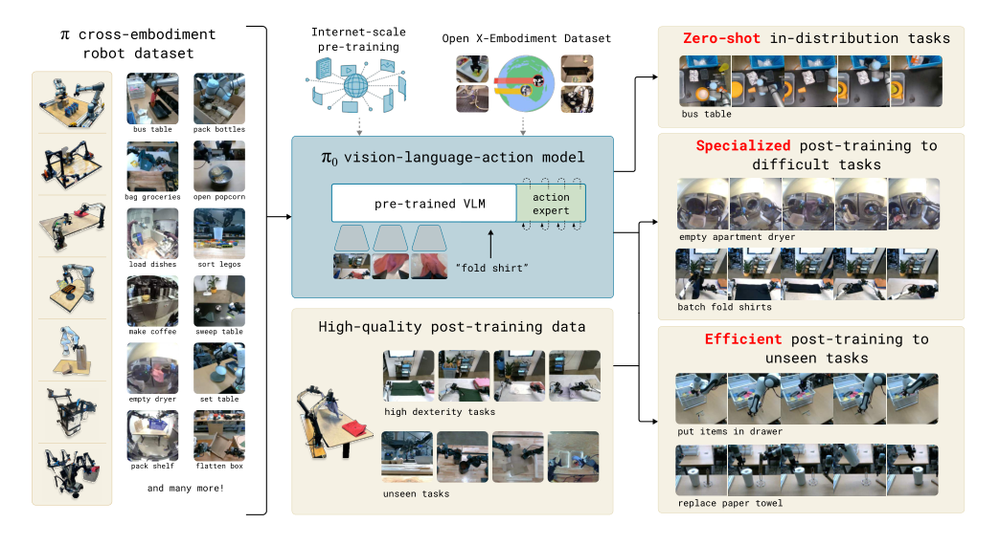
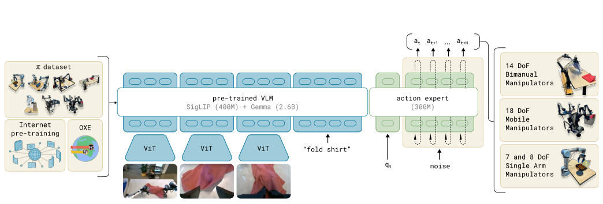
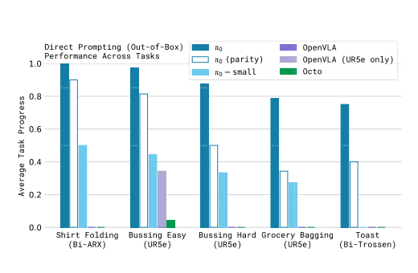
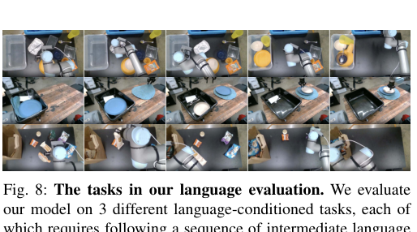
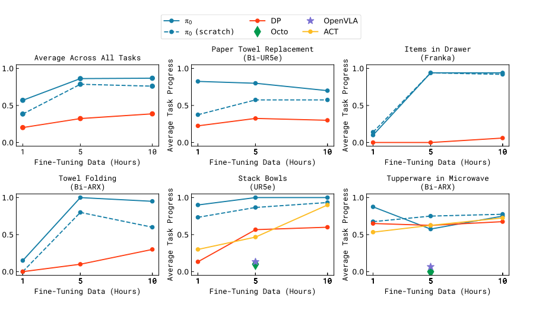
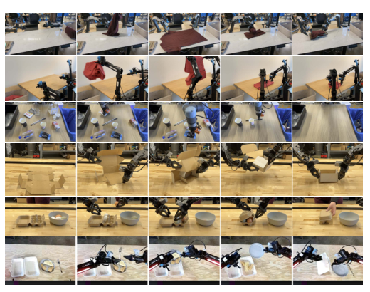
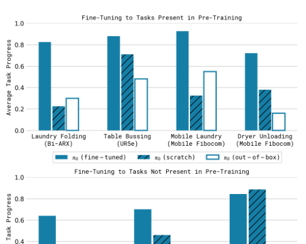

# π₀: A Vision-Language-Action Flow Model for General Robot Control

## 基本信息

- 作者 / 机构：Kevin Black、Noah Brown、Danny Driess、Adnan Esmail、Michael Equi、Chelsea Finn、Niccolo Fusai、Lachy Groom、Karol Hausman、Brian Ichter、Szymon Jakubczak、Tim Jones、Liyiming Ke、Sergey Levine、Adrian Li-Bell、Mohith Mothukuri、Suraj Nair、Karl Pertsch、Lucy Xiaoyang Shi、James Tanner、Quan Vuong、Anna Walling、Haohuan Wang、Ury Zhilinsky；Physical Intelligence，San Francisco。
- 年份 / 会议：2024 年首次提交；RSS 2025；本文整理所用 PDF 为 arXiv v4（2026-01-08 修订）。
- 论文链接：https://arxiv.org/abs/2410.24164
- 原文 PDF：[π₀ - A Vision-Language-Action Flow Model for General Robot Control.pdf](../sources/%CF%800%20-%20A%20Vision-Language-Action%20Flow%20Model%20for%20General%20Robot%20Control.pdf)
- 项目主页：https://physicalintelligence.company/blog/pi0
- 提取时间：2026-09-26 CST（Asia/Shanghai）。
- 提取范围：论文 PDF 共 17 页，包含正文、致谢、参考文献和附录 A--E；原文 PDF 的 SHA-256 为 `b2d124bd8d2e7cde3578a08770b64e75ff5082a5f0db9841b52622ccf7b2eb45`。

## 1. 开源资源

- 项目主页：https://physicalintelligence.company/blog/pi0
- 官方 GitHub：原文未列出。
- 模型权重：原文未列出公开下载地址。
- 数据：训练混合包括作者自建的跨本体灵巧操作数据，以及 OXE、Bridge v2、DROID 等数据集；原文未给出本文自建数据的公开下载地址。
- 文档：项目主页提供论文介绍和任务视频入口；具体训练、部署和数据采集说明以论文正文及附录为准。

## 2. 摘要

### 原文

Robot learning holds tremendous promise to unlock the full potential of flexible, general, and dexterous robot systems, as well as to address some of the deepest questions in artificial intelligence. However, bringing robot learning to the level of generality required for effective real-world systems faces major obstacles in terms of data, generalization, and robustness. In this paper, we discuss how generalist robot policies (i.e., robot foundation models) can address these challenges, and how we can design effective generalist robot policies for complex and highly dexterous tasks. We propose a novel flow matching architecture built on top of a pre-trained vision-language model (VLM) to inherit Internet-scale semantic knowledge. We then discuss how this model can be trained on a large and diverse dataset from multiple dexterous robot platforms, including single-arm robots, dual-arm robots, and mobile manipulators. We evaluate our model in terms of its ability to perform tasks via direct prompting, follow language instructions from people and from a high-level VLM policy, and its ability to acquire new skills via fine-tuning. Our results cover a wide variety of tasks, such as laundry folding, table cleaning, and assembling boxes.

### 中文翻译

机器人学习有望释放灵活、通用且具有灵巧性的机器人系统的全部潜力，也有望帮助解决人工智能领域一些最深层的问题。然而，要使机器人学习达到有效现实系统所要求的通用性，在数据、泛化能力和稳健性方面仍面临重大障碍。本文讨论通用机器人策略（即机器人基础模型）如何应对这些挑战，以及如何为复杂且高度灵巧的任务设计有效的通用机器人策略。我们提出一种建立在预训练视觉-语言模型（VLM）之上的新型流匹配架构，使模型能够继承互联网规模的语义知识。随后，我们讨论如何利用来自多个灵巧机器人平台的大规模、多样化数据集训练该模型，这些平台包括单臂机器人、双臂机器人和移动操作机器人。我们从多个方面评估模型：通过直接提示执行任务、遵循人类和高层 VLM 策略给出的语言指令，以及通过微调获得新技能的能力。实验覆盖了多种任务，例如折叠衣物、清理桌面和组装盒子。

*图 1 原文图注：通用机器人策略使用预训练视觉-语言模型（VLM）骨干，以及包含多种灵巧操作任务的多样化跨本体数据集。通过加入一个独立的动作专家，模型使用流匹配生成连续动作，从而获得精确且流畅的操作技能。模型既可以根据提示直接执行任务，也可以在高质量数据上微调，以完成折叠多件衣物或组装盒子等复杂多阶段任务。*

## 3. 引言

### 原文

Artificial intelligence systems come in all shapes and sizes, from highly specialized systems that solve complex problems inaccessible to the human mind, such as predicting the conformation of a protein [21], to systems that can produce lifelike high-resolution images or videos based on textual prompts [40]. However, the axis along which human intelligence most outpaces machine intelligence is versatility: the ability to solve diverse tasks situated in varied physical environments, while responding intelligently to environmental constraints, language commands, and unexpected perturbations. Perhaps the most tangible progress toward this kind of versatility in AI can be seen in large language- and vision-language models [1,48]: systems that are pre-trained on large and very diverse corpora of images and text from the web, and then fine-tuned (“aligned”) using more carefully curated datasets meant to induce the desired pattern of behavior and responsiveness. While such models have been shown to exhibit broad instruction-following and problem-solving abilities [53,27], they are not truly situated in a physical world the way that people are, and their understanding of physical interaction is based entirely on abstract descriptions. If such methods are to make tangible progress toward AI systems that exhibit the kind of physically situated versatility that people possess, we will need to train them on physically situated data — that is, data from embodied robot agents.

Flexible and general-purpose models that can be tasked to perform a variety of robot behaviors have tremendous practical ramifications, but they may also offer solutions to some of the toughest challenges facing robot learning today, such as availability of data, generalization, and robustness. In natural language [1] and computer vision [39], general-purpose foundation models that are pre-trained on diverse multi-task data tend to outperform narrowly tailored and specialized solutions. For example, if the goal is to recognize birds in photographs, it is likely more expedient to pre-train on many different image-language associations and then fine-tune or prompt for the bird recognition task, than it is to train on only bird recognition data. Similarly, we may find that for effective specialized robot systems, it is more effective to first pre-train on highly diverse robot data, and then fine-tune or prompt for the desired task. This can resolve the data scarcity challenge, because many more sources of data are available to a generalist model — including data from other tasks, other robots, or even non-robot sources — and it may resolve robustness and generalization challenges, because the diverse data exhibits a greater coverage of observations and actions, providing a variety of scenes, corrections, and recovery behaviors that might not be present in more narrow specialized data. Thus, adopting a large-scale pre-training approach to robot learning has the potential to address many of the field’s challenges and make practical learning-enabled robots a reality, while at the same time furthering our understanding of the deepest problems in artificial intelligence.

However, developing such generalist robot policies — i.e., robot foundation models — involves a number of major challenges. First, any such research must be done at a very large scale, because the full benefits of large-scale pre-training are often not present at smaller scales [54]. Second, it requires developing the right model architectures that can effectively make use of diverse data sources, while at the same time being able to represent the intricate and subtle behaviors necessary to interact with complex physical scenes. Third, it requires the right training recipe. This is perhaps the most important ingredient, as much of the recent progress with large models in NLP and computer vision has relied heavily on delicate strategies for curating pre-training and post-training data [35].

In this paper, we present a prototype model and learning framework, which we call π₀, that illustrates how each of these three bottlenecks could be tackled. We illustrate our model and system in Figure 1. To incorporate diverse data sources, we begin by utilizing a pre-trained vision-language model (VLM) to import Internet-scale experience. By basing our model on a VLM, we inherit the general knowledge, semantic reasoning, and problem-solving abilities of language- and vision-language models. We then further train our model to incorporate robot actions, turning it into a vision-language-action (VLA) model [7]. In order to make it feasible to utilize a variety of diverse robot data sources, we employ cross-embodiment training [10], where data from many robot types is combined into the same model. These different robot types have different configuration spaces and action representations, including single and dual-arm systems, as well as mobile manipulators. Additionally, in order to make it possible to perform highly dexterous and intricate physical tasks, we use an action chunking architecture [57] with flow matching (a variant of diffusion) to represent complex continuous action distributions [28,32]. This enables our model to control robots at frequencies of up to 50 Hz for dexterous tasks such as laundry folding (see Figure 1). To combine flow matching with VLMs, we use a novel action expert that augments the standard VLM with flow-based outputs.

As with language models, the architecture of our model is only part of our method. In order to flexibly and robustly perform complex tasks, we need the right training recipe. Our recipe mirrors the pre-training/post-training separation commonly seen in exascale language- and image-language models [1,48], where the model is first pre-trained on a very large and diverse corpus, and then fine-tuned on more narrow and more carefully curated data to induce the desired pattern of behavior — in our case, dexterity, efficiency, and robustness. Intuitively, training only on high-quality data does not teach the model how to recover from mistakes, since mistakes are rarely seen in such data. Training on only lower-quality pre-training data does not teach the model to act efficiently and robustly. Combining both provides the desired behavior: the model attempts insofar as possible to act in a manner similar to the high-quality data, but still has a repertoire of recoveries and corrections that it can deploy in the case of a mistake.

The contributions of our work consist of a novel generalist robot policy architecture based on VLM pre-training and flow matching, and an empirical investigation of pre-training/post-training recipes for such robot foundation models. We evaluate our model out of the box with language commands, with fine-tuning to downstream tasks, and in combination with a high-level semantic policy that outputs intermediate language commands to perform complex and temporally extended tasks. While our model and system make use of a variety of ideas presented in recent work, the combination of ingredients is novel, and the empirical evaluation demonstrates a level of dexterity and generality that goes significantly beyond previously demonstrated robot foundation models. We evaluate our approach by pre-training on over 10,000 hours of robot data, and fine-tuning to a variety of dexterous tasks, including laundry folding (see Figure 2), clearing a table, putting dishes in a microwave, stacking eggs into a carton, assembling a box, and bagging groceries.

### 中文翻译

人工智能系统形态各异、规模不同：一端是能够解决人类思维无法处理的复杂问题的高度专用系统，例如预测蛋白质构象 [21]；另一端是能够根据文本提示生成逼真高清图像或视频的系统 [40]。然而，人类智能最明显超越机器智能的维度是灵活性：在不同物理环境中解决多样任务，同时对环境约束、语言命令和意外扰动作出智能响应。当前，人工智能在这一灵活性方向上最切实的进展，或许体现在大型语言模型和视觉-语言模型 [1,48] 中：这类系统先在互联网上规模庞大且高度多样的图像和文本语料上预训练，再使用更加精心整理的数据集进行微调（“对齐”），以诱导所需的行为模式和响应性。尽管已有研究表明，这些模型具备广泛的指令遵循和问题求解能力 [53,27]，但它们并不像人一样真正处在物理世界中，对物理交互的理解完全建立在抽象描述之上。如果希望这类方法切实推动人工智能系统获得人类所具有的、处于物理环境中的灵活性，就需要使用处于物理环境中的数据训练它们，也就是来自具身机器人智能体的数据。

能够被要求执行多种机器人行为的灵活通用模型具有巨大的现实意义，也可能为当前机器人学习面临的一些最困难问题提供解决方案，例如数据可获得性、泛化和稳健性。在自然语言 [1] 和计算机视觉 [39] 中，在多任务多样化数据上预训练的通用基础模型往往优于针对狭窄任务定制的专用方案。例如，如果目标是在照片中识别鸟类，那么先在许多不同的图像-语言关联上预训练，再针对鸟类识别任务进行微调或提示，可能比只使用鸟类识别数据训练更高效。类似地，对于有效的专用机器人系统，我们也可能发现，先在高度多样化的机器人数据上预训练，再针对目标任务微调或提示，会更加有效。这能够缓解数据稀缺问题，因为通用模型可以使用更多数据来源——包括其他任务、其他机器人，甚至非机器人来源的数据；它也可能缓解稳健性和泛化问题，因为多样化数据覆盖了更广泛的观察和动作，提供了狭窄专用数据中可能不存在的多种场景、纠错和恢复行为。因此，采用大规模预训练的机器人学习方法，有潜力应对该领域的许多挑战，使具备学习能力的机器人变得实用，同时推进我们对人工智能最深层问题的理解。

然而，开发这类通用机器人策略，即机器人基础模型，仍涉及若干重大挑战。第一，这类研究必须在非常大的规模上进行，因为大规模预训练的全部收益往往不会在较小规模上出现 [54]。第二，需要开发合适的模型架构，使其既能有效利用多样化数据源，又能表示与复杂物理场景交互所需的精细而微妙的行为。第三，需要合适的训练配方。这或许是最重要的组成部分，因为自然语言处理和计算机视觉中大型模型近期的大量进展，都高度依赖于精细的预训练与后训练数据整理策略 [35]。

本文提出一个原型模型和学习框架，称为 π₀，用来说明如何应对这三个瓶颈。模型和系统如图 1 所示。为了纳入多样化数据源，我们首先利用预训练视觉-语言模型（VLM）引入互联网规模的经验。以 VLM 为基础，模型继承了语言模型和视觉-语言模型的通用知识、语义推理和问题求解能力。随后，我们进一步训练模型以纳入机器人动作，使其成为视觉-语言-动作（VLA）模型 [7]。为了能够利用多种多样的机器人数据源，我们采用跨本体训练 [10]，把多种机器人类型的数据合并到同一个模型中。这些机器人具有不同的构型空间和动作表示，包括单臂系统、双臂系统以及移动操作机器人。此外，为了执行高度灵巧且复杂的物理任务，我们使用带有流匹配（扩散的一种变体）的动作分块架构 [57]，表示复杂的连续动作分布 [28,32]。这使模型能够以最高 50 Hz 的频率控制机器人完成折叠衣物等灵巧任务（见图 1）。为了将流匹配与 VLM 结合，我们使用一个新的动作专家，在标准 VLM 上增加基于流的输出。

与语言模型一样，模型架构只是方法的一部分。为了灵活而稳健地完成复杂任务，还需要合适的训练配方。我们的配方仿照超大规模语言模型和视觉-语言模型中常见的预训练/后训练划分 [1,48]：先在非常庞大且多样化的语料上预训练，再在范围更窄、整理更仔细的数据上微调，以诱导所需的行为模式——在本文中即灵巧性、效率和稳健性。直观地说，只用高质量数据训练不会教会模型如何从错误中恢复，因为这类数据中很少出现错误；只用质量较低的预训练数据训练，又不会教会模型高效且稳健地行动。将两者结合，才能得到所需行为：模型尽可能按照高质量数据中的方式行动，同时在发生错误时仍拥有可调用的恢复和纠错行为库。

本文的贡献包括一种建立在 VLM 预训练和流匹配之上的通用机器人策略架构，以及对这类机器人基础模型预训练/后训练配方的实证研究。我们评估模型在直接使用语言命令时的开箱即用能力、微调到下游任务的能力，以及与能够输出中间语言命令的高层语义策略结合、完成复杂长时任务的能力。尽管模型和系统使用了近期工作提出的多种思想，但这些要素的组合是新的，实验评估展示出的灵巧性和通用性显著超越了以往展示的机器人基础模型。我们在超过 10,000 小时的机器人数据上预训练模型，并将其微调到多种灵巧任务，包括折叠衣物（见图 2）、清理桌面、把餐具放入微波炉、将鸡蛋装入蛋盒、组装盒子和装袋杂货。

## 4. 相关工作定位

- **视觉-语言-动作模型**：RT-2、OpenVLA、TinyVLA 等工作将预训练 VLM 微调为机器人控制器，多数使用自回归离散动作 token。π₀ 将连续动作通过流匹配建模，并加入动作专家，以支持高频动作块和灵巧操作。
- **扩散与动作生成**：Diffusion Policy、扩散 Transformer 以及 flow matching 为连续多峰动作分布提供了建模工具。π₀ 将这类目标与预训练 VLM 骨干结合。
- **跨本体机器人学习**：Open X-Embodiment、BridgeData v2、DROID 等数据集支持不同机器人和环境之间的联合训练。π₀ 将单臂、双臂和移动操作平台放进同一训练框架。
- **大规模训练配方**：论文把机器人基础模型的训练划分为面向广泛能力的预训练和面向流畅执行、纠错与任务专门化的后训练，类比大型语言模型的预训练/对齐流程。

## 5. 创新点与贡献

1. **流匹配 VLA 架构**：以 PaliGemma 预训练 VLM 为骨干，引入独立的动作专家，通过条件流匹配生成连续动作块。
2. **跨本体训练**：使用 7 种机器人构型、68 个灵巧操作任务和开放数据，在统一的最大动作维度中进行联合训练。
3. **预训练/后训练配方**：预训练数据覆盖广泛、行为多样，帮助模型学习恢复和纠错；后训练数据质量更高、策略更一致，帮助模型获得任务执行效率和流畅性。
4. **高频长时控制**：动作块长度为 50，支持最高 50 Hz 的机器人控制；模型可使用高层 VLM 将长任务拆成中间语言指令。
5. **真实机器人评估**：在开箱即用、语言跟随、新灵巧任务和复杂多阶段任务上评测，覆盖折叠衣物、清理桌面、微波炉、装蛋、组装盒子和装袋等任务。

## 6. 核心方法

### 6.1 总体框架

训练流程先组装预训练混合数据，再训练以 PaliGemma 为初始化的流匹配 VLA。预训练得到的基础模型能够跨机器人本体执行多种任务，但不一定在单个任务上达到最高性能；随后用小到中等规模的任务数据，或面向复杂任务的大规模高质量数据进行后训练。

*图 3 原文图注：框架从自建灵巧操作数据与开源数据构成的预训练混合开始，用该混合训练流匹配 VLA。模型包含较大的 VLM 骨干和处理机器人状态与动作的较小动作专家。VLM 骨干权重由 PaliGemma 初始化，从互联网规模预训练中获得表征。得到的 π₀ 可控制具有不同动作空间的多个机器人本体，完成多种任务。*

### 6.2 观察、动作块与动作专家

模型要学习的分布为 $p(A_t\mid o_t)$。未来动作块为

$$
A_t=[a_t,a_{t+1},\ldots,a_{t+H-1}],\qquad H=50
$$

观察由多张 RGB 图像、语言命令和本体感知状态组成：

$$
o_t=[I_t^1,\ldots,I_t^n,\ell_t,q_t],
$$

其中 $I_t^i$ 是第 $i$ 张图像（每个机器人使用 2 或 3 张），$\ell_t$ 是语言 token 序列，$q_t$ 是关节角向量。图像和状态分别通过编码器与线性投影层，映射到语言 token 使用的同一嵌入空间。

每个动作 $a_{t'}$ 对应一个动作 token，动作 token 由动作专家处理。动作专家和主 VLM 使用两套权重：图像与语言输入走较大的 VLM 权重；机器人状态和噪声动作走较小的动作专家权重。两套权重通过 Transformer 自注意力层交互，这种形式类似包含两个专家的混合专家模型。

### 6.3 条件流匹配目标

训练时，对每个动作块采样流时间 $\tau\in[0,1]$ 和高斯噪声 $\epsilon\sim\mathcal N(0,I)$。线性高斯概率路径为

$$
q(A_t^\tau\mid A_t)=\mathcal N(\tau A_t,(1-\tau)I),
$$

对应的噪声动作是

$$
A_t^\tau=\tau A_t+(1-\tau)\epsilon,
$$

目标向量场为 $u(A_t^\tau\mid A_t)=A_t-\epsilon$。模型 $v_\theta$ 使用条件流匹配损失：

$$
\mathcal L^\tau(\theta)=\mathbb E_{p(A_t\mid o_t),q(A_t^\tau\mid A_t)}
\left\|v_\theta(A_t^\tau,o_t)-u(A_t^\tau\mid A_t)\right\|^2
$$

动作 token 使用完全双向的注意力掩码，因此一个动作块内的所有动作 token 可以相互注意。流时间从偏向低时间步（更高噪声）的 beta 分布采样；附录给出的形式为

$$
p(\tau)=\operatorname{Beta}\left(\frac{s-\tau}{s};1.5,1\right),\qquad s=0.999
$$

### 6.4 推理

推理从 $A_t^0\sim\mathcal N(0,I)$ 开始，将学习到的向量场从 $\tau=0$ 积分到 $\tau=1$。论文使用 10 步前向 Euler 积分，步长 $\delta=0.1$：

$$
A_t^{\tau+\delta}=A_t^\tau+\delta v_\theta(A_t^\tau,o_t)
$$

前缀观察 $o_t$ 的注意力 key/value 可以缓存，每一步只重新计算动作 token 的后缀。论文没有采用时间集成（temporal ensembling），因为早期实验发现它会降低策略性能，而是直接执行动作块。

### 6.5 模型规模与注意力掩码

- **主模型**：PaliGemma 约 3B 参数，动作专家约 300M，总计约 3.3B 参数。PaliGemma 由 SigLIP 视觉编码器和 Gemma 语言模型组成。
- **注意力分块**：序列分成三块：图像与语言 $[I_t^1,\ldots,I_t^n,\ell_t]$、机器人状态 $[q_t]$、噪声动作 $[a_t^\tau,\ldots,a_{t+H-1}^\tau]$。每块内部为双向注意力，当前块不能注意未来块。
- **状态缓存**：状态块在流积分步骤之间不变，因此其 key/value 可缓存，动作块可以在每一步更新。
- **动作专家配置**：主 Gemma 语言模型宽度为 2048、深度为 18、MLP 维度为 16,384；动作专家缩小为宽度 1024、MLP 维度 4096，约 300M 参数。

### 6.6 π₀-small 基线

π₀-small 用于测量 VLM 初始化带来的收益。它约有 470M 参数，不使用 VLM 初始化，而是使用 DistilBERT 编码语言；图像使用较小的预训练 ViT；动作专家通过 encoder-decoder 式交叉注意力读取观察编码器输出；动作专家采用 DiT 架构，并用 AdaLN-Zero 注入流时间。它与主模型同样使用 10 步流匹配生成动作块。

## 7. 数据集与框架

### 7.1 预训练与后训练数据

| 数据来源 | 用途 | 规模 / 特点 |
|---|---|---|
| 作者自建灵巧操作数据 | 预训练主体 | 903M timestep；其中单臂 106M、双臂 797M；覆盖 68 个复杂任务 |
| OXE Magic Soup | 开源预训练混合 | 与 Bridge v2、DROID 一起占预训练混合的 9.1%；来自 22 个机器人及广泛物体和环境 |
| Bridge v2 | 开源预训练混合 | 通常为一到两台相机、2--10 Hz 的低频控制数据 |
| DROID | 开源预训练混合 | 提供真实环境中的多样操作数据；与 OXE、Bridge 一起补充物体和场景覆盖 |
| 高质量任务数据 | 后训练 | 简单任务约 5 小时，复杂任务可超过 100 小时；用于获得稳定、流畅的下游策略 |

论文将自建数据与开放数据合计描述为超过 10,000 小时的机器人数据。由于任务规模不均衡，任务-机器人组合按照 $n^{0.43}$ 加权，其中 $n$ 是该组合的样本数，以降低过度代表组合的权重。所有本体状态和动作向量都补齐到最大维度 18，最多容纳两条 6-DoF 手臂、两个夹爪、移动底座和升降躯干；低维机器人使用零填充，缺失相机槽位使用掩码。

### 7.2 机器人平台

| 配置 | 相机 | 配置 / 动作空间 | 说明 |
|---|---:|---:|---|
| UR5e | 2 | 7D | 平行夹爪，腕部相机和肩上相机 |
| Bimanual UR5e | 3 | 14D | 两个 UR5e |
| Franka | 2 | 8D | 单臂 Franka 设置 |
| Bimanual Trossen | 3 | 14D | 两个 Trossen ViperX，采用 ALOHA 构型 |
| Bimanual ARX / AgileX | 3 | 14D | 两条 6-DoF 手臂，两个腕部相机和一个底座相机 |
| Mobile Trossen / ARX | 3 | 16D | 双臂 Mobile ALOHA；非全向底座增加两个动作维度 |
| Mobile Fibocom | 3 | 17D | 两条 ARX 手臂和全向底座；底座增加平移与转向三个动作维度 |

### 7.3 高层语言策略

对于“清理桌面”这类需要语义推理与高层规划的任务，作者使用高层 VLM 将总体命令拆成更即时的子任务，例如“拿起餐巾”或“把餐巾扔进垃圾桶”。π₀ 接收这些中间语言命令并执行具体动作，这一方式与 SayCan 等将语言规划落地到机器人可供性的方法相似。

### 7.4 推理时间

在 NVIDIA GeForce RTX 4090、三台相机输入上，附录测得图像编码器 14 ms、观察前向 32 ms、10 次动作前向（流匹配）27 ms。板载总推理时间为 73 ms；移动机器人通过 Wi-Fi 进行板外推理时，网络延迟约 13 ms，总时间为 86 ms。20 Hz 的 UR5e 和 Franka 每 0.8 秒重新推理一次并执行 16 个动作；其他 50 Hz 机器人每 0.5 秒重新推理一次并执行 25 个动作。

## 8. 实验

### 8.1 实验问题与评价方式

实验研究四个问题：

1. 只经过预训练的 π₀ 能否在预训练见过的任务上直接工作？
2. π₀ 是否比无 VLM 初始化的 π₀-small 更能遵循语言命令？
3. π₀ 与专门面向灵巧操作的方法相比，能否学习新的下游任务？
4. π₀ 是否能通过后训练适应持续数分钟、包含多阶段行为的复杂任务？

每个任务通常运行 10 个 episode。评价使用归一化进度分数：完全成功为 1.0，部分完成按完成比例给分。例如，清理桌面的分数是正确放入对应容器的物体比例。

### 8.2 开箱即用评测

预训练后不做后训练，模型通过语言命令执行五项任务：

- **折叠衬衫**：折叠平铺的 T 恤。
- **简单清理桌面**：将垃圾放入垃圾箱，将餐具放入餐具箱。
- **困难清理桌面**：物体更多，存在餐具压在垃圾上、物体相互遮挡和预训练中未见物体等情况。
- **装袋杂货**：将薯片、棉花糖、猫粮等杂货放入袋子。
- **从烤面包机取出吐司**：取出吐司并放到盘子上。

比较对象包括在完整混合数据上训练的 OpenVLA、Octo、只使用 UR5e 数据训练的 OpenVLA，以及训练 160k 步的计算量对齐 π₀（主模型训练 700k 步）。结果显示：

- 完整 π₀ 在所有开箱即用任务上取得最高结果，折叠衬衫和简单清理桌面接近完全成功。
- 只训练 160k 步的计算量对齐 π₀ 仍优于各基线；π₀-small 也优于 OpenVLA 和 Octo。
- OpenVLA 的自回归离散动作架构不支持动作分块和高频控制，在这些任务上明显受限。
- Octo 支持动作块，但表示能力相对有限；π₀-small 与 π₀ 的比较进一步显示了 VLM 预训练的重要性。

*图 7 原文图注：比较训练 700k 步的 π₀、训练 160k 步的计算量对齐版本、π₀-small，以及在全部数据或仅 UR5e 数据上训练的 OpenVLA 和 Octo。计算量对齐版本在所有任务和比较中也超过各基线，完整 π₀ 的优势更大。*

### 8.3 语言指令跟随

作者在清理桌面、摆桌和装袋杂货上比较以下条件：

| 条件 | 输入 |
|---|---|
| π₀-flat / π₀-small-flat | 只有总体命令，例如“装袋杂货” |
| π₀-human / π₀-small-human | 人类专家提供中间步骤命令，例如要拿哪个物体、放到哪里 |
| π₀-HL | 高层 VLM 自动提供中间命令，无人类专家 |

语言标注片段通常约 2 秒，一个完整任务包含许多片段。π₀ 的语言跟随准确率显著高于 π₀-small；这种能力也转化为在人类专家指导和高层 VLM 指导下更好的任务表现。由于 π₀-small 的语言跟随能力有限，加入高层专家并没有明显提升它的总体性能。

*图 8 原文图注：三项语言条件任务分别是清理桌面、摆桌和装袋购物袋，每项任务都要求机器人遵循一系列中间语言命令。*

### 8.4 学习新的灵巧任务

作者使用不同数量的微调数据，比较从 π₀ 预训练初始化、从头训练 π₀、OpenVLA、Octo、ACT 和 Diffusion Policy。下游任务按与预训练数据的相似程度分层：

| 任务 | 难度层级 | 任务说明 |
|---|---|---|
| UR5e 堆叠碗 | 简单 | 与清理桌面一样需要抓取和移动餐具，测试包含见过和未见过的碗 |
| 折叠毛巾 | 简单 | 与预训练中的折叠衬衫相似 |
| 将保鲜盒放入微波炉 | 中等 | 操作容器的行为相似，但微波炉在预训练中未出现 |
| 更换纸巾卷 | 困难 | 需要取下旧纸巾卷并装上新纸巾卷，预训练中没有相似物体 |
| Franka 抽屉放物品 | 困难 | 打开抽屉、放入物品并关闭抽屉，Franka 上没有相似预训练任务 |

结果显示 π₀ 通常优于其他方法。仅 5 小时数据时，π₀ 在微波炉任务上的表现与基线相近，但使用 1 小时数据就明显更好。预训练带来的收益通常在与预训练更相似的任务上更大；在部分任务上，预训练模型比从头训练模型高约 2 倍。不过，对于非常不同的新领域，迁移仍然困难。

*图 11 原文图注：π₀ 在较少数据下也能学习部分简单任务，预训练模型相对于从头训练模型通常取得更大提升。*

### 8.5 复杂多阶段任务

这些任务耗时约 5--20 分钟，需要把几十个具体行为组合起来。作者比较三种设置：预训练后微调、只用后训练数据从头训练（scratch）、只使用预训练模型直接执行（out-of-box）。

| 任务 | 机器人 / 特点 | 是否在预训练中出现 |
|---|---|---|
| 静态双臂折叠衣物 | 从随机揉皱的衣物箱中取出衣物、展平、折叠并堆叠 | 是 |
| 移动折叠衣物 | Fibocom 移动机器人同时控制平移和朝向 | 是 |
| 卸载烘干机 | 移动机器人打开烘干机，把衣物装入篮子并关门 | 是 |
| 清理真实午餐桌 | 在密集杂乱中识别新物体、处理盘中垃圾并分类 | 否（该评测设置更难） |
| 组装盒子 | 将扁平纸盒弯折、固定两侧并完成闭合 | 否 |
| 打包外带盒 | 将多个食物从盘子装入盒中并用双臂合上 | 否 |
| 装鸡蛋 | 从碗中取出 6 个鸡蛋放入蛋盒并合上盒盖 | 否 |
| 打包食物 | 将盘中食物放入外带盒并合上盒盖 | 否 |

*图 12 原文图注：评测静态或移动机器人折叠衣物、清理真实午餐桌、组装盒子、将鸡蛋放入蛋盒和将食物装入外带盒。这些任务需要抓取、堆叠、折叠、展平等几十种行为，并要泛化到大量物体构型以及可变形衣物、柔性纸板等复杂物理属性。*

*图 13 原文图注：复杂任务上 10 次试验的平均分。完整预训练 π₀ 在所有任务上都超过最大分数的 50%，通常优于各消融设置，在最困难的任务上提升尤其明显。*

完整的预训练加微调配方在所有复杂任务上表现最好。许多困难任务中，使用预训练模型相对于 scratch 有很大提升，说明预训练在困难任务上尤其有用；绝对表现会随任务难度和任务在预训练数据中的覆盖程度而变化。作者称，这类任务上的自主性能代表了学习型灵巧机器人操作的一个新水平。

### 8.6 评价规则（附录 E）

| 任务 | 满分与计分方式 |
|---|---|
| 折叠衬衫 | 服装袖子折入并沿长度完成一次对折，成功记 1 分 |
| 简单 / 困难清理桌面 | 分别有 7 / 12 个物体，每个正确分类物体记 1 分 |
| 装袋杂货 | 7 件杂货，每件放进袋子记 1 分 |
| 从烤面包机取吐司 | 每片吐司成功取出和放上盘子各记 1 分，共 4 分 |
| 堆叠碗 | 两只碗放入更大的碗，并按最终整齐程度计 3 分 |
| 折叠毛巾 | 两次对折各 1 分，最终整齐 1 分，共 3 分 |
| 微波炉保鲜盒 | 打开微波炉、拿起保鲜盒、放入、关门各 1 分，共 4 分 |
| 更换纸巾 | 抓住并取下旧卷、抓住并装上新卷，共 4 分 |
| 抽屉放物品 | 打开抽屉、正确放入 3 件物品、关上抽屉，共 5 分 |
| 折叠衣物 | 取出并放上桌、展平、折叠、放入堆叠各 1 分，共 4 分 |
| 组装盒子 | 拿起、对折、关右侧盖片、关左侧盖片、居中整理，共 5 分 |
| 装鸡蛋 | 每个鸡蛋放入正确槽位 1 分，合上盒盖 1 分，共 7 分 |
| 打包食物 | 拿起食物盘、放入 3 件食物、合上外带盒，共 5 分 |
| 卸载烘干机 | 接近烘干机、放篮子、打开门、装入衣物、关门各 1 分，共 5 分 |

## 9. 局限与结论

### 局限

论文明确指出三方面局限：

1. **数据组成仍不清楚**：作者把当时可获得的数据尽可能组合起来，但还不知道哪些类型的数据最有帮助，以及各数据源应如何加权。
2. **可靠性尚未普及**：并非所有评测任务都能稳定工作，达到接近完美表现所需的数据量和数据类型仍无法预测。
3. **跨任务、跨机器人正迁移未知**：当前结果支持通用预训练机器人模型的可能性，但还需要研究这种通用性是否能扩展到自动驾驶、导航和足式运动等更不同的领域。

### 结论

π₀ 将互联网规模 VLM 预训练、跨机器人本体数据和流匹配动作生成结合到一个机器人基础模型中。它在 7 种机器人构型、68 个灵巧任务和超过 10,000 小时机器人数据上训练，动作块长度为 50，并支持最高 50 Hz 控制。实验证明，预训练模型能够直接完成多种任务；高层语言命令可以帮助它执行需要语义规划的行为；在高质量数据上后训练后，它可以完成折叠多件随机衣物、清理真实桌面、装蛋和组装盒子等多阶段任务。论文将这种训练方式概括为：预训练获得广泛的物理知识与恢复能力，后训练把这些能力组织成更高效、更流畅的任务策略。

## 10. 重要参考文献

| 原文编号 | 文献 | 本文中的引用用途 | 论文链接 |
|---|---|---|---|
| [5] | Lucas Beyer et al. *PaliGemma: A versatile 3B VLM for transfer* (2024) | π₀ 的预训练 VLM 骨干 | https://arxiv.org/abs/2407.07726 |
| [7] | Anthony Brohan et al. *RT-2: Vision-Language-Action Models Transfer Web Knowledge to Robotic Control* (2023) | VLA 与互联网知识迁移的代表工作 | https://arxiv.org/abs/2307.15818 |
| [9] | Cheng Chi et al. *Diffusion Policy: Visuomotor Policy Learning via Action Diffusion* (2023) | 灵巧操作的扩散策略基线 | https://arxiv.org/abs/2303.04137 |
| [10] | Open X-Embodiment Collaboration et al. *Open X-Embodiment: Robotic Learning Datasets and RT-X Models* (2023) | 跨本体开放数据与 RT-X 模型 | https://arxiv.org/abs/2310.08864 |
| [23] | Alexander Khazatsky et al. *DROID: A Large-Scale In-the-Wild Robot Manipulation Dataset* (2024) | 开源预训练混合数据 | https://arxiv.org/abs/2403.12945 |
| [24] | Moo Jin Kim et al. *OpenVLA: An Open-Source Vision-Language-Action Model* (2024) | 开箱即用评测中的 VLA 基线 | https://arxiv.org/abs/2406.09246 |
| [28] | Yaron Lipman et al. *Flow Matching for Generative Modeling* (2022) | 条件流匹配目标 | https://arxiv.org/abs/2210.02747 |
| [32] | Qiang Liu. *Rectified Flow: A Marginal Preserving Approach to Optimal Transport* (2022) | 流匹配与扩散的理论背景 | https://arxiv.org/abs/2209.14577 |
| [50] | Octo Model Team et al. *Octo: An Open-Source Generalist Robot Policy* (2024) | 扩散动作生成与通用策略基线 | https://arxiv.org/abs/2405.12213 |
| [52] | Homer Rich Walke et al. *BridgeData v2: A Dataset for Robot Learning at Scale* (2023) | 跨域机器人数据集 | 见原文参考文献 [52] |
| [57] | Tony Z. Zhao et al. *Learning Fine-Grained Bimanual Manipulation with Low-Cost Hardware* (2023) | 动作分块、ALOHA 与灵巧操作基线 | https://arxiv.org/abs/2304.13705 |
| [59] | Chunting Zhou et al. *Transfusion: Predict the Next Token and Diffuse Images with One Multi-Modal Model* (2024) | 混合离散 token 与连续扩散输出的架构启发 | https://arxiv.org/abs/2408.11039 |
