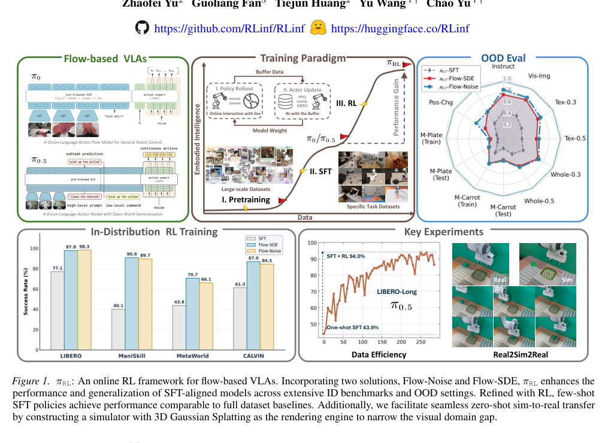

# πRL: Online RL Fine-tuning for Flow-based Vision-Language-Action Models

## 基本信息

- 作者 / 机构：Kang Chen、Zhihao Liu、Tonghe Zhang 等；Tsinghua University、Peking University、Institute of Automation, Chinese Academy of Sciences、Carnegie Mellon University、Infinigence AI、Zhongguancun Academy。
- 年份 / 会议：2026，arXiv preprint。
- 论文链接：https://arxiv.org/abs/2510.25889
- 原文 PDF：[πRL - Online RL Fine-tuning for Flow-based Vision-Language-Action Models.pdf](../sources/%CF%80RL%20-%20Online%20RL%20Fine-tuning%20for%20Flow-based%20Vision-Language-Action%20Models.pdf)
- 提取范围：PDF 共 24 页，包含正文、附录 A--J 和参考文献；SHA-256：`484e9f8be118be4f7adfd18470abc330e29b1b4cf457d316dc85a63e65299d36`。

## 1. 开源资源

- 官方 GitHub：https://github.com/RLinf/RLinf
- 模型资源：https://huggingface.co/RLinf

## 2. 摘要

### 原文

Vision-Language-Action (VLA) models enable robots to understand and perform complex tasks from multimodal input. Although recent work explores using reinforcement learning (RL) to automate the laborious data collection process in scaling supervised fine-tuning (SFT), applying RL to large-scale flow-based VLAs (e.g., π0, π0.5) remains challenging due to intractable action log-likelihoods raised from flow matching. We address this challenge with πRL, featuring two technical approaches: (1) Flow-Noise models the denoising process as a discrete-time MDP with a learnable noise network for exact log-likelihood computation. (2) Flow-SDE integrates denoising with agent-environment interaction, formulating a two-layer MDP that employs ODE-to-SDE conversion for efficient RL exploration. We evaluate πRL across various benchmarks, with experiments demonstrating that RL yields significant performance improvements in both in-distribution and out-of-distribution settings.

### 中文翻译

视觉-语言-动作（VLA）模型使机器人能够根据多模态输入理解并执行复杂任务。尽管近期工作探索使用强化学习（RL）来自动化扩展监督微调（SFT）时繁重的数据收集过程，但由于 flow matching 带来的难以处理的动作对数似然，将 RL 应用于大规模基于 flow 的 VLA（例如 π0、π0.5）仍具挑战。我们通过 πRL 解决这一挑战，它包含两种技术方法：（1）Flow-Noise 将去噪过程建模为离散时间 MDP，并使用可学习噪声网络精确计算对数似然；（2）Flow-SDE 将去噪与智能体-环境交互结合，构造采用 ODE 到 SDE 转换的两层 MDP，以进行高效 RL 探索。我们在多个基准上评估 πRL；实验表明，RL 在分布内和分布外设置中均带来显著性能提升。

## 3. 引言

### 原文

Vision-Language-Action (VLA) models (Din et al., 2025) have emerged as a leading solution for general-purpose robots, effectively bridging the gap between high-level multimodal reasoning and low-level physical control (Firoozi et al., 2025). Conditioned on sensor inputs and language commands, VLAs (Team et al., 2024; Kim et al., 2024; Black et al., 2024; Intelligence et al., 2025) can translate abstract instructions into executable robotic actions, thereby enabling intuitive and flexible human-robot interaction.

The training methodology for VLAs follows the standard pre-training and supervised fine-tuning (SFT) paradigm as shown in Fig. 1. Building on the pretrained Vision-Language Model (VLM) (Touvron et al., 2023; Beyer et al., 2024), VLAs are fine-tuned on large-scale, heterogeneous human demonstration datasets (O’Neill et al., 2024; Khazatsky et al., 2024), followed by SFT on the target task to align their capabilities with the specific embodiment and environment. However, reliance on SFT introduces a critical challenge: curating large-scale, high-quality expert trajectories is both laborious and costly (Din et al., 2025). Besides, models obtained via SFT tend to overfit to expert demonstrations (Fei et al., 2025), with their performance fundamentally constrained by the quality of expert demonstrations.

Recent efforts (Zang et al., 2025; Li et al., 2025a; Tan et al., 2025; Liu et al., 2025a) have explored expanding the VLA training process with reinforcement learning (RL), establishing a pre-training, SFT, and RL paradigm as shown in Fig. 1, allowing VLAs to improve their performance beyond expert demonstrations through environmental interaction and develop more generalizable policies.

However, these RL advances have been largely confined to autoregressive VLAs, featuring OpenVLA (Kim et al., 2024) and OpenVLA-OFT (Kim et al., 2025), which employ discrete action decoders that generate output in an autoregressive or parallel fashion. This stands in stark contrast to flow-based VLAs, exemplified by the π series models, which generate actions through iterative refinement in flow matching (Lipman et al., 2022), offering the advantages of generating action chunks in high-frequency and performing highly dexterous tasks (Black et al., 2024). Consequently, previous VLA-RL algorithms are incompatible with flow-based VLAs, and the fundamental challenge lies in how to characterize a logarithmic likelihood (Hutchinson, 1989; Chen et al., 2018) for the executed actions.

In this paper, we introduce πRL, a framework designed for fine-tuning flow-based VLAs with online RL algorithms. To address the intractable log-likelihood estimation problem in flow matching, we propose two solutions. **Flow-Noise** integrates a learnable noise network into the denoising process and models this stage as a discrete-time Markov decision process (MDP) for exact log-likelihood estimation. **Flow-SDE** converts the ordinary differential equation (ODE) denoising process into a stochastic differential equation (SDE) while maintaining equivalent marginal distributions for exploration, and builds a two-layer MDP that couples the denoising process with policy-environment interaction. Given the formulated MDP and the exact log-likelihood computation, πRL undergoes further optimization via the proximal policy optimization (PPO) (Schulman et al., 2017).

We conduct extensive experiments on various benchmarks to evaluate the effectiveness of πRL on π0 (Black et al., 2024) and π0.5 (Intelligence et al., 2025) models. Across all benchmarks, the proposed framework consistently yields substantial performance gains over SFT baselines. Furthermore, out of distribution evaluations confirm that our model yields genuine policy enhancement rather than narrow over-fitting on the target environment.

To sum up, our contributions are:

1. **RL for flow-based VLAs.** We introduce πRL, an online RL fine-tuning framework with Flow-Noise and Flow-SDE formulations for flow-based VLAs.
2. **Superior Performance.** We demonstrate significant performance improvements and enhanced generalization of πRL across various benchmarks.
3. **Comprehensive Ablation.** We conduct thorough ablation studies, offering empirical insights to guide future RL research on flow-based VLAs.
4. **Open-source Code and Models.** We release all codes and models to ensure reproducibility, hoping that our study helps to advance further research in this field.

### 中文翻译

视觉-语言-动作（VLA）模型（Din et al., 2025）已成为通用机器人的领先解决方案，有效弥合了高层多模态推理和低层物理控制之间的鸿沟（Firoozi et al., 2025）。以传感器输入和语言命令为条件，VLA（Team et al., 2024；Kim et al., 2024；Black et al., 2024；Intelligence et al., 2025）可将抽象指令转化为可执行的机器人动作，从而实现直观且灵活的人机交互。

如图 1 所示，VLA 的训练方法遵循标准的预训练和监督微调（SFT）范式。在预训练视觉-语言模型（VLM）（Touvron et al., 2023；Beyer et al., 2024）的基础上，VLA 在大规模异构人类示范数据集（O’Neill et al., 2024；Khazatsky et al., 2024）上微调，随后在目标任务上执行 SFT，使其能力与特定本体和环境对齐。然而，对 SFT 的依赖带来一个关键挑战：整理大规模高质量专家轨迹既费力又昂贵（Din et al., 2025）。此外，经 SFT 得到的模型倾向于过拟合专家示范（Fei et al., 2025），其性能从根本上受专家示范质量约束。

近期工作（Zang et al., 2025；Li et al., 2025a；Tan et al., 2025；Liu et al., 2025a）探索了用强化学习（RL）扩展 VLA 训练过程，建立了如图 1 所示的预训练、SFT 和 RL 范式，使 VLA 能通过环境交互将性能提升到专家示范之上，并形成更可泛化的策略。

不过，这些 RL 进展大多局限于自回归 VLA，如 OpenVLA（Kim et al., 2024）和 OpenVLA-OFT（Kim et al., 2025）。它们采用离散动作解码器，以自回归或并行方式生成输出。这与以 π 系列模型为例的基于 flow 的 VLA 截然不同：后者通过 flow matching 中的迭代细化生成动作（Lipman et al., 2022），具有高频生成动作 chunk 和完成高度灵巧任务的优势（Black et al., 2024）。因此，先前的 VLA-RL 算法与基于 flow 的 VLA 不兼容，根本挑战在于如何刻画已执行动作的对数似然（Hutchinson, 1989；Chen et al., 2018）。

本文提出 πRL，一个为使用在线 RL 算法微调基于 flow 的 VLA 而设计的框架。为解决 flow matching 中难以处理的对数似然估计问题，我们提出两种方案。**Flow-Noise** 将可学习噪声网络整合到去噪过程中，并把该阶段建模为离散时间马尔可夫决策过程（MDP），以精确估计对数似然。**Flow-SDE** 将常微分方程（ODE）去噪过程转化为随机微分方程（SDE），在用于探索时维持等价的边缘分布，并构建一个将去噪过程与策略-环境交互耦合的两层 MDP。在已构建的 MDP 和精确对数似然计算的基础上，πRL 再通过 proximal policy optimization（PPO）（Schulman et al., 2017）优化。

我们在多种基准上开展广泛实验，评估 πRL 在 π0（Black et al., 2024）和 π0.5（Intelligence et al., 2025）模型上的有效性。所提框架在所有基准上都持续取得相对于 SFT 基线的显著性能增益。此外，分布外评测确认，模型获得的是实际策略提升，而非对目标环境的狭隘过拟合。

总结而言，本文贡献为：

1. **用于基于 flow 的 VLA 的 RL。** 提出 πRL，一个针对基于 flow 的 VLA、含 Flow-Noise 和 Flow-SDE 表述的在线 RL 微调框架。
2. **更强性能。** 在多种基准上展示 πRL 的显著性能提升与增强的泛化。
3. **全面消融。** 开展彻底的消融研究，为未来基于 flow 的 VLA 的 RL 研究提供实证洞见。
4. **开源代码和模型。** 发布全部代码与模型以保证可复现性，并希望本研究推动该领域的进一步研究。

## 4. 创新点与贡献

1. 提出面向大规模基于 flow 的 VLA 的在线 RL 微调框架 πRL，处理 flow matching 下难以计算已执行动作精确对数似然的问题。
2. Flow-Noise：把去噪过程建模为离散时间 MDP，引入可学习噪声网络，使去噪序列转移为高斯分布并可直接计算 log-likelihood。
3. Flow-SDE：将确定性 flow ODE 转成边缘分布等价的 SDE，把去噪内层与环境交互外层组合成两层 MDP，以较短有效 horizon 实现探索。
4. 在 LIBERO、ManiSkill、MetaWorld、CALVIN 及 OOD 设置评测 π0、π0.5；论文报告平均成功率最大提升分别为 +29.2% 与 +31.0%，并以消融验证 critic、噪声、MDP 结构和超参选择。
5. 开源 RLinf 代码和 RLinf 模型，并报告基于 3D Gaussian Splatting 的 zero-shot sim-to-real 实验。

## 5. 核心方法

*图 1 原文图注：πRL: An online RL framework for flow-based VLAs. Incorporating two solutions, Flow-Noise and Flow-SDE, πRL enhances the performance and generalization of SFT-aligned models across extensive ID benchmarks and OOD settings. Refined with RL, few-shot SFT policies achieve performance comparable to full-dataset baselines. Additionally, we facilitate seamless zero-shot sim-to-real transfer by constructing a simulator with 3D Gaussian Splatting as the rendering engine to narrow the visual domain gap.*

*中文：πRL 是一个用于基于 flow 的 VLA 的在线 RL 框架。通过 Flow-Noise 和 Flow-SDE 两种方案，πRL 提升 SFT 对齐模型在广泛分布内基准和分布外设置中的性能与泛化；经 RL 改进后，少样本 SFT 策略达到与全数据集基线相当的性能；此外，论文以 3D Gaussian Splatting 为渲染引擎构造模拟器，缩小视觉域差距，实现零样本 sim-to-real 迁移。*

### 5.1 Flow-based VLA 与常规 RL 表述

给定 RGB 图像、语言 token 和 proprioception $o_t$，flow-based VLA 输出 $H$ 步动作序列 $A_t=[a_{t,0},\ldots,a_{t,H-1}]$，表示为 $p(A_t\mid o_t)$。VLM 提取视觉与语言特征，flow matching expert 学习条件向量场 $v_\theta$，把标准高斯噪声转换为目标动作。训练采用条件 flow matching：

$$\mathcal L_{CFM}=\mathbb E_{\tau,p(A_t,o_t),q(A_t^\tau\mid A_t)}\left[\|v_\theta(A_t^\tau,o_t)-u(A_t^\tau\mid A_t)\|_2^2\right],$$

其中 $A_t^\tau=\tau A_t+(1-\tau)\epsilon$，$\epsilon\sim\mathcal N(0,I)$，$\tau\in[0,1]$，$u(A_t^\tau\mid A_t)=A_t-\epsilon$。推理从 $A_t^0\sim\mathcal N(0,I)$ 开始，通过固定步数 forward Euler：$A_t^{\tau+\delta}=A_t^\tau+v_\theta(A_t^\tau,o_t)\delta$。

环境层 MDP 为 $\mathcal M=(\mathcal S,\mathcal A,P_0,P_{ENV},R_{ENV},\gamma)$，目标为 $J(\pi_\theta)=\mathbb E[\sum_{t=0}^T\gamma^tR_{ENV}(s_t,a_t)]$。但少量去噪 step 下直接对 flow ODE 做精确 likelihood 估计不准确，且确定性 ODE 采样没有探索。πRL 因此提出两种可优化表述。

### 5.2 Flow-Noise

Flow-Noise 在去噪阶段加入可学习噪声网络，将一条 flow 去噪轨迹视为标准单层 MDP。噪声网络输出每个 denoising transition 的方差；微调时使用该随机转移计算动作序列 likelihood，部署时丢弃噪声网络并恢复原始 flow policy。

其核心是把每个去噪步写成高斯转移 $p(A^{\tau+\delta}\mid A^\tau)=\mathcal N(\mu^\tau,\Sigma^\tau)$，均值为 Euler drift 加噪声项、协方差为各向同性 $\Sigma^\tau=\sigma_\tau^2\delta I$。这样整条 denoising sequence 的对数概率可由 transition log-probability 求和，能够直接放入 PPO 的重要性比。论文将 Flow-Noise 用于主要 benchmark，并在附录调节最小/最大 log-variance 与 entropy bonus。

### 5.3 Flow-SDE 与两层 MDP

Flow-SDE 以概率流 ODE 的速度场 $v^\tau$ 构造保持边缘分布等价的 SDE。论文给出的形式是：

$$dA^\tau=\left[v^\tau+\frac{\sigma_\tau^2}{2\tau}\left(A^\tau+(1-\tau)v^\tau\right)\right]d\tau+\sigma_\tau dw^\tau,$$

其中噪声日程 $\sigma_\tau=a\sqrt{\tau/(1-\tau)}$。离散化后同样得到高斯转移，因此可计算 log-likelihood。

作者把去噪内层嵌入环境外层，形成两层 MDP：状态 $\bar s_t^\tau=(o_t,A_t^\tau)$；当 $\tau<1$ 时动作是下一去噪状态 $A_t^{\tau+\delta}$，当 $\tau=1$ 时动作是与环境交互的 $A_t^1$；环境在完整去噪结束后返回新观察 $o_{t+1}$，并把新 action state 重置为 $A_{t+1}^0\sim\mathcal N(0,I)$。奖励仅在 $\tau=1$ 且完成环境交互时获得。这一构造将最终动作 likelihood 转化为高斯内层转移的 likelihood。

### 5.4 Hybrid ODE-SDE 与 PPO

每个环境 step 随机选择一个 denoising time $\tau_t$ 执行 SDE 探索，其他去噪 step 用确定性 ODE 更新；environment wrapper 执行剩余 ODE、环境转移，并在下个 step 重新采样 $\tau_{t+1}$。论文称该混合策略在保留理论一致性的同时缩短了 MDP horizon。

策略优化使用 PPO。对 π-series 的 action chunk，整段 $H$ 步动作视作一个 macro-step，reward 为 chunk 内逐步奖励之和；GAE 使用 $\hat A_t=\sum_k(\gamma\lambda)^k\delta_{t+k}$。PPO 比率可在常规外层 MDP 使用 $\pi_\theta(a_t\mid s_t)/\pi_{old}(a_t\mid s_t)$，或在 Flow-SDE 两层 MDP 使用 $\pi_\theta(\bar a_t^\tau\mid\bar s_t^\tau)/\pi_{old}(\bar a_t^\tau\mid\bar s_t^\tau)$。

### 5.5 Critic 设计

π0.5 将 proprioception 融入 VLM prompt，critic 直接接在 VLM 输出上预测 $V_{vlm}(o_t)$。π0 的 action expert 同时接收 noisy action state 和观察，作者因此用整个 denoising trajectory 的 value 平均近似 $V_{expert}(o_t)\approx\mathbb E_{\tau\sim U[0,1]}[V^{expert}(o_t,A_t^\tau)]$。论文比较 action expert 后和 VLM 后两种 critic；前者保留 π0 的状态输入，后者在 π0.5 上直接从 VLM 表征得到 value。

## 6. 数据集与框架

| 名称 | 用途 | 规模 / 版本 |
|---|---|---|
| π0、π0.5 | 基于 flow 的 VLA 基础模型 | 主要 RL 微调对象；附录 H 还评测 GR00T-N1.5 |
| LIBERO | ID 与 OOD 操作评测 | Spatial、Object、Goal、Long；π0/π0.5 的 OOD 与 few-shot SFT 设置 |
| ManiSkill | ID/OOD 评测 | 4,352 个 pick-and-place 组合及其 OOD 环境变化 |
| MetaWorld | ID/OOD 评测 | 50 个操作 primitive；OOD 为 ML45 任务设置 |
| CALVIN | 长时域评测 | ABC-D 设置，序列任务 |
| SIMPLER | 现实视觉评测 | eggplant、carrot、spoon、cube 等任务，配合 zero-shot sim-to-real |
| 3D Gaussian Splatting simulator | Real2Sim2Real | 用作渲染引擎以缩小视觉域差距 |
| RLinf / Hugging Face RLinf | 实现与模型 | 论文公开代码和模型资源 |

## 7. 实验

### 7.1 分布内结果

表 1 的完整结果如下，数值为成功率（%），最后两列为四个基准平均值及相对 SFT 的增益：

| 模型 / 方法 | LIBERO | ManiSkill | MetaWorld | CALVIN | Avg. | ΔAvg. |
|---|---:|---:|---:|---:|---:|---:|
| π0 SFT | 57.6 | 38.4 | 50.8 | 57.5 | 51.1 | — |
| π0 Flow-SDE | 96.1 | 78.8 | 78.1 | 61.7 | 78.7 | +27.6 |
| π0 Flow-Noise | 97.6 | 77.8 | 85.8 | 59.9 | **80.3** | **+29.2** |
| π0.5 SFT | 77.1 | 40.1 | 43.8 | 61.3 | 55.6 | — |
| π0.5 Flow-SDE | 97.9 | **90.9** | 70.7 | **87.0** | **86.6** | **+31.0** |
| π0.5 Flow-Noise | **98.3** | 89.7 | 66.1 | 84.5 | 84.7 | +29.1 |

论文逐项指出：π0.5 在 LIBERO 上 few-shot SFT 后再 RL 达到 98.3%，超过 full-dataset SFT 的 96.9%；ManiSkill 包含 4,352 个 pick-and-place 组合，MetaWorld 包含 50 个 manipulation primitive，CALVIN 覆盖长时域序列。

### 7.2 分布外泛化

图 5 评估 CALVIN ABC-D、ManiSkill OOD 和 MetaWorld ML45。RL 在 ManiSkill 与 CALVIN 的环境变化中把 ID 增益有效迁移到 OOD；MetaWorld OOD 的任务分布发生变化，性能波动且没有显著改善。作者据此认为，πRL 的收益主要是动作层 refinement，而不是跨任务泛化能力的广泛增强。

### 7.3 消融

论文在 Flow-SDE 上消融。critic placement 中，接在 VLM 后的 $V_{vlm}$ 在 π0 的 LIBERO-Long 上略优于接在 action expert 后的 $V_{expert}$，具有更低 value loss 和更高 explained variance；但 π0 仍保留包含 proprioception 的 $V_{expert}$ 架构。四层 MLP 比一层 MLP value head 有更准确 value 近似、更高性能和更稳定训练。

MDP formulation 在 LIBERO-Goal 比较一层 Flow-Noise 与两层 Flow-SDE：一层收敛最快，但最终成功率相近；混合两层范式相对标准采样约有 2× speedup；一层 MDP 没有明显 wall-clock 优势，因为 likelihood 估计需重算完整去噪轨迹。

噪声注入在 LIBERO-Long 比较 fixed 与 learnable noise。固定噪声为 0.5，learnable log-variance 上下界为 0.08/0.16，并将 entropy bonus 设为 0 以公平比较；两者在 step 0 的训练表现和收敛性能相近。

表 2 的超参消融在 LIBERO-Spatial 说明，训练阶段的 stochastic rollout（Train）和确定性评测（Eval）应分别报告；论文进一步提供 RL 算法及超参附录。

### 7.4 时序效率、GR00T 与 sim-to-real

在 ManiSkill，SFT 初始化的 π0.5 因执行错误产生更长 episode；RL 后 episode 长度收敛到专家范围，说明 temporal efficiency 改善。附录 H 将 Flow-SDE 应用于 GR00T-N1.5：SFT 在 LIBERO 四 suite 平均 52.5%，PPO 后为 89.9%，增益 +37.4 个百分点。论文还通过 3D Gaussian Splatting 渲染器构建 Real2Sim2Real 环境，报告无需额外真实数据的 zero-shot sim-to-real 迁移实验。

附录实验还报告了以下可复核结果：在 SIMPLER 上，Flow-Noise 将 π0 的平均成功率从 67.2% 提升至 86.7%，将 π0.5 从 59.2% 提升至 79.1%；π0 的 carrot / eggplant / spoon / cube 分别为 95.7 / 96.7 / 91.6 / 63.0。Real2Sim2Real 使用 Franka Panda 与 RealSense D435，手工对齐仿真和真实相机外参；用 20 条运动规划专家轨迹做 few-shot SFT，再 RL 100 iterations，真实部署中 SFT 未完成任务，而 RL 策略成功率为 40%。

附录 D 的 OOD 结论是：ManiSkill 和 CALVIN 的视觉、环境变化中，ID 收益能迁移到 OOD；MetaWorld ML45 的 held-out 新任务上性能在训练过程中持续振荡，RL 保留了 SFT 的 OOD 技能，却没有稳定提升跨任务目标的泛化。附录 F 比较 PPO 与 GRPO：LIBERO 上 π0 的平均值分别为 SFT 57.6、GRPO 90.0、PPO 96.0；π0.5 分别为 77.1、91.5、97.9。

附录还研究 VLM 是否参与 RL：π0 的 VLM frozen、LoRA-I、LoRA-II 对比表明，联合训练 VLM 需更保守学习率和 update 设置，LoRA-II 才与 frozen 基线相近；在 π0.5 的 LIBERO-Long 中，cosine learning-rate scheduler 可抑制 KL divergence 上升。作者观察到 ManiSkill critic warm-up 期间 eval 会先下降，随后随 explained variance 上升而恢复；长时域 LIBERO-Long 使用更大 action chunk（10，而其他 suite 多为 5）。

## 8. 局限与结论

论文结论是，Flow-Noise 和 Flow-SDE 让基于 flow 的 VLA 具有可探索且可计算 likelihood 的 MDP 表述，从而可以使用 PPO；π0、π0.5 在多个 ID/OOD 基准获得显著提升，少样本 SFT 经 RL 后可接近全数据 SFT。

作者列出的未来问题包括：当前噪声注入在 ODE 到 SDE 转换时仍有性能下降，Flow-CPS 等保持系数的采样可能改善数值误差但本文实验的 RL 增益有限；当前混合 ODE-SDE rollout 只随机选择一个 SDE step，进一步利用 flow 生成加速研究可能提高训练速度；ManiSkill OOD 显示 SFT 与 RL 的语义泛化仍有限，需要更丰富的任务分布与语言指令。

## 9. 重要参考文献

| 原文编号 | 文献 | 本文中的引用用途 |
|---|---|---|
| π0 | Black et al. (2024) | flow-based VLA 基础模型 |
| π0.5 | Physical Intelligence (2025) | flow-based VLA 基础模型 |
| PPO | Schulman et al. (2017) | 在线策略优化 |
| ReinFlow | Zhang et al. (2025) | Flow-Noise 的理论依据 |
| Flow-GRPO | Liu et al. (2025b) | Flow-SDE 的相关方法 |
| RLinf-VLA | Zang et al. (2025) | VLA 在线 RL 基础设施与 chunk-level PPO |
| GR00T-N1.5 | Bjorck et al. (2025) | 附录中的额外 flow-based VLA |
